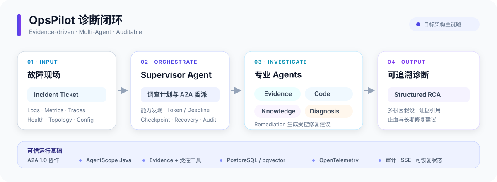

# OpsPilot

> 面向分布式、跨语言系统的智能故障诊断与修复建议系统。

OpsPilot 将日志、指标、Trace、健康状态、配置和拓扑等现场信号统一转换为可追溯的 Evidence，再由多个专业 Agent 协作完成证据收集、代码定位、知识检索、根因假设与验证，最终输出结构化 RCA 和修复建议。

项目当前定位是**本地可运行、可验证、可复现的 MVP / 工程演示**，用于验证一条不依赖 Mock 或固定答案的真实诊断链路；它不是可直接部署到企业生产环境的成品平台。

## 当前状态

- **已完成 Phase 0–6：** 工程基础、内聚核心、PostgreSQL 持久化、Sample System 与可观测链路、真实模型与 RAG、AgentScope 运行时、A2A 多 Agent 协作和产品 API。
- **正在规划 Phase 7：** Fault Lab、三个真实故障场景、结构化 RCA 和确定性 Evaluation。
- 最近完成阶段的门禁结果：299 项测试通过、0 failures、0 errors，详见 [Phase 6 Gate Summary](outputs/phase6/phase6-gate-summary.json)。

## 架构概览



> 上图展示目标架构的主链路。当前已实现到多 Agent 协作与产品 API；Fault Lab、完整 RCA 与 Evaluation 属于后续阶段。更完整的模块、数据流和安全边界见[系统设计](docs/design/OpsPilot-System-Design.md)。

## 项目目的

传统故障排查往往需要人工在日志、指标、Trace、代码和历史文档之间反复切换。OpsPilot 希望把这项工作变成一条受约束、可恢复、可审计的调查流程：

- 将异构可观测数据规范化为带来源与 Artifact 引用的 Evidence，避免 Agent 直接把原始文本当作事实。
- 由 Supervisor 通过 A2A 协议编排专业 Agent，在明确的 Token、Deadline、权限和状态边界内协作。
- 维护支持证据、冲突证据和验证过程；证据不足时允许输出 `PARTIAL` 或 `INCONCLUSIVE`，不强制编造唯一根因。
- 对模型、工具和 Agent 调用保留审计与关联标识，使结论可以追溯、复查和评测。
- 通过 Sample System 和 Fault Lab 构建可重复的真实故障场景，验证诊断链路而不是演示固定结果。

## 核心技术

| 领域 | 技术与用途 |
| --- | --- |
| 核心服务 | Java 21、Spring Boot 3.4.5、Maven 多模块、Jackson、Bean Validation |
| Agent 运行时 | AgentScope Java 2.0.0、有界 ReAct、Checkpoint 与恢复 |
| Agent 协作 | A2A 1.0（Agent Card、Message、Task、Artifact，HTTP + JSON） |
| 数据与检索 | PostgreSQL 16、pgvector 0.8.4、Flyway、Spring Data JPA、Embedding + Rerank |
| 模型接入 | OpenAI-Compatible Provider；当前 Compose 默认使用 DeepSeek |
| 可观测性 | OpenTelemetry、Prometheus、Jaeger、Actuator、SSE |
| 故障实验 | Java/Spring Boot Sample System、Toxiproxy、Fault Lab |
| 交付与验证 | Docker Compose、Testcontainers、JUnit、Python、GitHub Actions、OpenAPI / JSON Schema |

核心依赖方向保持为：

```text
opspilot-core
    ↑
tools / agent-runtime / a2a / adapters / evaluation
    ↑
opspilot-server
```

`opspilot-core` 不依赖 Spring、AgentScope、A2A SDK、JPA 或具体模型厂商；框架和基础设施通过窄 Port 与 Adapter 接入。

## 本地部署

### 前置条件

- Git
- JDK 21（项目 Maven Wrapper 会下载固定的 Maven 3.9.11）
- Python 3（构建时 `python` 命令需要指向 Python 3）
- Docker Engine 或 Docker Desktop，并启用 Docker Compose v2
- 可用的 DeepSeek API Key
- 首次构建时可访问 Maven 仓库、容器镜像仓库和 DeepSeek API

> 默认 Compose 会启动 PostgreSQL、6 个 OpsPilot 进程、3 个 Sample System 服务、Prometheus、Jaeger、OpenTelemetry Collector 和 Toxiproxy。请先为 Docker 分配足够的本地资源。

开始前确认工具版本；`java` 必须来自有效的 `JAVA_HOME`，且主版本为 21：

```bash
java -version
python --version
docker compose version
```

### 1. 获取代码

```bash
git clone https://github.com/lkwslm/OpsPilot.git
cd OpsPilot
```

### 2. 准备本地 Secret

所有 Secret 都保存在已被 Git 忽略的 `.tmp/secrets/` 下，不要把真实 Key 写入源码或提交到仓库。

<details>
<summary>Windows PowerShell</summary>

```powershell
# 生成 3 个数据库密码
.\scripts\environment\new-phase3-db-secrets.ps1

# 生成 6 个本地 Agent 服务令牌
$secretDir = Join-Path $PWD '.tmp\secrets'
$additionalSecretNames = @(
  'supervisor-service-token',
  'evidence-agent-token',
  'code-agent-token',
  'knowledge-agent-token',
  'diagnosis-agent-token',
  'remediation-agent-token'
)

foreach ($name in $additionalSecretNames) {
  $path = Join-Path $secretDir "$name.txt"
  if (-not (Test-Path -LiteralPath $path)) {
    [IO.File]::WriteAllText(
      $path,
      [Guid]::NewGuid().ToString('N'),
      [Text.UTF8Encoding]::new($false)
    )
  }
}

# 安全读取并保存 DeepSeek API Key
$secureKey = Read-Host 'DeepSeek API Key' -AsSecureString
$keyText = [Net.NetworkCredential]::new('', $secureKey).Password
[IO.File]::WriteAllText(
  (Join-Path $secretDir 'deepseek-api-key.txt'),
  $keyText,
  [Text.UTF8Encoding]::new($false)
)
Remove-Variable keyText
```

</details>

<details>
<summary>macOS / Linux（Bash）</summary>

```bash
mkdir -p .tmp/secrets

for name in \
  postgres-bootstrap-password \
  migrator-db-password \
  runtime-db-password \
  supervisor-service-token \
  evidence-agent-token \
  code-agent-token \
  knowledge-agent-token \
  diagnosis-agent-token \
  remediation-agent-token
do
  path=".tmp/secrets/${name}.txt"
  [ -s "$path" ] || python3 -c 'import secrets; print(secrets.token_hex(32), end="")' > "$path"
done

IFS= read -r -s -p 'DeepSeek API Key: ' deepseek_api_key
printf '\n'
printf '%s' "$deepseek_api_key" > .tmp/secrets/deepseek-api-key.txt
unset deepseek_api_key
```

</details>

### 3. 构建应用制品

Windows：

```powershell
.\mvnw.cmd -DskipTests package
```

macOS / Linux：

```bash
./mvnw -DskipTests package
```

如果系统只提供 `python3` 命令，可以执行：

```bash
./mvnw -DskipTests -Dexec.executable=python3 package
```

如果要在启动前执行完整测试，请去掉 `-DskipTests`。

### 4. 启动服务

```bash
docker compose -f deployment/docker-compose.yml up -d --build --wait --wait-timeout 300
```

查看容器状态：

```bash
docker compose -f deployment/docker-compose.yml ps
```

启动完成后可访问：

| 地址 | 用途 |
| --- | --- |
| `http://127.0.0.1:8080/actuator/health/readiness` | OpsPilot 就绪状态 |
| `http://127.0.0.1:8080/actuator/health/capabilities` | 模型、Agent 与工具能力状态 |
| `http://127.0.0.1:8090/actuator/health/readiness` | Sample System 网关就绪状态 |
| `POST http://127.0.0.1:8080/api/incidents` | 创建 Incident 的产品 API |

产品 API 合同和请求结构见 [OpenAPI 3.1](docs/design/contracts/openapi/opspilot-v1.yaml)。专业 Agent 的 `8081–8085` 端口只在 Compose 内部网络开放，不会发布到宿主机。

### 5. 停止服务

```bash
docker compose -f deployment/docker-compose.yml down
```

该命令会保留 PostgreSQL 数据卷。只有确定要删除全部本地数据时才使用 `down -v`。

<details>
<summary>常见启动问题</summary>

- `COPY ... target ... not found`：先完成 Maven `package`，再执行 Compose 构建。
- Compose 报 Secret 文件不存在：确认 `.tmp/secrets/` 下存在上述 10 个非空 `.txt` 文件。
- OpsPilot readiness 为 `DOWN`：先检查 DeepSeek API Key、网络连接和 `health/capabilities` 返回的具体能力状态。
- 端口冲突：确保宿主机 `8080` 和 `8090` 未被其他进程占用。
- 查看服务日志：`docker compose -f deployment/docker-compose.yml logs -f opspilot-server`。

</details>

## Roadmap

| 阶段 | 状态 | 目标 |
| --- | --- | --- |
| Phase 0–6 | ✅ 已完成 | 工程门禁、核心领域、持久化、可观测链路、真实 Provider / RAG、AgentScope、A2A 与产品 API |
| Phase 7 | 🧭 规划中 | Fault Lab、三个真实故障场景、结构化 RCA、确定性 Evaluation |
| Phase 8 | 📋 计划中 | 质量矩阵、恢复、安全、效率与性能门禁 |
| Phase 9 | 📋 计划中 | CI、持续交付、不可变 RC、SBOM 与 Release Manifest |

完整分阶段计划见[实施计划](docs/implementation-plan/README.md)。

## 文档

- [系统完整设计](docs/design/OpsPilot-System-Design.md)
- [分阶段实施计划](docs/implementation-plan/README.md)
- [OpenAPI 与 JSON Schema 合同](docs/design/contracts/README.md)
- [版本锁定清单](deployment/versions.lock.yaml)
- [Phase 6 验收证据](outputs/phase6/phase6-gate-summary.json)

## 当前边界

- 当前版本只面向本地集成测试，不接入真实企业生产系统。
- 暂不包含 Kubernetes、生产级 HA、多租户、自动代码 Patch、自动 Pull Request 或可视化审批前端。
- Java / Spring Boot 是首期 Sample System 的实现选择，不是 OpsPilot 对被诊断系统的语言限制。
- GitHub Actions 只生成并验证发布候选，不保存目标环境凭证，也不自动部署到生产环境。
