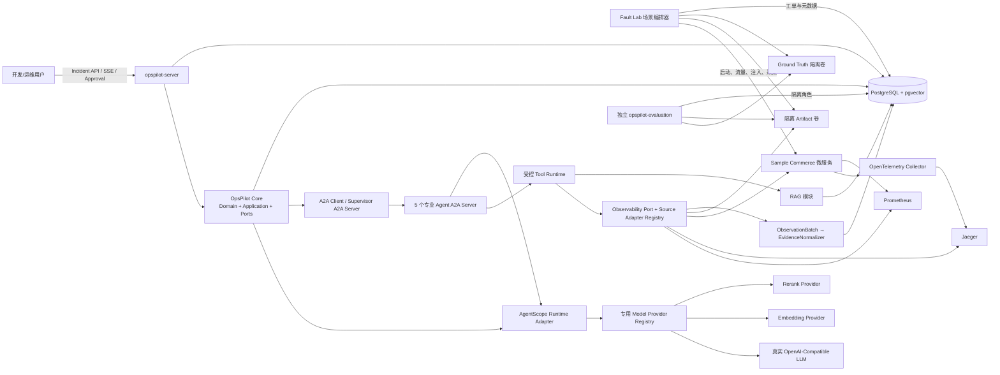
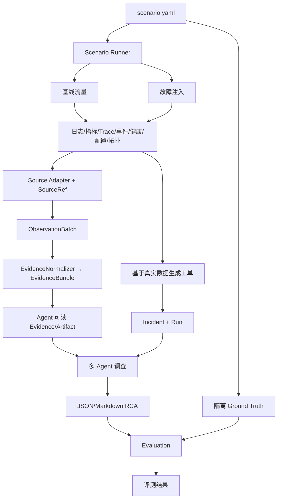

## 1. 系统目标与范围

### 1.1 项目目标

OpsPilot 是一个面向分布式、跨语言系统的智能故障诊断与修复建议系统。它通过受信 Source Adapter 接入日志、指标、Trace、事件、健康、配置和拓扑，统一转换为可追溯 Observation/Evidence，再由多 Agent 系统完成证据收集、可选代码定位、知识检索、根因假设与验证、结构化 RCA、修复建议和自动评测。首期使用 Java/Spring Boot Sample System 和 AgentScope Java 运行时验证完整链路，但被诊断系统不以 Java、Spring 或 JVM 为接入前提。

项目首先服务于本地可运行、可验证、可复现的工程演示，不接入真实企业生产系统；同时保留清晰的生产化边界，不以 Mock、固定结果或不可调用的 Provider 掩盖集成缺失。

### 1.2 两条主链路

故障实验链路：

```text
启动被测微服务
→ 产生正常基线流量
→ 注入故障
→ 持续产生业务请求
→ 采集日志、指标和 Trace
→ 恢复故障并观察恢复
→ 生成故障工单与 Agent 输入
→ 隔离保存 Ground Truth
→ 校验数据集完整性
```

Agent 诊断链路（Agent 间委派统一使用 A2A 1.0）：

```text
接收故障工单
→ Supervisor 通过 Agent Card 校验专业 Agent 能力并制定计划
→ 通过 A2A Task 委派日志、指标、Trace、健康状态和配置收集
→ 通过 A2A Task 委派代码定位和知识检索（知识结果允许为空）
→ 生成多个根因假设
→ 调用只读/受控工具验证
→ 通过确定性证据门禁计算结论等级并输出 RCA
→ 生成止血、长期修复、监控与测试建议
→ 高风险动作等待审批
→ 仅在受控沙箱执行白名单测试
→ 生成评测结果
```

### 1.3 MVP 范围

MVP 包含：

- 一个首期 Java/Spring Boot 模拟电商系统：`sample-gateway`、`order-service`、`inventory-service`；它是参考被测系统，不是产品语言边界；
- 6 个首期 Agent：`SupervisorAgent`、`EvidenceCollectorAgent`、`CodeAnalysisAgent`、`KnowledgeAgent`、`DiagnosisAgent`、`RemediationAgent`；六个角色是受版本控制的 `AgentProfile`，共享同一执行服务和运行时 Adapter，不是六套独立框架；
- 六个 Agent 均采用统一运行时驱动的有界 ReAct loop，Agent 间委派使用 A2A；业务代码不为每个 Agent 手写循环，也不通过扫描 Extension 动态增加未知角色；
- 9 类受控工具：日志、指标、Trace、健康、拓扑、配置、代码、知识库、沙箱测试；可观测 Tool 使用能力名称，具体产品由 Adapter 接入；
- 至少 3 个真实可执行场景：下游链路延迟、数据库连接池耗尽、库存实例停止；
- 统一 PostgreSQL 业务存储和 PostgreSQL + pgvector 向量存储；
- 真实 LLM、Embedding、Rerank Provider；
- JSON 和 Markdown 两种 RCA 输出；
- 独立评测、SSE 调查事件、工具/模型审计、Token 统计；
- Docker Compose 本地测试环境、单元/集成/端到端测试和启动文档。

### 1.4 非 MVP 范围

以下能力不属于首期验收范围：Tree-sitter MCP、自动代码 Patch、Git Worktree、自动 Pull Request、多租户、Kubernetes/Chaos Mesh、并行子 Agent、动态模型路由平台、LLM-as-a-Judge、可视化审批前端和 `ReviewerAgent`。

### 1.5 MVP 验收结果

MVP 完成时必须满足：

1. Java 与 Python 构建测试通过，Docker Compose 核心依赖健康。
2. 3 个被测服务可调用，3 个故障场景能真实注入、恢复并生成完整数据集。
3. Agent 无权访问 Ground Truth，但能通过 Source Adapter 调用日志、指标、Trace、健康、拓扑、代码和知识能力；每条现场 Evidence 可追溯到具体信息源。
4. 诊断链路使用真实可调用模型；配置缺失或模型不可用时返回可定位错误，不输出模拟结果。
5. Agent 能输出多个假设、证据引用、JSON/Markdown RCA、修复建议和评测结果。
6. 任务状态、事件、审计、模型配置元数据、文档元数据和向量统一存入 PostgreSQL。
7. MySQL、Redis、Qdrant、Milvus 和 Elasticsearch Vector 不出现在默认部署拓扑中。
8. 六个 Agent 通过 A2A 1.0 Agent Card、Message、Task、Artifact 和标准任务操作协作；禁用进程内快捷调用后仍可完成端到端诊断。
9. 知识库为空、无匹配或无历史案例时，系统仍能依据现场证据完成有限调查，并输出 `CONCLUSIVE`、`PARTIAL` 或允许根因为空的 `INCONCLUSIVE` 报告。
10. 任一模型、A2A、Tool、Embedding 或 Rerank 技术链路失败时，不得使用 Mock、固定结果或替代检索保底；有限重试后必须生成 `ChainFailure`。第 17.4 节定义为关键的能力使 Run 返回 `FAILED`；明确满足继续条件的 conditional 证据源记录 `missingEvidence` 后生成受限报告。

## 2. 需求与约束

### 2.1 功能约束

- 工单只暴露真实采集到的症状，不能泄漏根因；Ground Truth 必须由故障场景配置确定。
- 证据统一为强类型 `Evidence`，至少带来源、服务、时间范围、摘要、原始 Artifact 引用、相关性和可靠性。
- 根因必须维护支持证据、冲突证据、验证步骤和置信度；证据不足时不得强制生成 Top-1，必须允许 `rootCause=null` 的 `INCONCLUSIVE` 结果。
- 所有工具都通过统一 Tool SPI 和冻结的 `ToolRegistry` 调用；Agent 不能直接执行 SQL、任意 Shell、任意 HTTP 或越权文件读取。
- 所有模型都通过窄 Provider Port 和对应专用 Registry 调用；核心业务代码不依赖具体厂商 SDK，也不直接耦合 Infinity 或其他本地推理框架。
- 首期子 Agent 串行执行，每一步形成可恢复 checkpoint；Agent 间调用必须经过 A2A 协议，后续并行化不能破坏 A2A Task、状态版本和审计顺序。

### 2.2 技术约束

- Java：JDK 21、Spring Boot、Maven 多模块、Jackson、Bean Validation、Flyway、Spring Data JPA、Actuator、SSE、Testcontainers。
- Agent：AgentScope Java 由 Adapter/Facade 隔离。**待确认：**最终依赖版本、工具调用、结构化输出和流式 API。
- Fault Lab：Python 3.11+、Pydantic、PyYAML、httpx、Docker SDK、pytest；流量使用 k6 或 Python 并发脚本。
- 可观测性：OpenTelemetry、Prometheus、Jaeger，全部时间戳以 UTC 持久化。
- 目标系统：核心合同语言无关；Java/Spring/Maven 只属于首期 Sample、代码和沙箱 Adapter，扩展其他语言不得修改 Agent 状态机、Evidence/RCA 表结构或 A2A skill major version。
- 数据：PostgreSQL 是唯一业务关系型数据库；pgvector 与业务表部署在同一 PostgreSQL 实例的受控 schema 中。
- 模型：默认 LLM 协议为 OpenAI-Compatible，默认基地址为 `https://api.deepseek.com`；模型名和密钥不提供虚假默认值。

### 2.3 数据一致性约束

- PostgreSQL 同一事务内保存状态快照、状态转换和待发布事件，避免 Redis/数据库双写。
- `agent_state.version` 使用乐观锁；同一 Incident 同一时刻只有一个有效执行租约。
- 文档版本和向量版本使用“旁路构建、校验、原子切换”，不能在检索中混用半成品版本。
- Artifact 大文件不写入数据库；数据库保存路径/对象键、SHA-256、大小、类型、访问级别和生命周期。Agent 只能通过受控 Artifact 服务读取。

### 2.4 专用基础设施及成本说明

PostgreSQL 不替代以下有明确专用职责的组件：

| 组件 | PostgreSQL/pgvector 不直接替代的原因 | 解决的问题 | 新增成本与控制 |
|---|---|---|---|
| Prometheus | 故障场景需要 PromQL、时间序列采样和抓取语义；把高频指标写入业务表会增加分区、压缩和查询实现负担 | 真实指标采集、范围查询和告警证据 | 多一个服务、指标保留和磁盘管理；首期缩短保留期并使用独立卷 |
| Jaeger | Trace 是 span 图和时序检索，不适合由业务 JPA 表临时复刻；首期 `JaegerTraceAdapter` 为 `TraceQueryTool` 提供真实 Trace API | 分布式调用链、错误 span 和耗时定位 | 多一个服务及 Trace 保留成本；首期采样、限期保留，不作为业务真源 |
| 隔离文件卷 | 原始 JSONL 日志、Trace 导出、RCA、Diff、数据集和 Ground Truth 体积大且需要目录权限隔离；写成数据库 BLOB 会放大备份和 WAL | 可复现数据集、原始 Artifact 和 Ground Truth 隔离 | 卷备份、配额、清理与路径安全；数据库保存元数据和哈希，定期校验孤儿文件 |

Toxiproxy 是故障注入器而非数据存储。以上组件不会承载 Incident、Agent State、模型配置、文档元数据或向量数据。

### 2.5 容量与 SLO 假设

- MVP 容量基线为活跃 Chunk 小于 50,000、知识更新低频、检索并发低于 20 QPS；这是待压测验证的容量假设。
- 诊断任务是长任务，首期端到端、RAG、恢复和资源目标按第 25.9 节执行；生产 SLO 在目标环境容量测试后另行冻结，不能反向降低 MVP 质量和安全门禁。
- 生产文档数、Chunk 数、查询 QPS、保留周期、PostgreSQL HA/RPO/RTO **待确认**，需要用容量测试决定 ANN 索引和部署规格。

## 3. 总体架构

### 3.1 系统上下文与容器关系



### 3.2 数据流



### 3.3 架构原则

1. **领域与框架解耦：**领域对象和状态机不依赖 Spring、AgentScope、模型厂商或向量驱动。
2. **统一事实源：**业务、运行状态、配置元数据、审计与向量统一进入 PostgreSQL；原始大文件只通过 Artifact 引用关联。
3. **真实能力与失败透明：**启动/首次执行验证模型和能力；不注册可部署的 Mock Provider，不提供任何运行时保底数据或替代链路。技术失败必须显式失败并返回可定位错误。
4. **最小权限：**工具权限、数据库 schema、Artifact 根目录和模型密钥分别隔离。
5. **可恢复：**每个 A2A Task/Agent/工具边界写 checkpoint；A2A stream 通过 Task 查询/订阅恢复，产品 SSE 可重放，重试有上限。
6. **可评测：**每个结论引用真实 Evidence/Artifact；Ground Truth 与 Agent 运行账户隔离。
7. **空结果不等于降级：**知识库为空、无匹配和历史案例不足是成功检索后的合法业务结果；Provider/协议/工具故障是技术失败，禁止混淆或降级。
8. **目标系统与信息源解耦：**Java/Spring 是首期 Sample，Prometheus/Jaeger 是首期 Source Adapter；核心只依赖 Resource、Observation、Evidence 和 Tool/A2A 合同。
9. **选择性扩展而非全面插件化：**状态机、Supervisor、A2A、安全门禁和领域规则保持为内聚核心；只有 Provider、Source、Tool、代码分析和沙箱等多实现边界通过窄 Port 扩展。同步核心调用显式依赖 Port，异步投影才使用 outbox 事件。
