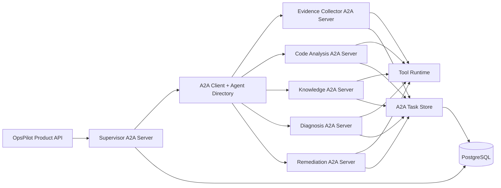
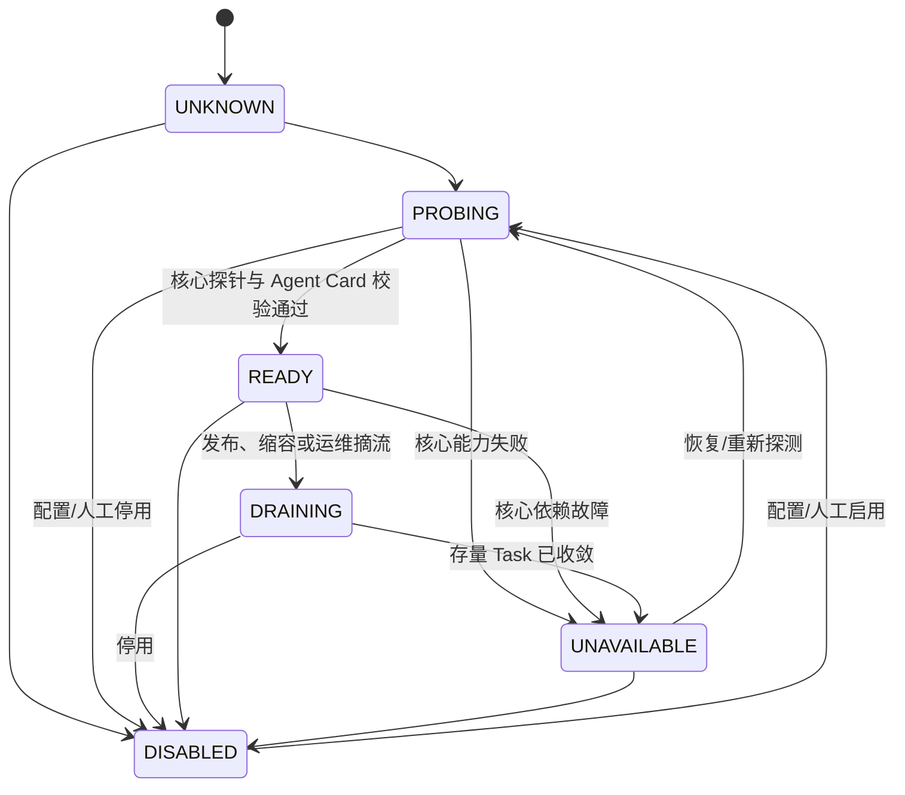
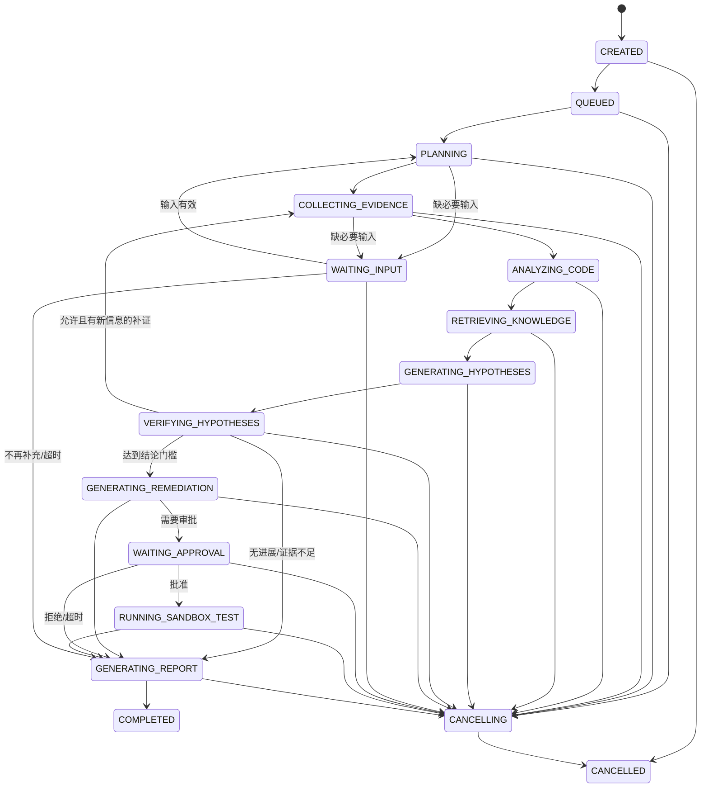
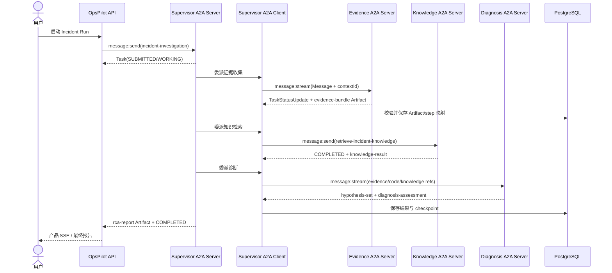

## 5. 基于 A2A 的多 Agent 架构

### 5.1 A2A 协议基线与合规要求

协议基线固定为 A2A 1.0，实现和合同测试锁定官方 `v1.0.1`。Agent Card 的 `protocolVersion` 填 `1.0`；协议升级必须通过 ADR、兼容性评估和双版本合同测试。

| A2A 能力 | 当前设计要求 |
|---|---|
| Agent Card 与技能发现 | 每个 Agent 暴露独立 Agent Card 和版本化 skill |
| 协议绑定 | MVP 使用 A2A HTTP+JSON |
| `Message` / `Part` | 所有 Agent 委派封装为 A2A Message/Part |
| `Task` 生命周期 | A2A Task 与 Incident step/attempt 显式映射 |
| Artifact | Agent 结果通过 A2A Artifact 返回并经校验后持久化 |
| Task 操作 | 实现 send、stream、get、cancel 和 subscribe |
| 流恢复 | A2A stream 断开后通过 get/subscribe 对账和恢复 |
| 认证、授权与版本 | 使用服务身份、skill scope、`A2A-Version` 和 capability 校验 |

### 5.2 架构原则

1. `SupervisorAgent` 继续负责业务编排，但它通过 A2A Client 委派专业 Agent，不直接调用其 Java 方法。
2. 六个 Agent 都是独立的 A2A 逻辑端点。MVP 可以部署在同一 JVM/容器，但调用必须经过与远程部署相同的 HTTP+JSON 协议栈，禁止生产代码短路为内存调用。
3. PostgreSQL 是任务、审计和领域结果的持久化介质，不是 Agent 通信协议。专业 Agent 不能通过轮询共享表读取其他 Agent 的输出。
4. Agent 内部调用日志、指标、代码和知识库等能力仍走 Tool Runtime；A2A 用于 Agent 之间协作，Tool SPI/MCP 用于 Agent 与工具协作，两者不能混用。
5. Agent 只交换任务所需的 Message、Artifact、状态和引用，不共享隐藏思考、完整内存、数据库实体或框架对象。
6. MVP 仍由 Supervisor 单向委派，不开放专业 Agent 之间的自由对话或任意级联委派，避免失控循环。

### 5.3 六个 Agent 的有界 ReAct 执行模型

六个 Agent 都采用 ReAct（Reason + Act）执行模型，但必须是由运行时控制的**有界 ReAct**，不是让模型自行编写或控制循环。每轮统一执行：

```text
Observe：读取当前 A2A Task 输入、checkpoint、已验证 Artifact/Evidence 和上轮动作结果
→ Reason：模型输出结构化 Decision（不持久化隐藏思考过程）
→ Validate：Schema、权限、预算、重复动作和终止条件校验
→ Act：执行一个白名单 Tool 动作或 A2A 委派动作
→ Checkpoint：保存动作、可审计决策摘要、Observation 引用、Usage 和状态
→ Stop/Next：满足结束条件则生成 Artifact，否则进入下一轮
```

各 Agent 的动作空间固定如下，模型不能创造新动作类型：

| Agent | ReAct Action | Observation | 终止输出 |
|---|---|---|---|
| `SupervisorAgent` | `DELEGATE_A2A_TASK`、`CONTINUE_A2A_TASK`、`REQUEST_USER_INPUT`、`CANCEL_TASK`、`FINISH` | 下游 Task 状态和已校验 Artifact | Investigation plan / RCA Artifact |
| `EvidenceCollectorAgent` | 调用日志、指标、Trace、健康、配置 Tool，或 `FINISH` | Tool result + Evidence 引用 | Evidence bundle / Missing evidence Artifact |
| `CodeAnalysisAgent` | 调用受限代码 Tool，或 `FINISH` | 文件、行号、调用路径和 Evidence 引用 | Code findings Artifact |
| `KnowledgeAgent` | 调用完整 Knowledge Search 链路，或 `FINISH` | 真实检索结果或正常 `NO_MATCH` | Knowledge result Artifact |
| `DiagnosisAgent` | `FORM_HYPOTHESES`、`REQUEST_VERIFICATION`、`FINISH` | Evidence/Code/Knowledge Artifact；补证后用同一 Task continuation | Hypothesis set / Diagnosis assessment Artifact |
| `RemediationAgent` | `PROPOSE_PLAN`、`REQUEST_APPROVED_TEST`、`FINISH` | 已验证结论、审批和沙箱测试结果 | Remediation plan Artifact |

六个 Agent 都使用 AgentScope `ReActAgent` 的内置 reasoning-acting loop。`opspilot-agent-core` 的 `BoundedReActRunner` 是策略包装器，不再实现第二套 `while` 循环；它通过 AgentScope 的 `ReactConfig`、Middleware、事件和中断接口施加 checkpoint、最大轮数、deadline、Token/Tool/A2A Task 预算、取消、重复动作指纹和 `NO_PROGRESS` 停机。AgentScope Adapter 负责把这些 Port 映射到经构建验证的框架 API。业务开发者只配置 Prompt、允许动作/工具、输入输出 Schema、预算和完成条件，无须自行编排 Agent loop。Supervisor 的 ReAct loop 通过允许的 A2A 动作编排专业 Agent；专业 Agent 的 ReAct loop 只执行自身 skill，二者不嵌套接管对方循环。

### 5.4 A2A 逻辑拓扑



`opspilot-server` 先把产品 API 请求转换为发给 Supervisor 的 A2A Message。Supervisor 为每个 Incident Run 创建一个 A2A `contextId`，每次专业委派创建独立的 A2A Task。应用表保存 `runId + stepId + remoteAgentId + a2aTaskId + contextId + messageId` 映射，以支持幂等、取消、恢复和审计。

### 5.5 Agent Card 与发现

每个 Agent 必须在 `/.well-known/agent-card.json` 暴露有效 Agent Card，至少声明：

- `name`、`description`、`version`、`provider`；
- `supportedInterfaces`：MVP 只声明真实实现的 `HTTP+JSON`、URL 和 `protocolVersion: "1.0"`；
- `capabilities`：MVP 开启 streaming，不实现 push notification 就必须声明为 false；
- `securitySchemes` 与所需 scope；
- `defaultInputModes`、`defaultOutputModes`；
- 唯一、稳定、可版本化的 `skills`、输入输出媒体类型和示例。

MVP 使用受控静态 Agent Directory，保存允许的 Agent Card URL、期望身份、证书/签名指纹和技能版本。启动时拉取并校验 Agent Card；发现失败、协议版本不兼容、技能缺失、URL 越过 allowlist 或能力声明与实测不符时 readiness 失败。不得由模型根据自然语言 URL 动态发现并调用任意 Agent。

技能映射如下：

| Agent | A2A Skill ID | 主要输入 | 主要 Artifact |
|---|---|---|---|
| `SupervisorAgent` | `incident-investigation` | Incident ticket、约束和预算 | `investigation-plan`、`rca-report` |
| `EvidenceCollectorAgent` | `collect-observability-evidence` | 时间窗、服务、证据请求 | `evidence-bundle`、`missing-evidence` |
| `CodeAnalysisAgent` | `analyze-code-location` | 堆栈、路径和 Evidence 引用 | `code-findings` |
| `KnowledgeAgent` | `retrieve-incident-knowledge` | 查询和元数据过滤 | `knowledge-result`，允许 `NO_MATCH` |
| `DiagnosisAgent` | `generate-and-verify-hypotheses` | 证据、代码、知识引用 | `hypothesis-set`、`diagnosis-assessment` |
| `RemediationAgent` | `propose-remediation` | 已验证结论和约束 | `remediation-plan` |

### 5.6 协议操作与数据合同

HTTP+JSON 绑定使用 `Content-Type: application/a2a+json`，请求带 `A2A-Version: 1.0` 和服务身份。每个 A2A Server 至少实现：

```http
GET  /.well-known/agent-card.json
POST /message:send
POST /message:stream
GET  /tasks/{id}
POST /tasks/{id}:cancel
POST /tasks/{id}:subscribe
```

`message:send`、`tasks/{id}` 和 `tasks/{id}:cancel` 是最低合规门禁；长任务使用 `message:stream` 或 `tasks/{id}:subscribe`。MVP 不实现 push notification，Agent Card 不得虚假声明该能力。

委派请求使用 `Message(role=ROLE_USER)`，其中：

- `messageId` 由调用方生成并作为重复发送检测键；
- `contextId` 固定为 Incident Run 的 A2A 上下文；
- `taskId` 仅用于继续非终态任务；终态任务不得复活，重新执行必须创建新 Task；
- `Part(data, mediaType=application/json)` 承载版本化任务合同；大内容使用受控 URL/File Part 和 SHA-256；
- `metadata` 只放 `incidentId`、`runId`、`stepId`、trace context、schema version 和数据分级，不放密钥或完整业务状态。

结果必须作为 Artifact 返回，状态 Message 只用于进度、澄清和限制说明，不能作为可靠最终结果。Artifact 至少包含 `artifactId`、`name`、`parts`、schema version、Evidence/Artifact 引用和完整性哈希。流式输出用 `TaskArtifactUpdateEvent`；客户端按 `taskId + artifactId` 幂等合并，并在最终状态后校验完整 Artifact。

### 5.7 任务状态映射

| A2A TaskState | OpsPilot step 状态 | 处理 |
|---|---|---|
| `UNSPECIFIED` | 无 | 非法业务值；返回 `InvalidAgentResponse`，不得持久化为有效状态 |
| `SUBMITTED` | `QUEUED` | 已接受，尚未执行 |
| `WORKING` | `RUNNING` | 写租约、进度和 checkpoint |
| `INPUT_REQUIRED` | `WAITING_INPUT` | Supervisor 请求用户/运维补充数据；不自动循环 |
| `AUTH_REQUIRED` | `WAITING_AUTH` | 仅表示 A2A 凭证/认证挑战；不等同于业务动作审批 |
| `COMPLETED` | `VALIDATING_RESULT` | 远端已完成；Artifact 校验通过后本地 step 才进入 `COMPLETED` |
| `FAILED` | `FAILED` | 记录协议错误或执行错误；由有限重试策略决定下一步 |
| `CANCELED` | `CANCELLED` | 传播取消并停止下游调用 |
| `REJECTED` | `REJECTED` | 能力、策略或输入不接受；Supervisor 重新规划或结束 |

合法 A2A Task 流转固定为：

```text
SUBMITTED → WORKING | INPUT_REQUIRED | AUTH_REQUIRED | COMPLETED | FAILED | CANCELED | REJECTED
WORKING → INPUT_REQUIRED | AUTH_REQUIRED | COMPLETED | FAILED | CANCELED | REJECTED
INPUT_REQUIRED → WORKING | FAILED | CANCELED | REJECTED
AUTH_REQUIRED → WORKING | FAILED | CANCELED | REJECTED
COMPLETED | FAILED | CANCELED | REJECTED → 无后继
```

同状态进度事件允许重复，但不算状态迁移。短任务允许 `SUBMITTED → COMPLETED`。终态后的重试必须创建新 Task，不能复活原 Task。

“没有知识命中”是合法业务结果，应以 `COMPLETED + knowledge-result(outcome=NO_MATCH)` 返回，不能伪装成协议失败。“模型不可用、Artifact Schema 无效、越权或状态无法持久化”才进入失败语义。

### 5.8 Agent 端点状态

A2A 规范定义的是 Task 状态，不定义 Agent 端点的运行状态。OpsPilot 额外定义 `AgentEndpointState`，只用于调度、健康检查、熔断和摘流，不能作为任务结果：

| 状态 | 含义 | 是否接收新 Task |
|---|---|---|
| `UNKNOWN` | 尚未探测或没有近期可信状态 | 否 |
| `PROBING` | 正在获取 Agent Card 并验证身份、协议、skill、容量和依赖 | 否 |
| `READY` | 核心依赖和声明 skill 可用 | 是 |
| `UNAVAILABLE` | 核心依赖、协议端点、状态持久化或必需 skill 不可用 | 否 |
| `DRAINING` | 停止接收新 Task，等待或取消存量 Task | 否 |
| `DISABLED` | 被配置或人工停用 | 否 |



Agent Directory 只把 `READY` 实例纳入选择。任一声明 skill 的真实依赖不可用时端点进入 `UNAVAILABLE`，不得以缩减动作空间、Mock 或伪结果继续接收该 skill。端点状态同时记录独立 `reasonCode`（至少含 `CARD_INVALID`、`PROTOCOL_INCOMPATIBLE`、`UNTRUSTED_IDENTITY`、`SKILL_MISSING`、`AUTH_FAILED`、`HEALTH_CHECK_FAILED`、`CIRCUIT_OPEN`、`CAPACITY_EXHAUSTED`、`OPERATOR_DISABLED`）、`retryable`、`lastSuccessfulProbeAt` 和 Agent Card digest。状态变化不得修改已存在 A2A Task 的事实；单个 Task 失败也不能直接把端点判为不可用。

### 5.9 安全、幂等与可观测性

- 本地可使用短期服务 Token；生产使用 mTLS 或 OAuth2 client credentials，scope 至少按 Agent skill 划分。
- A2A Server 按调用方身份隔离 Task；未授权访问统一返回不泄露资源存在性的错误。
- Agent Card 只能包含公开元数据；生产应通过 HTTPS 获取并校验受信来源，支持签名时验证签名。
- `messageId`、`taskId`、`contextId`、`runId`、`stepId` 和 W3C trace context 全链路记录，但不作为 Prometheus 高基数 label。
- 重复 `messageId` + 相同请求 hash 返回原 Task；相同 ID 不同 hash 返回冲突。取消是幂等操作。
- A2A 流中断后通过 `GET /tasks/{id}` 或 subscribe 恢复，不能把缺失的瞬时 Message 当作可靠事实；关键状态和 Artifact 必须可重新获取。
- 协议错误映射至少覆盖版本不支持、内容类型不支持、Task 不存在/不可取消、认证/授权、输入校验和无效 Agent 响应。

## 6. Agent 状态、调度与知识不足处理

### 6.1 领域状态与 A2A 状态分离

`IncidentAgentState` 是 Supervisor 对单个 Incident Run 的**可恢复领域快照**。它只保存恢复编排所需的当前值、计数器和业务对象引用，不保存日志正文、模型对话或其他 Agent 的内部状态。专业 Agent 不能读取或写入该快照；Supervisor 只把当前 A2A Task 所需的最小上下文封装为 Message。

权威定义如下：

```java
public record IncidentAgentState(
    String incidentId,
    String runId,
    String a2aContextId,
    String supervisorAgentSessionId,
    long version,
    IncidentRunStatus status,
    InvestigationOutcome outcome,          // 仅终态设置；执行中为 null
    String planArtifactId,
    int planVersion,
    String currentStepId,
    List<AgentStepReference> steps,
    List<String> evidenceIds,
    List<String> codeFindingIds,
    List<String> knowledgeResultArtifactIds,
    List<String> hypothesisIds,
    String remediationPlanArtifactId,
    String approvalId,
    TokenBudgetSnapshot budget,
    UsageStatistics usage,
    ReactLoopSnapshot supervisorLoop,
    List<String> missingEvidence,
    List<String> warnings,
    String failureId,
    String finalReportArtifactId,
    boolean cancellationRequested,
    Instant deadline,
    Instant createdAt,
    Instant updatedAt
) {}

public record AgentStepReference(
    String stepId,
    StepStatus status,
    List<StepAttemptReference> attempts
) {}

public record StepAttemptReference(
    int attempt,
    String remoteAgentId,
    String a2aTaskId,
    String contextId,
    String agentSessionId,
    String requestMessageId,
    String resultArtifactId,
    StepAttemptStatus status
) {}

public enum StepAttemptStatus {
    PENDING, DISPATCHING, RECONCILING, QUEUED, RUNNING,
    WAITING_INPUT, WAITING_AUTH, VALIDATING_RESULT,
    RETRY_SCHEDULED, CANCEL_REQUESTED,
    COMPLETED, FAILED, CANCELLED, REJECTED, SKIPPED
}

public enum InvestigationOutcome {
    CONCLUSIVE,
    PARTIAL,
    INCONCLUSIVE
}

public record ReactLoopSnapshot(
    int round,
    int replanCount,
    int clarificationCount,
    int noProgressCount,
    String lastActionFingerprint,
    List<String> completedActionFingerprints,
    Instant lastCheckpointAt
) {}
```

字段分组和用途：

| 字段组 | 内容 | 用途 |
|---|---|---|
| 身份与并发 | `incidentId`, `runId`, `a2aContextId`, `supervisorAgentSessionId`, `version` | 绑定业务 Run、A2A 上下文、Supervisor 的 AgentScope 会话引用和 CAS 版本 |
| 业务进度 | `status`, `outcome`, `planArtifactId`, `planVersion`, `currentStepId` | 恢复 Incident 状态机和当前调查计划 |
| Agent 调度 | `steps` 及其 attempts | 定位每个 A2A Task、派发/对账/校验/重试状态 |
| 调查结果引用 | Evidence、CodeFinding、KnowledgeResult、Hypothesis、Remediation、Approval ID | 组合上下文和最终 RCA，不复制业务对象正文 |
| 预算与循环 | `budget`, `usage`, `supervisorLoop`, `deadline` | 强制 Token、成本、轮数、重复动作和无进展停机 |
| 缺失与失败 | `missingEvidence`, `warnings`, `failureId` | 生成限制说明或关联唯一 `ChainFailure` |
| 完成与取消 | `finalReportArtifactId`, `cancellationRequested` | 恢复报告生成和取消传播 |
| 时间 | `createdAt`, `updatedAt` | 审计快照生命周期 |

`IncidentAgentState` 与 AgentScope `AgentState` 不是同一个 state。两者属于不同状态平面：

| 状态对象 | 所有者与作用域 | 保存内容 | 存储与主键 |
|---|---|---|---|
| OpsPilot `IncidentAgentState` | Supervisor；一个 Incident Run | 业务阶段、step/attempt、A2A 引用、证据引用、预算、循环治理投影、失败和报告引用 | `opspilot.agent_state`；`run_id` |
| AgentScope `AgentState` | 每个 ReActAgent；一个 Agent 会话 | 当前会话消息上下文、压缩摘要、权限、工具及框架恢复所需上下文 | `opspilot_a2a.agent_runtime_state`；`server_agent_id + user_id + session_id` |
| A2A Task 状态 | 对应专业 Agent 的 A2A Server；一个远端 Task | 协议 Task 状态、Message、Artifact 和事件 | `opspilot_a2a.task/message/artifact/task_event`；`server_agent_id + a2a_task_id` |

关联规则是“引用与投影”，不是对象复制：Supervisor 使用 `supervisorAgentSessionId` 关联自己的 AgentScope 会话；每个专业 Agent attempt 使用 `agentSessionId` 关联该 Agent 的会话。`ReactLoopSnapshot` 只是从 AgentScope 事件/Middleware checkpoint 提取的有界治理数据，用于预算、重复动作和恢复判定，不包含 AgentScope `AgentState` 的消息、工具结果或完整上下文，也不能反向覆盖框架状态。

会话键必须确定且可恢复：Supervisor 使用 `sessionId = "supervisor:" + runId`；专业 Agent 在 A2A Server 创建 Task 后使用 `sessionId = serverAgentId + ":" + a2aTaskId`。`userId` 使用经过认证的 tenant/service principal；MVP 无租户时使用固定的 `opspilot-system`，不得使用模型生成值。相同 A2A Task continuation 必须复用相同 sessionId；新的 attempt/A2A Task 必须创建新 sessionId，禁止继承失败 attempt 的框架上下文。

持久化规则如下：

1. `IncidentAgentState` 序列化到 `opspilot.agent_state.state_json`，每个 `run_id` 只保留一行当前快照；表结构见[数据与向量存储设计](./05-data-and-vector-storage.md#101-核心业务表)。
2. `schema_version` 标识 JSON Schema 版本，应用启动和读取快照时只执行显式、可测试的版本迁移；无法识别的版本返回 `STATE_SCHEMA_UNSUPPORTED`，禁止猜测字段或丢弃字段后继续运行。
3. 表列 `version` 必须等于快照内 `version`。Supervisor 使用 `IncidentAgentStateRepository.compareAndSet(runId, expectedVersion, nextState)` 更新；冲突时重读权威状态并重新判断迁移，禁止覆盖写。
4. 快照、`incident_run.status`、`state_transition`、`a2a_task_binding` 和待发布的 `incident_event` 必须在同一数据库事务中提交或回滚。
5. Evidence、Hypothesis、Artifact、Approval 和 `ChainFailure` 等对象以各自业务表为权威；快照中的 ID 只是可恢复引用。加载快照时发现必需引用不存在或归属其他 Run，返回 `STATE_REFERENCE_INVALID` 并停止该 Run。
6. 只有 Supervisor 运行角色可以创建或更新 `opspilot.agent_state`。专业 Agent 只能维护自身 A2A Task Store，通过 A2A Artifact 返回结果，不能直接读取或修改该快照。
7. AgentScope `AgentStateStore` 由 `opspilot-agent-adapter-agentscope` 适配到 `opspilot_a2a.agent_runtime_state`。框架状态的加载/保存遵守 AgentScope 调用边界，OpsPilot 领域代码不能直接修改其 JSON；保存失败属于状态持久化链路故障，返回 `AGENT_STATE_PERSIST_FAILED`，禁止改用内存或本地文件继续运行。

以下内容禁止放入 `IncidentAgentState`：日志/Trace/代码/知识正文、完整 Evidence、模型 Prompt/Response、隐藏推理、A2A Message history、Tool 原始输出、密钥、Ground Truth 和大 Artifact。它们分别存入自己的业务表或受控 Artifact；快照只保存稳定 ID。`steps`、指纹和告警列表都受 Incident 预算上限约束，防止 `state_json` 无界增长。

`COMPLETED` 表示流程按设计结束，不代表一定找到根因。RCA 必须同时记录 `InvestigationOutcome`、置信度、证据覆盖、缺失项、未验证假设和建议的人工下一步。

OpsPilot 明确区分三层状态，禁止复用同一个 `status` 字段跨层表达：

| 状态层 | 主键/作用域 | 权威所有者 | 解决的问题 |
|---|---|---|---|
| Agent 端点状态 | `remoteAgentId + instanceId` | Agent Directory/健康系统 | Agent 当前能否接收某 skill |
| A2A Task 状态 | `remoteAgentId + a2aTaskId` | 创建 Task 的 A2A Server | 一次 Agent 委派执行到哪一步 |
| step/attempt 状态 | `runId + stepId + attempt` | Supervisor | 本地派发、对账、结果校验和重试处于哪一步 |
| Incident Run 状态 | `runId` | Supervisor/领域状态机 | 整体调查处于哪个业务阶段 |

### 6.2 A2A Task 与本地 step 状态流转

本地 step 状态完整定义为：

```text
PENDING → DISPATCHING → QUEUED → RUNNING → VALIDATING_RESULT → COMPLETED
                 ↘ RECONCILING ↗   ↘ WAITING_INPUT/AUTH ↗
FAILED/REJECTED → RETRY_SCHEDULED → 新 attempt 的 PENDING
任意活动态 → CANCEL_REQUESTED → CANCELLED
```

| 本地 step 状态 | 进入条件 | 允许的下一状态 |
|---|---|---|
| `PENDING` | Supervisor 已创建 attempt，尚未构造 Message | `DISPATCHING`, `SKIPPED`, `CANCELLED` |
| `DISPATCHING` | 已持久化 messageId，正在发送/确认远端 Task | `QUEUED`, `RUNNING`, `RECONCILING`, `WAITING_INPUT`, `WAITING_AUTH`, `VALIDATING_RESULT`, `FAILED`, `REJECTED`, `CANCEL_REQUESTED` |
| `RECONCILING` | 请求结果未知或恢复中，正在以 messageId/taskId 对账 | `QUEUED`, `RUNNING`, `WAITING_INPUT`, `WAITING_AUTH`, `VALIDATING_RESULT`, `FAILED`, `REJECTED`, `CANCEL_REQUESTED` |
| `QUEUED` | A2A `SUBMITTED` | `RUNNING`, `WAITING_INPUT`, `WAITING_AUTH`, `VALIDATING_RESULT`, `FAILED`, `REJECTED`, `CANCEL_REQUESTED` |
| `RUNNING` | A2A `WORKING` | `WAITING_INPUT`, `WAITING_AUTH`, `VALIDATING_RESULT`, `FAILED`, `REJECTED`, `CANCEL_REQUESTED` |
| `WAITING_INPUT` | A2A `INPUT_REQUIRED` | `RUNNING`, `FAILED`, `REJECTED`, `CANCEL_REQUESTED` |
| `WAITING_AUTH` | A2A `AUTH_REQUIRED`，仅等待凭证/认证挑战 | `RUNNING`, `FAILED`, `REJECTED`, `CANCEL_REQUESTED` |
| `VALIDATING_RESULT` | A2A 已 `COMPLETED`，正在校验 Artifact | `COMPLETED`, `FAILED` |
| `RETRY_SCHEDULED` | 逻辑 step 允许新 attempt，旧 attempt 保持其终态 | 新 attempt 从 `PENDING` 开始 |
| `CANCEL_REQUESTED` | 已写取消意图并向远端发送 Cancel | `CANCELLED`, `COMPLETED`, `FAILED` |
| `COMPLETED` | Artifact 的媒体类型、Schema、hash、Task 归属、权限和引用均通过 | 无，attempt 终态 |
| `FAILED` | A2A `FAILED`、对账失败或结果合同不可恢复地无效 | 无，attempt 终态 |
| `CANCELLED` | A2A `CANCELED`，或未派发前被取消 | 无，attempt 终态 |
| `REJECTED` | A2A `REJECTED` | 无，attempt 终态 |
| `SKIPPED` | Supervisor 根据能力/计划明确跳过，记录原因 | 无，attempt 终态 |

`DISPATCHING/RECONCILING` 处理“请求已发出但响应未知”的窗口；恢复时必须以 messageId 查重并查询远端 Task，不能直接退回 `PENDING`。`WAITING_INPUT/AUTH` 是中断态，不是失败，必须有 deadline 和 continuation 次数上限；只有带同一 `taskId/contextId` 的有效后续 Message 才能恢复。认证问题与高风险业务审批严格分离，后者只使用 Incident `WAITING_APPROVAL`。重试必须创建新 messageId、新 A2A Task 和新 attempt，旧 attempt 终态不可覆盖。

### 6.3 Incident Run 状态定义与合法流转

| Incident Run 状态 | 定义 |
|---|---|
| `CREATED` | Run 已创建但尚未进入调度队列 |
| `QUEUED` | 顶层任务已入队，等待 Supervisor 领取 |
| `PLANNING` | 正在生成或修订有限调查计划 |
| `COLLECTING_EVIDENCE` | 正在收集现场日志、指标、Trace、健康和配置 |
| `ANALYZING_CODE` | 正在定位与证据相关的代码路径 |
| `RETRIEVING_KNOWLEDGE` | 正在执行结果可为空、但技术链路不可降级的知识/案例检索 |
| `GENERATING_HYPOTHESES` | 正在生成证据约束的候选根因 |
| `VERIFYING_HYPOTHESES` | 正在执行可证伪验证和证据门禁 |
| `GENERATING_REMEDIATION` | 正在为已验证或受限结论生成修复建议 |
| `WAITING_INPUT` | 缺少用户/运维提供的必要事实；有 deadline |
| `WAITING_APPROVAL` | 等待高风险业务动作审批；与 A2A `AUTH_REQUIRED` 无关 |
| `RUNNING_SANDBOX_TEST` | 已批准并在白名单沙箱执行测试 |
| `GENERATING_REPORT` | 正在固化结构化 RCA 及限制，即使结论不确定也可进入 |
| `CANCELLING` | 已接受取消，不再创建新 step，正在有限传播下游取消 |
| `COMPLETED` | 编排按设计结束；结论质量由独立 `InvestigationOutcome` 表示 |
| `FAILED` | 核心依赖或不可恢复一致性/安全错误导致编排无法完成 |
| `CANCELLED` | 取消流程已收敛或达到取消 deadline |



`COMPLETED`、`FAILED`、`CANCELLED` 是 Incident Run 终态。任何非终态遇到状态库不可用、核心 LLM 不可用且重试耗尽、协议安全错误或不可恢复的数据损坏时可进入 `FAILED`；知识空/无匹配、历史案例不足、证据不足、预算耗尽或 `NO_PROGRESS` 不应自动进入 `FAILED`，而应进入 `GENERATING_REPORT` 并完成为 `PARTIAL/INCONCLUSIVE`。

阶段只允许因任务本身不需要某能力而按计划跳过，例如无需代码定位时 `COLLECTING_EVIDENCE → RETRIEVING_KNOWLEDGE`。已经进入计划的技术链路若不可用，必须有限重试后进入 `FAILED` 并返回详细错误，禁止以跳过该阶段实现保底降级。所有跳转必须出现在版本化白名单中，并记录 `fromStatus`、`toStatus`、`reasonCode`、actor、对应 A2A taskId 和状态版本。

### 6.4 状态流转不变量

1. A2A Task 状态以远端 A2A Server 为权威，本地只能映射，不能猜测或回写远端状态。
2. Task 终态和 Incident Run 终态不可离开；非法迁移返回 `INVALID_STATE_TRANSITION`，记录审计且不修改快照。
3. Agent 端点变为 `UNAVAILABLE/DISABLED` 不等于其存量 Task 自动失败；恢复器先查 Task Store，再决定恢复、取消或失败。单个 Task 失败也不能直接改变端点状态。
4. 下游 Task 到达 `COMPLETED` 后，只有 Artifact 校验成功才能把本地 step 提交为 `COMPLETED`；校验失败进入 `FAILED` 并保留该 Task/Artifact 审计。
5. Incident 取消以 CAS 写入取消意图，再向所有非终态 A2A Task 传播 Cancel；个别远端取消失败不允许 Incident 回到运行态。
6. 状态快照、状态转换、A2A binding 更新和待发布产品事件在同一事务中提交；并发冲突重读后重新判定合法迁移。
7. `INPUT_REQUIRED/AUTH_REQUIRED` 是有 deadline 和 continuation 上限的中断态；超时后必须完成为受限结果、失败或取消，不能永久悬挂。
8. `AUTH_REQUIRED` 只处理 A2A 认证挑战；高风险 Tool/修复动作只使用 Incident `WAITING_APPROVAL`。
9. 同一 `(runId, stepId)` 最多一个活动 attempt；同一 attempt 最多绑定一个远端 Agent 身份和一个 a2aTaskId；重试创建新 attempt 并保留旧终态。
10. Incident 进入 `CANCELLING` 后禁止创建新 step/Task。取消竞态中晚到的完成 Artifact 可以审计保存，但不得把 Incident 从 `CANCELLING/CANCELLED` 拉回运行态。
11. 顶层 Supervisor A2A Task 必须最终与 Incident Run 收敛：Run `COMPLETED/FAILED/CANCELLED` 分别映射顶层 Task `COMPLETED/FAILED/CANCELED`；失联下游 Task 必须留下取消超时或对账处置记录。

### 6.5 Supervisor 调度流程

1. `POST /run` 创建 Incident Run，并向 Supervisor A2A Server 发送 `incident-investigation` Message。
2. Supervisor 生成有限步骤计划，按 Agent Card 技能选择允许的专业 Agent。
3. 每次委派先持久化 step 和 messageId，再调用 A2A `message:send` 或 `message:stream`。
4. 收到 Artifact 后校验媒体类型、Schema、引用权限、哈希和 Task 归属，再写入领域表。
5. Agent 返回 `INPUT_REQUIRED` 时，Supervisor 生成明确缺失项；有可回答的用户/运维输入才继续同一 Task。
6. 失败或流断开时先 `GET /tasks/{id}` 确认远端事实，再决定有限重试，禁止盲目创建重复 Task。
7. Incident 取消时，Supervisor 对所有非终态下游 Task 调用 `tasks/{id}:cancel`，并等待有限时间收敛。
8. 达到结束条件后生成一个结构化 RCA，再渲染 JSON 和 Markdown。

### 6.6 正常调度时序



### 6.7 知识不足不是致命错误

系统必须区分三类信息：

1. **现场事实：**日志、指标、Trace、健康状态、配置和代码；是诊断的主要证据。
2. **领域知识：**知识库文档；用于解释机制、扩展候选和验证方法，不能替代现场证据。
3. **历史案例：**相似 Incident；只提供先验和对照，不能直接证明当前根因。

因此，知识库为空、检索无匹配、相似度低或历史案例不足时，`KnowledgeAgent` 返回结构化合法结果：

```json
{
  "schemaVersion": "1.0",
  "outcome": "NO_MATCH",
  "queries": ["order-service connection timeout"],
  "references": [],
  "coverage": 0.0,
  "reasonCode": "NO_RELEVANT_CHUNK",
  "limitations": ["无可引用领域文档", "无相似历史案例"]
}
```

Supervisor 随后继续执行，不把空列表交给模型自由补全：

```text
知识无匹配
→ 收紧时间窗并检查现场 Evidence 完整性
→ 依据日志/指标/Trace/配置/代码生成证据约束假设
→ 用只读工具执行可证伪验证
→ 证据足够：输出 CONCLUSIVE 或 PARTIAL RCA
→ 证据仍不足：请求明确输入或输出 INCONCLUSIVE RCA
```

系统不在 MVP 中自动访问互联网，也不把模型预训练记忆包装成内部知识引用。若任务确实依赖缺失的领域规则、运行手册或业务语义，进入 `INPUT_REQUIRED`，列出所需文档/负责人/字段；用户不补充时仍应在预算内结束为 `INCONCLUSIVE`，保留已确认事实和后续采集建议。

上述规则只适用于“真实链路成功执行，但业务结果为空”。Embedding、Rerank、KnowledgeAgent、A2A、数据库或 Tool 调用超时/鉴权失败/协议错误/响应 Schema 无效属于技术链路失败：完成有限重试和对账后必须把下游 Task 与 Incident Run 标为 `FAILED`，禁止切换到 Mock/Fake、固定结果、关键词检索、vector-only、备用自然语言排序、模型预训练记忆或跳过计划步骤。

技术失败统一返回 `ChainFailure`，并在产品 API/SSE、A2A Task status message、审计表和结构化日志中使用相同关联 ID：

```json
{
  "errorCode": "RERANK_PROVIDER_UNAVAILABLE",
  "category": "DEPENDENCY_FAILURE",
  "message": "Rerank provider did not become ready before the task deadline",
  "failedComponent": "retrieval-inference",
  "operation": "rerank",
  "retryable": false,
  "attempts": 2,
  "retriesExhausted": true,
  "incidentId": "inc-001",
  "runId": "run-001",
  "stepId": "knowledge-01",
  "a2aTaskId": "task-001",
  "invocationId": "inv-001",
  "requestId": "req-001",
  "traceId": "trace-001",
  "upstreamStatus": 503,
  "upstreamRequestId": "provider-request-id",
  "checkpoint": "knowledge-query-validated",
  "logArtifactId": "art-log-001",
  "occurredAt": "2026-07-11T02:00:00Z"
}
```

错误响应必须包含失败组件、操作、重试判定/次数、脱敏 cause chain、上游状态/请求 ID、最近 checkpoint、trace/request/invocation/tool/A2A Task 关联 ID 和受控日志 Artifact 引用。不得返回密钥、完整 Prompt、敏感配置或未脱敏原始数据；详细不等于泄密。

### 6.8 防幻觉与结论门禁

- 每个根因 Claim 必须引用至少一个当前 Incident 可访问的 Evidence；纯知识/案例只能作为背景，不能单独支撑根因。
- 引用必须通过 `CitationValidity`：对象存在、属于当前 Incident/允许 collection、时间范围匹配、内容摘要与 Claim 可核验。
- 模型输出分离 `observedFacts`、`inferences`、`unknowns`；无法引用的陈述只能放入 `unknowns` 或“待验证假设”。
- Top-1 结论达到配置化的证据覆盖、冲突检查和验证门槛后才标为 `CONCLUSIVE`；门槛未达到只能是 `PARTIAL` 或 `INCONCLUSIVE`。
- 报告禁止把“未发现反例”写成“已证明”，禁止伪造 KnowledgeReference、Evidence ID、文件行号、指标值和历史案例。
- 没有知识命中时，不降低上述门槛，也不提高模型自述置信度。

### 6.9 防无限循环与停机条件

Supervisor 对每个 Run 强制执行以下有限预算：

- 最大总轮数、每类 Agent 最大调用数、最大 Tool 调用数、Token、费用和总 deadline；
- `replanCount`、`clarificationCount`、同类查询次数和同一 Task continuation 次数上限；
- 每次补证计算 `attemptFingerprint = agent + skill + normalizedInput + evidenceSetHash`，重复指纹且无新 Evidence 时禁止再次执行；
- 连续两轮 `evidenceNovelty=0` 或置信度提升低于阈值即判定 `NO_PROGRESS`；
- Task 已进入终态时不得继续发送 Message；需要新方案时创建有明确原因的新 step，而不是复活 Task。

停止优先级如下：用户取消 → 安全/权限拒绝 → 关键基础设施失败 → 达到结论门槛 → 需要输入 → 无进展/预算耗尽。最后三种分别产生 `CONCLUSIVE/PARTIAL`、`INPUT_REQUIRED` 或 `INCONCLUSIVE` 结果；任何一种都必须保存 checkpoint、限制和下一步建议，禁止自动无限重试。

### 6.10 并发、恢复与一致性

- `IncidentAgentStateRepository.compareAndSet(runId, expectedVersion, state)` 提供领域 CAS；A2A Task Store 对 Task 状态单独做单调转换校验。
- `incident_run` 限制同一 Incident 的有效运行；step 的 `(runId, stepId, attempt)` 和 messageId 唯一。
- 恢复时先读取本地 step，再查询对应远端 Task：远端完成则拉取并校验 Artifact，仍工作则订阅，找不到才按错误策略决定重建。
- 专业 Agent 完成 A2A Task 后不得直接更新 `IncidentAgentState`；只有 Supervisor 的结果接收事务可把已校验 Artifact 转换为领域对象。
- 产品 SSE 和 A2A stream 是两个边界：前者面向用户体验，后者面向 Agent 互操作；两者都从持久化事件恢复，但事件类型和权限不可混用。

### 6.11 A2A 与状态机验收标准

1. 六个 Agent Card 均通过官方 Schema/SDK 验证，能力声明与实测一致。
2. 禁用所有进程内快捷调用后，六个 Agent 在同机不同端口仍能完成三种故障场景。
3. 合同测试覆盖 send、stream、get、cancel、subscribe、版本不兼容、重复 messageId、终态续写和非法 Artifact。
4. 任意专业 Agent 重启后，Supervisor 能通过 Task 查询/checkpoint 恢复且不重复副作用。
5. PostgreSQL 中不存在“其他 Agent 轮询共享状态以接收任务”的通信路径。
6. 知识库为空、无匹配、无历史案例三类 E2E 均能在有限轮次内输出带证据和限制的 RCA，而非幻觉、直接失败或死循环。
7. Agent 实例、A2A Task、本地 step 和 Incident Run 四组状态分别覆盖所有合法/非法迁移；终态不可离开，中断态可在同一 Task 上恢复。
8. 构造 stream 响应未知、Agent 重启、取消竞争、Artifact 校验失败和 CAS 冲突，验证恢复后的权威状态与审计一致。

官方基线：

- A2A 1.0 规范：https://a2a-protocol.org/v1.0.0/specification/
- A2A 官方 v1.0.1 release：https://github.com/a2aproject/A2A/releases/tag/v1.0.1
- Agent discovery：https://a2a-protocol.org/latest/topics/agent-discovery/
