## 9. PostgreSQL 与 pgvector 设计

### 9.1 统一存储方案

默认只部署一个 PostgreSQL 集群，使用逻辑 schema 和角色隔离：

- `opspilot`：Incident、Agent State、审计、模型非敏感配置、知识库、向量和 Artifact 元数据；
- `opspilot_a2a`：A2A Server 自有 Task/Message/Artifact 状态；按 `server_agent_id` 和数据库角色隔离，专业 Agent 不能写 `opspilot` 领域状态；
- `sample`：订单和库存业务表，供模拟系统制造真实数据库故障；
- `opspilot_eval`：Ground Truth 索引和评测数据，Agent 运行角色无任何访问权限。

默认数据拓扑只使用 PostgreSQL + pgvector，不部署 MySQL、Redis 或 Qdrant，不引入双写或跨数据库一致性协议。

### 9.2 pgvector 初始化

测试环境使用带 pgvector 的 PostgreSQL 镜像；生产可使用已安装同版本扩展的托管 PostgreSQL。扩展由高权限迁移账户创建，运行账户无 `CREATE EXTENSION` 权限：

```sql
-- V1__create_extensions_and_schemas.sql
CREATE EXTENSION IF NOT EXISTS vector;

CREATE SCHEMA IF NOT EXISTS opspilot;
CREATE SCHEMA IF NOT EXISTS opspilot_a2a;
CREATE SCHEMA IF NOT EXISTS sample;
CREATE SCHEMA IF NOT EXISTS opspilot_eval;
```

启动检查执行：

```sql
SELECT extversion FROM pg_extension WHERE extname = 'vector';
```

查询为空时 readiness 为 DOWN，并返回 `PGVECTOR_EXTENSION_MISSING`；应用不能退化成内存向量库。镜像标签和 pgvector 版本在部署清单中锁定，升级先执行回归与索引重建评估。**待确认：**生产 PostgreSQL/pgvector 的最终版本和镜像摘要。

### 9.3 向量字段与维度管理

通用表不写死维度，使用无 typmod 的 `vector`，并把模型修订与维度做复合外键约束：

```sql
CREATE TABLE opspilot.embedding_model_revision (
    revision_id uuid PRIMARY KEY,
    provider varchar(64) NOT NULL,
    endpoint_profile_id uuid NOT NULL,
    model_name varchar(255) NOT NULL,
    model_revision varchar(255) NOT NULL,
    dimension integer NOT NULL CHECK (dimension > 0 AND dimension <= 16000),
    distance_metric varchar(16) NOT NULL
        CHECK (distance_metric IN ('COSINE', 'INNER_PRODUCT', 'L2')),
    normalization varchar(32) NOT NULL,
    capability_snapshot jsonb NOT NULL,
    status varchar(16) NOT NULL
        CHECK (status IN ('PROBING', 'READY', 'ACTIVE', 'RETIRED', 'FAILED')),
    created_at timestamptz NOT NULL DEFAULT now(),
    UNIQUE (revision_id, dimension)
);

CREATE TABLE opspilot.knowledge_chunk_embedding (
    chunk_id uuid NOT NULL REFERENCES opspilot.knowledge_chunk(chunk_id) ON DELETE CASCADE,
    model_revision_id uuid NOT NULL,
    embedding_dimension integer NOT NULL,
    embedding vector NOT NULL,
    content_hash char(64) NOT NULL,
    searchable boolean NOT NULL DEFAULT false,
    created_at timestamptz NOT NULL DEFAULT now(),
    PRIMARY KEY (chunk_id, model_revision_id),
    FOREIGN KEY (model_revision_id, embedding_dimension)
        REFERENCES opspilot.embedding_model_revision(revision_id, dimension),
    CHECK (vector_dims(embedding) = embedding_dimension)
);

CREATE FUNCTION opspilot.validate_embedding_contract()
RETURNS trigger LANGUAGE plpgsql AS $$
DECLARE metric varchar(16);
BEGIN
    SELECT distance_metric INTO STRICT metric
    FROM opspilot.embedding_model_revision
    WHERE revision_id = NEW.model_revision_id
      AND dimension = NEW.embedding_dimension;
    IF metric = 'COSINE' AND vector_norm(NEW.embedding) = 0 THEN
        RAISE EXCEPTION 'COSINE embedding must not be a zero vector';
    END IF;
    RETURN NEW;
END;
$$;

CREATE TRIGGER trg_validate_embedding_contract
BEFORE INSERT OR UPDATE OF embedding, model_revision_id, embedding_dimension
ON opspilot.knowledge_chunk_embedding
FOR EACH ROW EXECUTE FUNCTION opspilot.validate_embedding_contract();
```

维度确定流程：

1. 对配置模型执行真实探针请求，输入固定非敏感短文本。
2. 读取真实返回向量数组长度，结合 Provider/模型名称/模型 revision 或摘要形成 `embedding_model_revision`。
3. 若配置提供 `expected_dimension`，必须与探针长度一致，否则启动/导入失败。
4. 每批写入同时校验长度；数据库 `vector_dims` 与复合外键做第二道约束。
5. 模型名相同但权重 revision、维度、归一化或距离度量变化时创建新 revision，不能覆盖旧记录。

候选 Embedding 模型 `BAAI/bge-m3` 通常输出 1024 维，但该数值只作为测试探针预期，不写死在通用 DDL；最终以锁定 revision 经 Infinity `/embeddings` 返回的实际维度为准。

### 9.4 相似度与距离度量

距离度量是模型 revision 的不可变属性：

| 度量 | pgvector 运算符 | 分数转换 | 适用前提 |
|---|---|---|---|
| COSINE | `<=>` | `1 - cosine_distance` | 默认候选；模型/验证集确认使用余弦 |
| INNER_PRODUCT | `<#>` | `-1 * negative_inner_product` | 模型要求点积且向量处理一致 |
| L2 | `<->` | 以距离升序，不伪装成统一 0~1 分数 | 模型明确要求欧氏距离 |

Repository 只从上述 allowlist 选择运算符，不能把配置文本直接拼入 SQL。MVP 的 BGE-M3 测试路径采用 COSINE，但集成测试仍要验证归一化和排序语义。

### 9.5 MVP 精确检索 SQL

在活跃 Chunk 小于 50,000 的 MVP 容量基线下，向量检索使用过滤后精确扫描，不创建近似索引：

```sql
WITH filtered AS MATERIALIZED (
    SELECT
        e.chunk_id,
        e.embedding,
        c.content,
        c.token_count,
        d.document_id,
        d.title,
        d.source_path,
        d.document_type,
        d.service,
        d.fault_type,
        d.tags
    FROM opspilot.knowledge_chunk_embedding e
    JOIN opspilot.knowledge_chunk c ON c.chunk_id = e.chunk_id
    JOIN opspilot.knowledge_document_version v ON v.version_id = c.version_id
    JOIN opspilot.knowledge_document d ON d.document_id = v.document_id
    JOIN opspilot.knowledge_collection col ON col.collection_id = d.collection_id
    WHERE col.collection_id = :collection_id
      AND e.model_revision_id = col.active_model_revision_id
      AND e.searchable = true
      AND d.deleted_at IS NULL
      AND v.status = 'ACTIVE'
      AND (:document_types_empty OR d.document_type = ANY(:document_types))
      AND (:services_empty OR d.service = ANY(:services))
      AND (:fault_types_empty OR d.fault_type = ANY(:fault_types))
      AND (:language IS NULL OR d.language = :language)
      AND (:tags_empty OR d.tags @> CAST(:tags AS jsonb))
)
SELECT
    chunk_id,
    document_id,
    title,
    source_path,
    content,
    1 - (embedding <=> CAST(:query_vector AS vector)) AS similarity
FROM filtered
ORDER BY embedding <=> CAST(:query_vector AS vector)
LIMIT :candidate_k;
```

调用前必须验证 Query 向量维度等于 revision 维度。`candidate_k` 是重排候选数，最终 `top_k` 由 RerankProvider 返回。MVP 不提供禁用 Rerank 的配置：候选为空时返回 `COMPLETED + NO_MATCH` 且不调用 Rerank；候选非空时 Rerank 是必经步骤，失败必须显式失败。`rerankApplied=false` 只允许出现在候选为空的 `NO_MATCH` 结果中，不能表示 vector-only 降级。

### 9.6 索引策略

| 方案 | 数据规模/写入 | 延迟与召回 | 构建与内存 | 本设计选择 |
|---|---|---|---|---|
| 无 ANN，精确扫描 | 小于约 50k 活跃 Chunk、低 QPS、持续写入 | 召回精确；过滤后延迟可控 | 无 ANN 构建/常驻内存，写入最轻 | MVP 默认 |
| HNSW | 约 50k~1m、读多写少或中等写入 | 低查询延迟、通常较高召回；需调参和过采样 | 构建慢、内存和写放大较高，不需训练 | 数据增长且压测不达标时首选 |
| IVFFlat | 百万级以上、批量导入、内存更受限、可接受训练/重建 | 依赖 `lists/probes`，低 probes 会降低召回 | 构建相对轻，但数据分布变化后需重建/ANALYZE | 仅基准证明优于 HNSW 时采用 |

阈值是启动基线而非硬规则。启用 ANN 的门槛是代表性过滤条件下的 p95、Recall@K、构建时间、WAL、写入吞吐和内存共同不达标；不能只根据行数切换。

无 typmod `vector` 的 ANN 必须按已验证维度和模型 revision 建表达式 + 部分索引，例如：

```sql
-- <D> 与 revision UUID 均来自已完成真实探针的数据库记录
CREATE INDEX CONCURRENTLY idx_kce_hnsw__<revision_short_id>
ON opspilot.knowledge_chunk_embedding
USING hnsw ((embedding::vector(<D>)) vector_cosine_ops)
WHERE model_revision_id = '<verified-revision-uuid>'
  AND searchable = true;
```

只有基准选择 IVFFlat 时才生成对应索引；`<L>` 由样本量和压测确定，不能复制一个固定值：

```sql
CREATE INDEX CONCURRENTLY idx_kce_ivf__<revision_short_id>
ON opspilot.knowledge_chunk_embedding
USING ivfflat ((embedding::vector(<D>)) vector_cosine_ops)
WITH (lists = <L>)
WHERE model_revision_id = '<verified-revision-uuid>'
  AND searchable = true;

-- 在单次只读事务内按基准设置，结束后自动恢复
SET LOCAL ivfflat.probes = <P>;
```

标准 `vector` ANN 的可索引维度上限必须按锁定的 pgvector 版本在启动/迁移测试中验证；如果真实维度超出该上限，继续精确检索，或在有质量对照时评估 `halfvec`。这不是自动引入外部向量库的理由；任何额外存储仍需单独 ADR 说明能力缺口与运维/一致性成本。

对应查询必须包含同一 revision 谓词和相同 cast 才能命中索引。HNSW 的 `m/ef_construction/ef_search` 与 IVFFlat 的 `lists/probes` 分别影响构建内存、写放大、延迟和召回，必须由同一黄金查询集压测；查询级参数用 `SET LOCAL` 限定在事务内。`VectorIndexManager` 只接受数据库中 READY/ACTIVE revision 的 UUID、已校验整数维度和 allowlist operator class，生成确定性索引名；禁止用户输入任意 SQL。限制性元数据过滤下需要提高候选过采样、在锁定版本支持时启用迭代扫描，或回退过滤后精确检索，并用真实数据测 Recall@K。

### 9.7 新增、更新、删除与重新向量化

新增文档：

1. 创建 `knowledge_document` 和 `knowledge_document_version(status=PROCESSING)`。
2. 按稳定 Chunk 策略写 `knowledge_chunk`，保存序号、内容、Token 数、内容哈希和元数据。
3. 使用 ACTIVE Embedding revision 分批调用真实 Provider；每批在事务中 upsert 向量。
4. 校验 Chunk 覆盖率、维度、有限数值、抽样检索后，在同一事务中把旧版本置为非 ACTIVE/对应向量 `searchable=false`，把新版本置为 `ACTIVE`/对应向量 `searchable=true`。

更新文档不覆盖原 Chunk，而是创建新 document version。内容哈希未变化时，可以在同一模型 revision 内复用**计算结果**：从已验证的同哈希向量复制并插入新 `chunk_id` 对应的向量行，再重新执行哈希、维度和有限值校验；不能让新 Chunk 直接指向旧 Chunk 的主键行，也不能跨 revision 复用。删除先设置 `deleted_at` 并立即被检索过滤；异步清理版本/Chunk 时由外键级联删除向量。硬删除任务必须审计且不得删除受保留策略保护的 Artifact。

重新向量化：

```text
新模型真实探针
→ 创建 PROBING/READY model revision
→ 对当前 ACTIVE 文档版本旁路生成向量
→ 校验覆盖率/维度/质量/延迟
→ 同一事务更新 collection.active_model_revision_id，并切换新旧向量 searchable
→ 新 revision ACTIVE，旧 revision RETIRED
→ 保留回滚窗口后清理旧向量和旧 ANN 索引
```

查询在一次请求内固定 revision，不混读新旧向量；切换失败时继续使用旧 revision。`knowledge_ingestion_job` 保存批次进度、失败原因和重试次数，失败不能静默丢 Chunk。

### 9.8 Repository、DAO 与 ORM

- 常规 CRUD 使用 Spring Data JPA；`agent_state.version` 映射为 `@Version`，JSONB 使用明确 DTO/JSON 类型映射。
- 向量列、距离运算、过滤后 Top-K 和 ANN 表达式查询由 `KnowledgeVectorRepository` 的 JDBC/jOOQ 实现，不强行让通用 JPA 方言生成 `<=>`/`<#>`/`<->`。
- `EmbeddingModelRevisionRepository` 管理能力快照和 revision 状态；`KnowledgeIngestionRepository` 负责批次 checkpoint；业务 Agent 只能调用 `KnowledgeSearchService`，不能接触 SQL。
- SQL 参数全部绑定；只有已校验维度和运算符通过受控模板生成 SQL 片段。

## 10. 数据表与向量索引设计

### 10.1 核心业务与运行表

| 表 | 关键字段 | 说明/约束 |
|---|---|---|
| `opspilot.incident` | `incident_id`, `target_system_id`, `resource_scope_json`, `scenario_id`, `ticket_json`, `severity`, `status`, `created_at` | 工单、目标系统/资源范围与当前状态；不存 Ground Truth |
| `opspilot.incident_run` | `run_id`, `incident_id`, `status`, `run_version`, `analysis_sealed_at`, `model_config_snapshot`, `token_budget_json`, `started_at`, `ended_at` | 一次可恢复执行；同 Incident 活跃运行唯一；进入 `GENERATING_REPORT` 后封账并拒绝新的分析事实写入 |
| `opspilot.task` | `task_id`, `run_id`, `type`, `status`, `payload jsonb`, `priority`, `attempts`, `max_attempts`, `available_at`, `lease_owner`, `lease_until`, `idempotency_key`, `last_error` | PostgreSQL 持久任务队列；`SKIP LOCKED` 领取、过期租约恢复、幂等键唯一 |
| `opspilot.api_idempotency` | `idempotency_key`, `operation`, `request_hash`, `resource_id`, `response_status`, `response_body`, `expires_at` | API 写请求幂等；相同 Key 不同请求哈希返回冲突 |
| `opspilot.agent_state` | `run_id`, `schema_version`, `state_json`, `version`, `updated_at` | `IncidentAgentState` 当前快照；每个 Run 一行，`run_id` 主键/FK，CAS 更新；只存摘要、计数器和稳定引用 |
| `opspilot.agent_endpoint` | `remote_agent_id`, `instance_id`, `endpoint_state`, `reason_code`, `retryable`, `card_digest`, `last_successful_probe_at`, `updated_at` | Agent Directory 权威端点状态；不与 Task/Incident 状态复用 |
| `opspilot.a2a_task_binding` | `run_id`, `step_id`, `attempt`, `attempt_status`, `remote_agent_id`, `agent_card_digest`, `message_id`, `context_id`, `a2a_task_id`, `agent_session_id`, `a2a_state`, `result_artifact_id`, `last_event_at` | Supervisor step attempt、远端 A2A Task 与专业 AgentScope 会话的映射；`message_id` 和 `(remote_agent_id,a2a_task_id)` 唯一 |
| `opspilot.state_transition` | `transition_id`, `run_id`, `step_id`, `a2a_task_id`, `state_scope`, `from_status`, `to_status`, `reason_code`, `actor`, `state_version`, `created_at` | 追加写状态历史；区分 Incident/step/Task 映射状态 |
| `opspilot.target_system` | `system_id`, `name`, `environment`, `owner_ref`, `status`, `config_version`, `created_at`, `updated_at` | 被诊断分布式系统稳定身份；不绑定语言或部署平台 |
| `opspilot.target_resource` | `resource_id`, `system_id`, `resource_type`, `service_name`, `environment`, `scope_json`, `attributes`, `valid_from`, `valid_to` | Service/Instance/Pod/Node/DataStore/Queue 等统一 Resource；短暂实例不覆盖逻辑服务身份 |
| `opspilot.resource_relation` | `relation_id`, `system_id`, `from_resource_id`, `to_resource_id`, `relation_type`, `source_id`, `valid_from`, `valid_to`, `attributes` | 版本化分布式拓扑边；来源可追溯 |
| `opspilot.observability_source` | `source_id`, `source_kind`, `adapter_id`, `adapter_version`, `connection_ref`, `environment`, `scope_json`, `capabilities`, `priority`, `state`, `config_version`, `updated_at` | Source Registry；只保存 Secret 引用，不保存 URL 凭证 |
| `opspilot.code_source` | `source_id`, `source_kind`, `adapter_id`, `adapter_version`, `connection_ref`, `scope_json`, `capabilities`, `state`, `config_version`, `updated_at` | GitHub/GitLab 等代码源 Registry；只保存 Secret 引用和受控作用域 |
| `opspilot.code_repository` | `repository_id`, `source_id`, `external_repository_ref`, `allowed_ref_policy`, `state`, `config_version`, `updated_at` | 内部稳定仓库身份到受信代码源仓库的映射；模型不可提交外部 URL |
| `opspilot.resource_code_binding` | `binding_id`, `resource_id`, `image_digest`, `repository_id`, `commit_sha`, `source_revision`, `valid_from`, `valid_to` | 将线上部署资源/镜像精确映射到仓库完整 commit；`main` 不作为版本身份 |
| `opspilot.code_snapshot` | `snapshot_id`, `run_id`, `step_id`, `source_id`, `repository_id`, `commit_sha`, `adapter_id`, `adapter_version`, `manifest_artifact_id`, `manifest_sha256`, `status`, `retrieved_at` | 单次代码源 Adapter 的统一不可变结果；源码 workspace 临时只读，不存数据库大正文 |
| `opspilot.observation_batch` | `batch_id`, `run_id`, `step_id`, `source_id`, `query_template_id`, `parameter_hash`, `window_start`, `window_end`, `collected_at`, `upstream_request_id`, `record_count`, `status`, `schema_version`, `artifact_id` | 一次 Adapter 调用和单一来源的审计单元；联邦入口仍是一条 Source |
| `opspilot.observation_record` | `observation_id`, `batch_id`, `signal_type`, `resource_id`, `origin_source_id`, `observed_at`, `summary`, `attributes`, `quality_json`, `artifact_id` | 规范化 Observation 元数据；原始日志/时序/Span 图放 Artifact |
| `opspilot.evidence` | `evidence_id`, `run_id`, `fact_origin`, `signal_type`, `resource_id`, `start_time`, `end_time`, `summary`, `attributes`, `artifact_id`, `relevance`, `reliability` | 系统唯一事实真源；运行、代码和可引用知识断言统一进入此表，Hypothesis/RCA 只引用 `evidence_id` |
| `opspilot.evidence_provenance_ref` | `evidence_id`, `provenance_kind`, `batch_id`, `observation_id`, `code_snapshot_id`, `finding_artifact_id`, `finding_set_id`, `finding_id`, `knowledge_result_artifact_id`, `reference_id`, `source_id`, `source_revision`, `created_at` | Evidence 到 Observation、CodeFinding 或知识引用的不可变追溯；代码来源通过 `code_snapshot_id` 回溯 Code Source/Repository/commit，CHECK 保证每种 kind 只填写对应字段 |
| `opspilot.root_cause_hypothesis` | `hypothesis_id`, `run_id`, `title`, `description`, `component`, `confidence`, `status`, `created_at`, `updated_at` | 结构化多假设及收敛状态；不保存隐藏思考 |
| `opspilot.hypothesis_evidence` | `hypothesis_id`, `evidence_id`, `relation`, `created_at` | 假设与 `SUPPORTING/CONFLICTING` Evidence 的关系；联合主键防重复 |
| `opspilot.hypothesis_verification` | `verification_id`, `hypothesis_id`, `step_id`, `tool_call_id`, `a2a_task_id`, `status`, `result_summary`, `artifact_id`, `started_at`, `ended_at` | 可查询的验证动作与结果；大正文写 Artifact |
| `opspilot.rca_report` | `rca_id`, `run_id`, `run_version`, `outcome`, `root_cause_code`, `confidence`, `evidence_count`, `hypothesis_count`, `schema_version`, `json_artifact_id`, `markdown_artifact_id`, `generated_at` | 封账后从当前 Run 全量结构化数据生成；`run_id` 唯一，双格式来自同一 RCA 对象 |
| `opspilot.tool_call` | `tool_call_id`, `run_id`, `step_id`, `agent_name`, `tool_name`, `idempotency_key`, `attempt`, `input_summary`, `output_summary`, `permission`, `approval_status`, `status`, `error_code`, `started_at`, `ended_at` | 工具审计；幂等键唯一；敏感输入不落库 |
| `opspilot.chain_failure` | `failure_id`, `run_id`, `step_id`, `a2a_task_id`, `invocation_id`, `tool_call_id`, `request_id`, `trace_id`, `error_code`, `category`, `failed_component`, `operation`, `retryable`, `attempts`, `upstream_status`, `upstream_request_id`, `checkpoint`, `cause_summary`, `log_artifact_id`, `created_at` | 技术链路失败真源；错误体、SSE、A2A status 和日志共享关联 ID；仅保存脱敏摘要 |
| `opspilot.approval` | `approval_id`, `run_id`, `requested_action`, `risk_level`, `status`, `requested_by`, `decided_by`, `decided_at` | 审批记录，MVP 不放开任意高风险命令 |
| `opspilot.incident_event` | `event_id bigserial`, `run_id`, `event_type`, `payload`, `created_at` | SSE 可重放事件；追加写 |
| `opspilot.artifact` | `artifact_id`, `run_id`, `uri`, `sha256`, `size_bytes`, `media_type`, `access_level`, `created_at`, `expires_at` | 文件/对象元数据，不存大 BLOB |
| `opspilot.evaluation_result` | `evaluation_id`, `run_id`, `metrics_json`, `report_artifact_id`, `created_at` | 8 类评测指标与报告引用 |

A2A Server 的协议状态和 AgentScope 框架状态不与上表混写：`opspilot_a2a.task`、`message`、`artifact`、`task_event` 以 `server_agent_id` 分区/授权；`opspilot_a2a.agent_runtime_state(server_agent_id, user_id, session_id, schema_version, state_json, version, updated_at)` 实现 AgentScope `AgentStateStore`，唯一键为 `(server_agent_id, user_id, session_id)`。专业 Agent 角色只能维护自己的 A2A Task Store、AgentScope 会话和受控 Artifact，不能写 `opspilot.agent_state`、`root_cause_hypothesis` 或最终 RCA。Supervisor 收到并校验 A2A Artifact 后，才在单一领域事务中更新上述业务表。

CodeAnalysisAgent 不直接读取 Incident、Run 或 Resource 领域表。数据库提供最小只读视图 `opspilot.code_analysis_scope(run_id, resource_id, repository_id, commit_sha, source_id, source_kind, adapter_id, adapter_version, external_repository_ref, connection_ref)`：由 Server/Supervisor 在委派前根据当前 Run 的目标资源和有效 `resource_code_binding` 解析，Code Agent 数据库角色只能按 A2A 请求中的 `runId + repositoryId` 查询该视图，且无底表权限；`connection_ref` 只是 Secret 引用，不含凭证。零行返回 `CODE_REVISION_UNRESOLVED`；同一 repository 返回多个未消歧 commit 同样拒绝，不能选择最新值或 `main`。Code Agent 产生 Snapshot Manifest/CodeFinding Artifact，Supervisor 校验后才写 `opspilot.code_snapshot`、Evidence 和 provenance。

### 10.2 模拟业务表

| 表 | 关键字段 | 说明 |
|---|---|---|
| `sample.orders` | `order_id`, `sku`, `quantity`, `status`, `created_at`, `updated_at`, `version` | `order-service` 通过 PostgreSQL/HikariCP 读写 |
| `sample.inventory` | `sku`, `available_quantity`, `reserved_quantity`, `updated_at`, `version` | 使用乐观锁防超卖；不依赖 Redis 缓存 |

连接池耗尽场景通过测试 Profile 的连接泄漏/长事务/小连接池配置制造，故障恢复必须回滚配置并验证连接池回到基线。

### 10.3 模型、Prompt 与用量表

| 表 | 关键字段 | 说明 |
|---|---|---|
| `opspilot.model_profile` | `profile_id`, `capability_type`, `provider`, `base_url`, `model_name`, `api_key_ref`, `settings_json`, `config_version`, `enabled` | 非敏感有效配置；LLM/Embedding/Rerank 独立记录 |
| `opspilot.agent_model_override` | `agent_name`, `profile_id`, `overrides_json`, `config_version` | 仅保存与默认值不同的字段；6 个 Agent 名称白名单 |
| `opspilot.prompt_template` | `template_key`, `agent_name`, `version`, `content_hash`, `artifact_id`, `active` | 公共/专属 Prompt 版本；正文可放受控 Artifact |
| `opspilot.model_invocation` | `invocation_id`, `run_id`, `agent_name`, `capability_type`, `protocol`, `provider`, `model`, `model_revision`, `config_version`, `prompt_version`, `context_snapshot_id`, `pricing_profile_id`, `input_tokens`, `output_tokens`, `cached_tokens`, `usage_estimated`, `estimated_cost`, `currency`, `latency_ms`, `retry_count`, `attempt`, `status`, `error_code`, `upstream_request_id`, `started_at`, `ended_at` | Token/成本/延迟审计；字段与用量账本一致；不默认保存原始 Prompt |
| `opspilot.pricing_profile` | `pricing_profile_id`, `provider`, `model`, `currency`, `input_unit_price`, `output_unit_price`, `cached_unit_price`, `effective_from`, `effective_to`, `source_ref`, `config_version` | 可选的版本化估价快照；只用于估算，不宣称等于供应商账单 |

### 10.4 知识与向量表

| 表 | 关键字段 | 说明 |
|---|---|---|
| `opspilot.knowledge_document` | `document_id`, `collection_id`, `title`, `source_path`, `document_type`, `service`, `fault_type`, `language`, `tags jsonb`, `deleted_at` | 文档稳定身份、所属 collection 和过滤字段 |
| `opspilot.knowledge_document_version` | `version_id`, `document_id`, `version_no`, `content_hash`, `status`, `created_at`, `activated_at` | 内容版本；以部分唯一索引保证每个文档最多一个 ACTIVE |
| `opspilot.knowledge_chunk` | `chunk_id`, `version_id`, `ordinal`, `content`, `token_count`, `content_hash`, `metadata jsonb` | 稳定切分结果；`UNIQUE(version_id, ordinal)` |
| `opspilot.embedding_model_revision` | `revision_id`, `provider`, `model_name`, `model_revision`, `dimension`, `distance_metric`, `normalization`, `capability_snapshot`, `status` | 真实探针后的不可变 Embedding 合同 |
| `opspilot.knowledge_chunk_embedding` | `chunk_id`, `model_revision_id`, `embedding_dimension`, `embedding vector`, `content_hash`, `searchable` | Chunk 与模型 revision 的向量；维度双重约束；只有当前已激活组合可检索 |
| `opspilot.knowledge_collection` | `collection_id`, `name`, `active_model_revision_id` | 检索入口和原子模型切换指针 |
| `opspilot.knowledge_ingestion_job` | `job_id`, `document_id`, `target_revision_id`, `status`, `processed_chunks`, `failed_chunks`, `attempts`, `last_error` | 导入/重新向量化 checkpoint |

### 10.5 Ground Truth 隔离表

`opspilot_eval.ground_truth` 保存 `scenario_id`、root cause code、故障服务/组件/方法、expected evidence/actions 及受控 Artifact 引用。只有 `fault_lab_role` 和 `evaluation_role` 可访问；`opspilot_app_role`、Agent Tool 数据源和模型上下文构建器均无 schema `USAGE`/表 `SELECT` 权限。Evaluation 使用独立凭证，且其结果只把评分写回 `opspilot.evaluation_result`。

### 10.6 数据模型关系

```mermaid
erDiagram
    INCIDENT ||--o{ INCIDENT_RUN : has
    INCIDENT_RUN ||--|| AGENT_STATE : checkpoints
    INCIDENT_RUN ||--o{ STATE_TRANSITION : records
    INCIDENT_RUN ||--o{ OBSERVATION_BATCH : collects
    OBSERVABILITY_SOURCE ||--o{ OBSERVATION_BATCH : produces
    CODE_SOURCE ||--o{ CODE_REPOSITORY : hosts
    CODE_REPOSITORY ||--o{ CODE_SNAPSHOT : materializes
    TARGET_RESOURCE ||--o{ RESOURCE_CODE_BINDING : deploys
    CODE_REPOSITORY ||--o{ RESOURCE_CODE_BINDING : maps
    OBSERVATION_BATCH ||--o{ OBSERVATION_RECORD : contains
    TARGET_SYSTEM ||--o{ TARGET_RESOURCE : owns
    TARGET_RESOURCE ||--o{ RESOURCE_RELATION : connects
    INCIDENT_RUN ||--o{ EVIDENCE : collects
    EVIDENCE ||--o{ EVIDENCE_PROVENANCE_REF : cites
    OBSERVATION_RECORD ||--o{ EVIDENCE_PROVENANCE_REF : supports
    CODE_SNAPSHOT ||--o{ EVIDENCE_PROVENANCE_REF : supports
    INCIDENT_RUN ||--o{ ROOT_CAUSE_HYPOTHESIS : generates
    ROOT_CAUSE_HYPOTHESIS ||--o{ HYPOTHESIS_EVIDENCE : evaluates
    EVIDENCE ||--o{ HYPOTHESIS_EVIDENCE : supports
    ROOT_CAUSE_HYPOTHESIS ||--o{ HYPOTHESIS_VERIFICATION : verifies
    INCIDENT_RUN ||--o| RCA_REPORT : reports
    INCIDENT_RUN ||--o{ TOOL_CALL : audits
    INCIDENT_RUN ||--o{ MODEL_INVOCATION : consumes
    INCIDENT_RUN ||--o{ INCIDENT_EVENT : publishes
    INCIDENT_RUN ||--o{ ARTIFACT : owns
    INCIDENT_RUN ||--o{ EVALUATION_RESULT : evaluates

    KNOWLEDGE_DOCUMENT ||--o{ KNOWLEDGE_DOCUMENT_VERSION : versions
    KNOWLEDGE_DOCUMENT_VERSION ||--o{ KNOWLEDGE_CHUNK : contains
    KNOWLEDGE_CHUNK ||--o{ KNOWLEDGE_CHUNK_EMBEDDING : embeds
    EMBEDDING_MODEL_REVISION ||--o{ KNOWLEDGE_CHUNK_EMBEDDING : produces
    KNOWLEDGE_COLLECTION }o--|| EMBEDDING_MODEL_REVISION : activates
```



### 10.7 关系索引与约束

- `incident(status, created_at desc)`、`incident(target_system_id, created_at desc)`、`incident_run(incident_id, started_at desc)`；
- `UNIQUE(a2a_task_binding.message_id)`、`UNIQUE(a2a_task_binding.remote_agent_id, a2a_task_id)`、`UNIQUE(a2a_task_binding.run_id, step_id, attempt)`，并以部分唯一索引保证同一 step 最多一个活动 attempt；
- `task(status, available_at, priority desc) WHERE status IN ('PENDING','RETRY_WAIT')` 支撑领取，`UNIQUE(task.idempotency_key)` 防重复；
- `api_idempotency(expires_at)` 支撑受控清理；
- `target_resource(system_id, resource_type, valid_to)`、`resource_relation(system_id, from_resource_id, relation_type, valid_to)`；
- `observability_source(environment, source_kind, state)`，`UNIQUE(source_id, config_version)` 保留配置身份；
- `code_source(source_kind, state)`、`UNIQUE(code_source.source_id, config_version)`、`UNIQUE(code_repository.source_id, external_repository_ref, config_version)`；`resource_code_binding(resource_id, valid_to)` 和 `resource_code_binding(image_digest)` 支撑线上 revision 解析；
- `UNIQUE(code_snapshot.run_id, code_snapshot.step_id, code_snapshot.source_id, code_snapshot.repository_id, code_snapshot.commit_sha)` 防止同一 step 重复物化；`commit_sha` 只接受完整哈希；
- `observation_batch(run_id, step_id, collected_at)`、`observation_batch(source_id, collected_at)`、`observation_record(batch_id, signal_type, observed_at)`、`observation_record(resource_id, observed_at)`；
- `evidence(run_id, fact_origin, signal_type, start_time)`、`evidence(run_id, resource_id, start_time)`；运行来源使用 `UNIQUE(evidence_id, provenance_kind, source_id, source_revision)`，代码来源使用 `UNIQUE(evidence_id, code_snapshot_id, finding_set_id, finding_id) WHERE provenance_kind = 'CODE_FINDING'`，其他 provenance kind 分别建立精确 partial unique index；
- `UNIQUE(hypothesis_evidence.hypothesis_id, hypothesis_evidence.evidence_id, hypothesis_evidence.relation)`、`hypothesis_verification(hypothesis_id, started_at)`、`UNIQUE(rca_report.run_id)`；Repository 在 `analysis_sealed_at` 非空后拒绝该 Run 的 Evidence/Hypothesis/关系/验证写入；
- `tool_call(run_id, started_at)`、`UNIQUE(tool_call.idempotency_key)`、`model_invocation(run_id, agent_name, started_at)`；
- `incident_event(run_id, event_id)` 支撑 SSE 续传；
- `knowledge_document(document_type, service, fault_type, language) WHERE deleted_at IS NULL`；
- `UNIQUE (knowledge_document_version.document_id) WHERE status = 'ACTIVE'` 保证内容版本原子切换后唯一；
- `GIN (knowledge_document.tags)` 用于标签包含过滤；
- `knowledge_chunk(version_id, ordinal)` 唯一；
- 向量主键 `(chunk_id, model_revision_id)`，MVP 无 ANN；ANN 按第 9.6 节创建。

关键并发不变量使用可执行的部分唯一索引，而不是只靠应用检查：

```sql
CREATE UNIQUE INDEX uq_incident_one_active_run
ON opspilot.incident_run (incident_id)
WHERE status NOT IN ('COMPLETED', 'FAILED', 'CANCELLED');

CREATE UNIQUE INDEX uq_document_one_active_version
ON opspilot.knowledge_document_version (document_id)
WHERE status = 'ACTIVE';

CREATE UNIQUE INDEX uq_tool_call_idempotency
ON opspilot.tool_call (idempotency_key);
```

JSONB 只存扩展字段、快照和结构化结果，不替代可查询的核心列。所有外键按生命周期选择 `RESTRICT` 或 `CASCADE`，审计和模型调用记录不随 Incident 误删。

`incident_run.status` 必须有数据库 `CHECK` 约束，只允许第 6.3 节定义的状态。活动 Run 定义为“状态不属于 `COMPLETED/FAILED/CANCELLED` 的 Run”，唯一索引、领域方法、API 冲突判断和并发测试必须复用该定义，禁止各层维护不同的活动状态枚举。两个并发 `POST /api/incidents/{incidentId}/run` 只有一个可以提交；失败请求返回 `409 INCIDENT_ACTIVE_RUN_EXISTS`，并携带现有 `runId`。

### 10.8 Flyway 迁移顺序

```text
V1__create_extensions_and_schemas.sql
V2__create_core_incident_tables.sql
V3__create_sample_commerce_tables.sql
V4__create_model_config_and_usage_tables.sql
V5__create_knowledge_and_vector_tables.sql
V6__create_evaluation_isolation_tables.sql
V7__create_relational_indexes.sql
R__seed_non_secret_model_profiles.sql
```

数据库角色/密码由部署层预置，Flyway migration role 负责扩展和 DDL，应用 role 只拥有所需 DML。迁移必须在应用接收流量前完成；失败时应用不启动，不能跳过 pgvector 表后继续运行。
