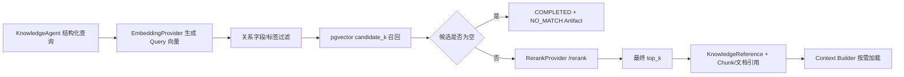

## 11. LLM Provider 设计

### 11.1 接口与协议

```java
public interface ChatModelProvider {
    ChatResult generate(ChatRequest request);
    Flow.Publisher<ChatEvent> stream(ChatRequest request);
    ChatCapabilityReport probe(ChatProbeRequest request);
}

public record ChatRequest(
    List<ChatMessage> messages,
    List<ToolSchema> tools,
    OutputSchema outputSchema,
    double temperature,
    int maxTokens,
    boolean stream,
    Instant deadline,
    InvocationContext context
) {}
```

`OpenAI-Compatible` 只代表 Chat HTTP 请求/响应协议，不代表端点必然支持 Embedding、Rerank、工具调用、JSON Schema、流式输出或一致的 Token Usage。Provider Registry 的能力键至少包含 `capability + protocol + baseUrl + model + modelRevision`。

`OpenAICompatibleChatModelProvider` 使用通用 HTTP 客户端和 Jackson，不使用 DeepSeek 或其他厂商 SDK。`base_url` 是 API 根地址，资源相对路径配置化，Adapter 不能无条件重复拼接 `/v1`。

### 11.2 默认真实 Provider

```yaml
models:
  defaults:
    llm:
      provider: openai-compatible
      base_url: https://api.deepseek.com
      api_key: ""
      api_key_ref: env:DEEPSEEK_API_KEY
      model: ${DEFAULT_LLM_MODEL:}
      timeout_seconds: 60
      retry:
        max_attempts: 2
      concurrency_limit: 4
```

- `base_url` 默认固定为 `https://api.deepseek.com`。
- `api_key` 和 `model` 默认空；`api_key_ref` 指向环境变量、Docker Secret 或外部密钥系统。Secret Resolver 只在内存中解析引用，数据库和配置快照永不保存解析后的密钥值。
- 密钥禁止进入代码、YAML 明文、数据库值、镜像层、日志、Trace、错误响应和 RCA。
- 模型名、超时、重试、并发、上下文、Token、流式与能力要求均配置化。

### 11.3 启动与能力探针

启动校验分两层：

1. **静态校验：**实际启用 Agent 的有效配置缺 provider/base URL/model/API Key、上限非法或 Agent 能力冲突时，Spring 进程非零退出。错误包含配置路径和应注入的变量名，不回显密钥。
2. **真实探针：**按去重后的有效模型配置发送最小真实请求；需要工具调用、结构化输出或流式的 Agent 分别验证相应能力。探针结果存 capability registry，并写脱敏审计。

典型错误码：`MODEL_CONFIG_MISSING_API_KEY`、`MODEL_CONFIG_MISSING_MODEL`、`MODEL_CONFIG_INVALID_BASE_URL`、`MODEL_CAPABILITY_UNVERIFIED`、`MODEL_CAPABILITY_UNSUPPORTED`、`MODEL_PROVIDER_UNAVAILABLE`。

配置缺失不可恢复，直接退出。配置完整但 Provider 暂时不可达时，liveness 仍可为 UP，readiness 为 DOWN，业务调用明确失败；不得返回 Mock/Fake/固定结果。周期健康检查只做低成本连通性或模型存在性检查，不高频发起收费生成。

### 11.4 请求、流式与结果

- 每次调用带 `runId/agentName/invocationId/deadline/configVersion`，并在发送前执行并发与 Token 预算预留。
- 结构化输出优先使用已验证的 JSON Schema 能力；只有模型明确不支持且该 Agent 配置允许时，才使用严格 JSON 模式 + 一次解析修复。
- 流式中断不把半截内容当最终结果；记录已接收 Usage/片段摘要，任务保持在可恢复失败状态。
- Provider 返回 Usage 时原样记录输入、输出和缓存 Token；没有返回时标记估算。
- 同一调用的网络重试复用 invocation ID 并增加 attempt；只有未产生业务副作用且错误可重试时重试。

### 11.5 真实 Provider 切换

生产可为不同 Agent 配置不同 OpenAI-Compatible 端点或模型。切换前必须通过相同 Provider contract 与能力探针。默认不启用自动 failover；如未来配置真实备用 Provider，必须显式列出顺序、能力等价条件、数据出境策略和预算，并在结果中记录实际 Provider，绝不静默切到虚假实现。

## 12. Embedding Provider 设计

### 12.1 接口

```java
public interface EmbeddingProvider {
    EmbeddingBatchResult embed(EmbeddingBatchRequest request);
    EmbeddingCapabilityReport probe(EmbeddingProbeRequest request);
}

public record EmbeddingBatchResult(
    String provider,
    String model,
    String modelRevision,
    int dimension,
    List<float[]> embeddings,
    ModelUsage usage
) {}
```

结果必须返回非空、条数匹配、长度一致且所有元素为有限数值的向量。使用 COSINE 时还必须拒绝零范数向量，避免距离结果无意义。Provider Adapter 不截断、不补零、不自动改维度；维度变化创建新的 `embedding_model_revision` 并重新向量化。

### 12.2 测试环境实现

测试环境使用统一的本地 Infinity `retrieval-inference` 服务，通过 OpenAI-aligned `/embeddings` 调用专用 Embedding 模型。候选从 `BAAI/bge-m3` 开始；仍需在目标开发机验证 Infinity 镜像、准确模型 revision、中文/代码混合检索、实际维度、CPU/内存或显存、冷启动、p95 延迟和 License 后，才写入测试环境清单。

因此基础配置保留空模型，不能猜测或注册伪 Provider；部署前必须显式填写并通过真实探针，否则应用启动失败：

```yaml
models:
  embedding:
    provider: infinity
    protocol: infinity-embedding
    base_url: http://retrieval-inference:7997
    path: /embeddings
    api_key: ""
    model: ${EMBEDDING_MODEL:}
    timeout_seconds: 60
    retry:
      max_attempts: 2
    concurrency_limit: 2
    batch_size: 16
    startup_probe: true
```

本地空 API Key 只允许在不暴露宿主端口的 Docker 网络内；生产 Embedding 地址、认证和模型独立配置，不依赖该容器名。

### 12.3 批处理与一致性

- 文档向量批次按 Provider 限制和 Token 数切分，不能只按字符串条数；超长 Chunk 在导入阶段拒绝或按版本化切分策略重切。
- 以 `content_hash + model_revision_id` 判断能否复用 Embedding 计算结果；复用时仍为新 `chunk_id` 插入独立向量行并重新校验，跨 revision 不复用。
- 批次部分失败不写半批；记录 job checkpoint 后按可重试错误重跑。
- Query 和文档必须使用同一 revision、同一预处理/归一化合同；查询时若 ACTIVE revision 的 Provider 不可用，返回明确错误，不调用其他维度模型。
- 实际 dimension、模型 revision、预处理、距离度量和 License 记录到 capability snapshot，供索引、回滚和审计。

### 12.4 生产环境

生产 Embedding 默认继续使用统一 Infinity 服务，也可以显式配置其他真实 Provider，但仅在该端点真实支持 embeddings 协议并通过探针时注册。不能因为 LLM 端点是 OpenAI-Compatible 就推断同一端点支持 Embedding。

## 13. Rerank Provider 设计

### 13.1 接口与请求合同

```java
public interface RerankProvider {
    RerankResult rerank(RerankRequest request);
    RerankCapabilityReport probe(RerankProbeRequest request);
}
```

统一领域请求：

```json
{
  "model": "<resolved-model>",
  "query": "订单服务请求超时且连接池 pending 上升",
  "documents": [
    {"id": "chunk-101", "text": "..."},
    {"id": "chunk-205", "text": "..."}
  ],
  "top_n": 10
}
```

统一结果保存 `documentId`、原始 index、score、rank、实际 model/revision。score 不假定归一化到 0~1，也不跨模型比较；响应引用不存在、重复 index、NaN/Infinity 或模型不匹配时合同测试失败。

### 13.2 测试环境协议选择

测试环境的 Rerank 与 Embedding 共用同一个本地 Infinity `retrieval-inference` 服务和基地址，通过 Cohere-aligned `/rerank` 调用专用 Cross-Encoder 模型。Infinity 在一个服务实例中同时加载 Embedding 与 Rerank 两个模型，并按请求中的 `model` 路由；这是一套服务、一个容器和一套监控，但不是让同一个模型权重兼任两种任务。业务层仍分别依赖 `EmbeddingProvider` 和 `RerankProvider`，避免基础设施合并破坏领域边界。

具体模型正式状态：

> 待通过本地资源占用、接口兼容性和中文重排效果测试后确定。

优先验证两个真实候选：

- `BAAI/bge-reranker-base`：Infinity 已测试支持，适合作为 CPU 基线；
- `BAAI/bge-reranker-v2-m3`：Infinity 已测试支持，与 `bge-m3` 属于一致的多语言检索模型族；模型更大，需验证目标 Infinity 镜像、资源和中文效果。

选型表必须记录准确模型 ID/revision、推理框架与镜像摘要、权重来源、License、内存/显存、冷启动、并发、最大长度、中文 NDCG/Recall 提升和 p95。未完成验证前 `RERANK_MODEL` 保持空并使启动门禁失败，不能以 vector-only、关键词或 Mock 替代。

Infinity 的 `/models` 和响应模型名不能替代部署 revision 证明。Adapter 必须使用锁定并注入的 `EMBEDDING_MODEL_REVISION`、`RERANK_MODEL_REVISION`，在启动时与 Infinity 加载清单、镜像 digest 和真实双能力探针核对；调用账本记录该已验证身份，不能从响应伪造模型 revision。

### 13.3 明确禁止的实现

- 使用生成模型产生自然语言排序后伪装成标准 Rerank；
- 固定返回原顺序或固定分数；
- 再做一次余弦排序却记为独立 Rerank 模型调用；
- Rerank 不可用时仍返回 `rerankApplied=true`；
- 在 `KnowledgeAgent` 中直接依赖 Infinity、Transformers 或其他推理框架客户端。

### 13.4 RAG 调用流程



零候选、空知识库和无历史案例是链路成功后的合法结果，不调用 Rerank，也不抛协议失败。只要存在候选，Rerank 就是该链路的必经步骤；Rerank 失败时 KnowledgeAgent Task 必须 `FAILED` 并返回 `ChainFailure`。任何环境都不允许 vector-only、关键词检索、Mock/Fake、固定排序或模型自然语言排序作为保底替代。
