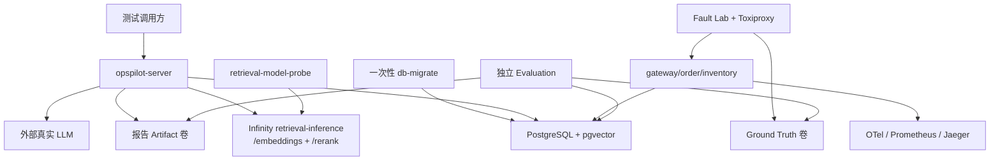
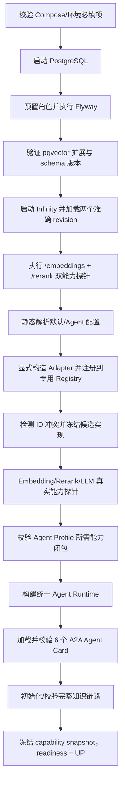

## 14. 测试环境统一检索推理服务设计

### 14.1 拓扑与选择说明

测试环境使用一个本地自托管 Infinity `retrieval-inference` 容器同时承载 Embedding 与 Rerank。该容器加载两个专用模型，通过同一基地址分别暴露 `/embeddings` 和 `/rerank`，按请求 `model` 路由。这样统一镜像、端口、缓存、健康检查和监控，同时保留两种模型的独立 revision、批量限制和调用账本。服务故障会同时影响两种能力，因此 readiness 必须整体置为 DOWN，禁止切换 Mock、向量直排或其他保底链路。



### 14.2 Docker Compose 结构基线

以下是核心结构；所有镜像 tag/digest 和模型 revision 在本地选型验收后锁定。空模型配置会明确失败，示例不伪造“已验证默认模型”。

```yaml
services:
  postgres:
    image: pgvector/pgvector:${PGVECTOR_IMAGE_TAG:?required}
    environment:
      POSTGRES_DB: opspilot
      POSTGRES_USER: opspilot_migrator
      POSTGRES_PASSWORD: ${POSTGRES_MIGRATOR_PASSWORD:?required}
      OPSPILOT_APP_PASSWORD: ${OPSPILOT_APP_PASSWORD:?required}
      SAMPLE_APP_PASSWORD: ${SAMPLE_APP_PASSWORD:?required}
      EVALUATION_DB_PASSWORD: ${EVALUATION_DB_PASSWORD:?required}
    volumes:
      - postgres-data:/var/lib/postgresql/data
      - ./postgres/init:/docker-entrypoint-initdb.d:ro
    networks: [opspilot-backend]
    healthcheck:
      test: ["CMD-SHELL", "pg_isready -U opspilot_migrator -d opspilot"]
      interval: 5s
      timeout: 3s
      retries: 20
    cpus: "${POSTGRES_CPUS:-2.0}"
    mem_limit: "${POSTGRES_MEM_LIMIT:-2g}"
    pids_limit: 256

  # 迁移使用一次性进程；长期运行的 Server 不持有 DDL/扩展权限。
  db-migrate:
    image: opspilot-server:local
    build:
      context: ..
      dockerfile: deployment/opspilot-server.Dockerfile
    entrypoint: ["/app/bin/opspilot-migrate"]
    environment:
      DB_URL: jdbc:postgresql://postgres:5432/opspilot
      DB_USERNAME: opspilot_migrator
      DB_PASSWORD: ${POSTGRES_MIGRATOR_PASSWORD:?required}
    depends_on:
      postgres:
        condition: service_healthy
    networks: [opspilot-backend]
    restart: "no"

  retrieval-inference:
    image: michaelf34/infinity:${INFINITY_IMAGE_TAG:?required}
    command: ["v2", "--host", "0.0.0.0", "--port", "7997"]
    environment:
      INFINITY_MODEL_ID: "${EMBEDDING_MODEL:?required};${RERANK_MODEL:?required};"
      INFINITY_SERVED_MODEL_NAME: "embedding;rerank;"
      INFINITY_REVISION: "${EMBEDDING_MODEL_REVISION:?required};${RERANK_MODEL_REVISION:?required};"
      INFINITY_BATCH_SIZE: "${EMBEDDING_BATCH_SIZE:-16};${RERANK_MAX_BATCH_SIZE:-16};"
      INFINITY_MODEL_WARMUP: "true;true;"
      INFINITY_ANONYMOUS_USAGE_STATS: "0"
    volumes:
      - retrieval-model-cache:/app/.cache
    networks: [opspilot-backend]
    cpus: "${RETRIEVAL_INFERENCE_CPUS:-4.0}"
    mem_limit: "${RETRIEVAL_INFERENCE_MEM_LIMIT:-10g}"
    pids_limit: 256

  # 同一个门禁必须证明两个模型均已加载且两种真实能力都可调用。
  retrieval-model-probe:
    image: curlimages/curl:${CURL_IMAGE_TAG:?required}
    depends_on:
      retrieval-inference:
        condition: service_started
    entrypoint: ["/bin/sh", "-ec"]
    command:
      - |
        i=0
        until curl -fsS http://retrieval-inference:7997/models >/tmp/models.json && \
          curl -fsS -X POST http://retrieval-inference:7997/embeddings \
          -H 'Content-Type: application/json' \
          -d '{"model":"embedding","input":["数据库连接池超时"]}' \
          >/tmp/embedding.json && \
          curl -fsS -X POST http://retrieval-inference:7997/rerank \
          -H 'Content-Type: application/json' \
          -d '{"model":"rerank","query":"数据库连接池超时","documents":["连接未归还","CPU 正常"]}' \
          >/tmp/rerank.json; do
          i=$$((i+1)); test $$i -lt 60 || exit 1; sleep 5
        done
        grep -q '"embedding"' /tmp/embedding.json
        grep -q '"index"' /tmp/rerank.json
        grep -q '"relevance_score"' /tmp/rerank.json
    networks: [opspilot-backend]
    restart: "no"

  opspilot-server:
    image: opspilot-server:local
    build:
      context: ..
      dockerfile: deployment/opspilot-server.Dockerfile
    environment:
      SPRING_PROFILES_ACTIVE: test
      DB_URL: jdbc:postgresql://postgres:5432/opspilot
      DB_USERNAME: opspilot_app_role
      DB_PASSWORD: ${OPSPILOT_APP_PASSWORD:?required}
      DEEPSEEK_API_KEY: ${DEEPSEEK_API_KEY:-}
      DEFAULT_LLM_MODEL: ${DEFAULT_LLM_MODEL:-}
      EMBEDDING_BASE_URL: http://retrieval-inference:7997
      EMBEDDING_MODEL: ${EMBEDDING_MODEL:-}
      RERANK_BASE_URL: http://retrieval-inference:7997
      RERANK_MODEL: ${RERANK_MODEL:-}
      RERANK_MODEL_REVISION: ${RERANK_MODEL_REVISION:-}
      MODEL_STARTUP_PROBE_ENABLED: "true"
      ARTIFACT_INPUT_ROOT: /datasets/input
      ARTIFACT_REPORT_ROOT: /artifacts/reports
    volumes:
      - agent-input:/datasets/input:ro
      - report-artifacts:/artifacts/reports
    depends_on:
      db-migrate:
        condition: service_completed_successfully
      retrieval-inference:
        condition: service_started
    ports:
      - "127.0.0.1:8080:8080"
    networks: [opspilot-backend]
    cpus: "${OPSPILOT_CPUS:-2.0}"
    mem_limit: "${OPSPILOT_MEM_LIMIT:-2g}"
    pids_limit: 256
    healthcheck:
      test: ["CMD", "wget", "-qO-", "http://localhost:8080/actuator/health/readiness"]
      interval: 10s
      timeout: 5s
      retries: 20

  # 五个专业 Agent 不是 opspilot-server 内的进程内快捷调用。完整的
  # evidence-agent/code-agent/knowledge-agent/diagnosis-agent/remediation-agent
  # Compose 定义、端口、角色和 Agent Directory 以第 24 章为权威基线。

  # 独立评测进程是 Ground Truth 隔离边界；Server 无该 schema/卷权限。
  opspilot-evaluation:
    image: opspilot-server:local
    profiles: ["evaluation"]
    entrypoint: ["/app/bin/opspilot-evaluate"]
    environment:
      DB_URL: jdbc:postgresql://postgres:5432/opspilot
      DB_USERNAME: evaluation_role
      DB_PASSWORD: ${EVALUATION_DB_PASSWORD:-}
      EVALUATION_RUN_ID: ${EVALUATION_RUN_ID:-}
      GROUND_TRUTH_ROOT: /datasets/ground-truth
      ARTIFACT_INPUT_ROOT: /datasets/input
      ARTIFACT_REPORT_ROOT: /artifacts/reports
    volumes:
      - ground-truth:/datasets/ground-truth:ro
      - agent-input:/datasets/input:ro
      - report-artifacts:/artifacts/reports
    depends_on:
      db-migrate:
        condition: service_completed_successfully
    networks: [opspilot-backend]
    restart: "no"

  sample-gateway:
    build: ../sample-system/sample-gateway
    environment:
      ORDER_BASE_URL: http://order-service:8080
      OTEL_EXPORTER_OTLP_ENDPOINT: http://otel-collector:4318
    depends_on:
      order-service: {condition: service_healthy}
    networks: [opspilot-backend]
    healthcheck:
      test: ["CMD", "wget", "-qO-", "http://localhost:8080/actuator/health/readiness"]
      interval: 10s
      timeout: 5s
      retries: 20

  order-service:
    build: ../sample-system/order-service
    environment:
      DB_URL: jdbc:postgresql://postgres:5432/opspilot?currentSchema=sample
      DB_USERNAME: sample_app_role
      DB_PASSWORD: ${SAMPLE_APP_PASSWORD:?required}
      INVENTORY_BASE_URL: http://toxiproxy:8666
      OTEL_EXPORTER_OTLP_ENDPOINT: http://otel-collector:4318
    depends_on:
      postgres: {condition: service_healthy}
      inventory-service: {condition: service_healthy}
      toxiproxy: {condition: service_started}
    networks: [opspilot-backend]
    healthcheck:
      test: ["CMD", "wget", "-qO-", "http://localhost:8080/actuator/health/readiness"]
      interval: 10s
      timeout: 5s
      retries: 20

  inventory-service:
    build: ../sample-system/inventory-service
    environment:
      DB_URL: jdbc:postgresql://postgres:5432/opspilot?currentSchema=sample
      DB_USERNAME: sample_app_role
      DB_PASSWORD: ${SAMPLE_APP_PASSWORD:?required}
      OTEL_EXPORTER_OTLP_ENDPOINT: http://otel-collector:4318
    depends_on:
      postgres: {condition: service_healthy}
    networks: [opspilot-backend]
    healthcheck:
      test: ["CMD", "wget", "-qO-", "http://localhost:8080/actuator/health/readiness"]
      interval: 10s
      timeout: 5s
      retries: 20

  prometheus:
    image: prom/prometheus:${PROMETHEUS_IMAGE_TAG:?required}
    volumes: ["./prometheus:/etc/prometheus:ro", "prometheus-data:/prometheus"]
    networks: [opspilot-backend]

  jaeger:
    image: jaegertracing/all-in-one:${JAEGER_IMAGE_TAG:?required}
    environment:
      SPAN_STORAGE_TYPE: badger
      BADGER_EPHEMERAL: "false"
      BADGER_DIRECTORY_VALUE: /badger/data
      BADGER_DIRECTORY_KEY: /badger/key
    volumes: ["jaeger-data:/badger"]
    networks: [opspilot-backend]

  otel-collector:
    image: otel/opentelemetry-collector-contrib:${OTEL_IMAGE_TAG:?required}
    volumes: ["./otel-collector/config.yaml:/etc/otelcol-contrib/config.yaml:ro"]
    depends_on: [jaeger]
    networks: [opspilot-backend]

  toxiproxy:
    image: ghcr.io/shopify/toxiproxy:${TOXIPROXY_IMAGE_TAG:?required}
    networks: [opspilot-backend]

  fault-lab-runner:
    build: ../fault-lab/scenario-runner
    profiles: ["fault-lab"]
    volumes:
      - agent-input:/datasets/input
      - ground-truth:/datasets/ground-truth
      - execution-artifacts:/datasets/execution
      - /var/run/docker.sock:/var/run/docker.sock
    networks: [opspilot-backend]

networks:
  opspilot-backend:
    # 测试 LLM 需要访问外部真实 Provider；生产用出口策略限制目的地址。
    internal: false

volumes:
  postgres-data:
  retrieval-model-cache:
  prometheus-data:
  jaeger-data:
  agent-input:
  ground-truth:
  execution-artifacts:
  report-artifacts:
```

`/app/bin/opspilot-migrate` 与 `/app/bin/opspilot-evaluate` 是镜像内明确入口：前者只执行 Flyway 后退出，后者校验非空评测密码/Run ID 后读取 Ground Truth 并写评测结果。Compose 中的 `wget`/健康命令必须由实际构建镜像提供；若运行镜像不含该二进制，改用镜像内 Java health probe，不能删除健康检查。Docker socket 只挂载给 Fault Lab，绝不挂给 OpsPilot Server、Evaluation 或 Agent Tool 容器。

### 14.3 服务依赖与资源

- PostgreSQL 健康后由一次性 `db-migrate` 运行 Flyway；Server 只持有 DML 账户，并检查 `vector` 扩展和 schema 版本。
- Infinity `/health` 或 `/models` 只证明进程和模型注册；`retrieval-model-probe` 必须分别调用真实 `/embeddings` 与 `/rerank` 并验证结构、维度、有限分数和索引。一次性 `retrieval-model-probe` 是部署前/Phase 0 资格门禁，不作为 Server/Agent 的 `service_completed_successfully` 启动依赖；Server/Agent 自身执行等价的运行时探针。模型身份、revision、维度或响应合同等确定性不兼容属于启动失败并非零退出；配置合法但端点暂时不可达时进程保持 liveness UP、readiness DOWN，并在恢复后重新探针，不接收新任务。
- `InfinityEmbeddingProvider` 将 OpenAI-aligned Embedding 响应映射为统一领域结果；`InfinityRerankProvider` 将 Cohere-aligned `results[index,relevance_score]` 映射为第 13 章结果。
- Embedding 和 Rerank 共享服务进程、端口和缓存卷，但使用两个锁定模型 revision、独立模型别名、批量限制和调用指标。压测必须验证并发资源竞争；资源不足时调低并发或扩大该服务资源，不能删除 Rerank 或改走其他链路。
- Infinity 整体不可用、任一模型未加载或任一能力探针失败时，统一检索推理 capability 为 DOWN；在途任务有限重试后显式失败。
- Server 只挂 Agent 输入只读卷和报告可写卷；独立 Evaluation 才能同时读取 Ground Truth，并只获写 `evaluation_result` 与评测 Artifact 所需权限。
- Server/Agent readiness 校验第 27 章 Source Registry：每个启用 Source 的 Adapter 存在、版本兼容、`connectionRef` 可解析且 capability probe 成功；Source 不可用时保留具体 `sourceId/sourceKind/adapterId`，不能只报告“可观测服务失败”。
- CPU-only 是可移植基线；GPU 通过单独 Compose override 显式配置。资源初值必须根据本地压测调整。
- 只有 API、Prometheus/Jaeger 调试端口在需要时绑定 `127.0.0.1`；数据库和模型端口默认不暴露宿主机。

## 15. 配置项与环境变量设计

### 15.1 环境分层

| 环境 | LLM | Embedding | Rerank | 规则 |
|---|---|---|---|---|
| 单元测试 | 测试类内 mock SPI 或构造领域结果 | 同左 | 同左 | 不注册可部署 Mock Provider，不声称验证真实模型 |
| 集成/本地测试 | DeepSeek 或其他已配置真实 Provider | 统一 Infinity `/embeddings` | 同一 Infinity `/rerank` | 两个专用模型、同一服务；缺模型/能力即失败，不允许 Mock 替代 |
| 生产 | 独立配置真实 Provider | 默认统一 Infinity | 默认同一 Infinity | 可显式替换 Provider；不能在运行时自动降级或切换 |

### 15.2 配置清单

| 变量 | 默认/示例 | 是否敏感 | 说明 |
|---|---|---|---|
| `DB_URL` | 无 | 否 | PostgreSQL JDBC URL |
| `DB_USERNAME` | 无 | 否 | 运行角色 |
| `DB_PASSWORD` | 无 | 是 | 外部注入 |
| `FLYWAY_USER` / `FLYWAY_PASSWORD` | 无 | 后者是 | 只注入一次性 `db-migrate`，绝不注入长期运行 Server |
| `OBSERVABILITY_SOURCE_CONFIG` | `/app/config/observability-sources.yaml` | 否 | 版本化 Source/Adapter/作用域/能力配置；只包含 `connectionRef`，不包含凭证 |
| `DEFAULT_LLM_PROVIDER` | `openai-compatible` | 否 | 默认 Chat 协议 |
| `DEFAULT_LLM_BASE_URL` | `https://api.deepseek.com` | 否 | API 根地址 |
| `DEEPSEEK_API_KEY` | 空 | 是 | 缺失时 fail-fast |
| `DEFAULT_LLM_MODEL` | 空 | 否 | 不猜测模型名 |
| `DEFAULT_LLM_TIMEOUT_SECONDS` | `60` | 否 | 单请求超时 |
| `DEFAULT_LLM_MAX_RETRIES` | `2` | 否 | 总尝试次数由实现语义明确 |
| `DEFAULT_LLM_MAX_CONCURRENCY` | `4` | 否 | Provider bulkhead |
| `DEFAULT_LLM_CONTEXT_WINDOW` | 空 | 否 | 必须通过配置/能力清单确认 |
| `INFINITY_IMAGE_TAG` | 空 | 否 | 验收后锁定 tag 和镜像 digest |
| `RETRIEVAL_INFERENCE_BASE_URL` | test: `http://retrieval-inference:7997` | 否 | Embedding/Rerank 共用服务地址 |
| `EMBEDDING_PROVIDER` | test: `infinity` | 否 | 与 LLM 独立 |
| `EMBEDDING_BASE_URL` | test: 同 `RETRIEVAL_INFERENCE_BASE_URL` | 否 | 不单独启动第二个服务 |
| `EMBEDDING_MODEL` / `EMBEDDING_MODEL_REVISION` | 空 | 否 | 本地验收后锁定准确身份 |
| `EMBEDDING_EXPECTED_DIMENSION` | 空 | 否 | 可选预期；必须与真实探针一致 |
| `EMBEDDING_BATCH_SIZE` | `16` | 否 | 仍受 Token/请求大小限制 |
| `RERANK_PROVIDER` | test: `infinity` | 否 | 与 Embedding 共用进程，领域 SPI 独立 |
| `RERANK_BASE_URL` | test: 同 `RETRIEVAL_INFERENCE_BASE_URL` | 否 | 指向同一 Infinity 服务 |
| `RERANK_MODEL` / `RERANK_MODEL_REVISION` | 空 | 否 | 未本地验证前不设默认 |
| `RERANK_MAX_DOCUMENTS` | `50` | 否 | 单请求候选上限 |
| `MODEL_STARTUP_PROBE_ENABLED` | test/prod: `true` | 否 | 不允许在集成环境关闭 |
| `ARTIFACT_INPUT_ROOT` | `/datasets/input` | 否 | Agent 可读根目录 |
| `ARTIFACT_REPORT_ROOT` | `/artifacts/reports` | 否 | Server 写 RCA、Evaluation 读写评测报告；独立卷 |
| `GROUND_TRUTH_ROOT` | 仅 Fault Lab/Eval | 否 | 不注入 Agent Server |
| `EVALUATION_DB_PASSWORD` | 空 | 是 | 只注入 PostgreSQL 初始化与独立 Evaluation 进程 |
| `EVALUATION_RUN_ID` | 空 | 否 | 启动评测 Profile 时必填；空值明确失败 |
| `AGENT_MAX_ROUNDS` | 配置化 | 否 | Supervisor 全局上限 |
| `AGENT_MAX_TOOL_CALLS` | 配置化 | 否 | Incident 上限 |
| `INCIDENT_MAX_TOKENS` | 配置化 | 否 | Incident 总预算 |

每个 Agent 的环境覆盖采用统一前缀（如 `AGENTS_SUPERVISOR_LLM_MODEL`），但推荐把非敏感稀疏覆盖导入 `agent_model_override`，避免维护大量重复变量。API Key 只引用 Secret Resolver 名称。

### 15.3 配置验证规则

- URL 必须是允许的 `https`；仅测试 Docker 内网模型允许 `http`。
- 模型名、Key、Timeout、并发、上下文、输入/输出/任务预算必须非空且在边界内。
- Agent 要求的 tool calls/structured output/stream 必须被选定具体模型的能力报告覆盖。
- Embedding 探针维度必须与 revision/可选预期一致；Rerank 必须输出真实有限分数和稳定索引映射。
- 任何配置错误返回具体路径和错误码；敏感值统一显示为 `***`。

## 16. 初始化与启动流程

### 16.1 启动顺序



具体步骤：

1. Compose 展开配置时先检查数据库密码、镜像 tag、模型 ID/revision；缺失直接停止。
2. PostgreSQL init 脚本只预置数据库/角色；Flyway migration role 创建扩展、schema、表、约束和关系索引。
3. 应用以 `ddl-auto=validate` 验证 ORM，不允许 Hibernate 自动改表。
4. Infinity 按两个准确 revision 下载到统一缓存并分别预热；镜像 digest、模型 revision 和模型缓存哈希写入部署清单。
5. 应用合并 Bootstrap 配置、PostgreSQL 非敏感配置和 6 个 Agent 稀疏覆盖，生成去密钥有效配置；`opspilot-server` 作为唯一 composition root 显式构造选定 Adapter。
6. 各专用 Registry 注册实现并检查稳定 ID、合同 major 和重复项；冲突或 required 实现缺失时直接退出，不以扫描/Bean 顺序覆盖。
7. Secret Resolver 检查所有启用 Provider 的 Key 引用；外部 LLM model/Key 为空时进程非零退出。
8. Provider/Source/Code/Sandbox Registry 对默认 Profile 的能力闭包执行真实探针：Embedding 检查维度；Rerank 检查排序；LLM 检查 Chat/Tool/Structured/Stream；Source 检查受信端点和最小查询。任一 required 链路失败都阻止 readiness。
9. Embedding 合同写入/核对 `embedding_model_revision`。已有同 identity 但维度不同则失败并要求新 revision，不覆盖旧记录。
10. 校验每个 `AgentProfile` 的 Tool、Provider、输入输出 Schema、预算和权限引用均能从已探针 Registry 解析，再构建统一 Agent Runtime；新增 Adapter 不会自动扩大 Agent 动作空间。
11. 从受信目录获取六个 Agent Card，校验 A2A 1.0、HTTP+JSON interface、skill、媒体类型、安全要求、URL allowlist 和卡摘要；核心 skill 缺失时 readiness 为 DOWN。
12. 若知识库为空，完整执行 Embedding/Rerank 探针后登记 `KB_EMPTY` 并允许系统启动；若已有 collection，则校验 active revision 和向量覆盖。空库是数据状态，不是技术链路故障。
13. 只有数据库、状态持久化、LLM、Embedding、Rerank、Supervisor 和全部专业 Agent A2A skill 有效时才冻结 capability snapshot 并置 readiness 为 UP；首次 Incident 执行仍检查近期健康。

### 16.2 健康端点

- `/actuator/health/liveness`：进程、事件循环和关键线程；外部模型短时不可达不触发容器杀进程循环。
- `/actuator/health/readiness`：完整链路门禁，包括 PostgreSQL、Flyway、状态持久化、LLM、Embedding、Rerank、Supervisor 和全部 A2A skill。空知识库/零历史案例不会置 DOWN，Provider 或协议故障必须置 DOWN。
- `/actuator/health/capabilities`：分别返回各真实能力 `UP|DOWN`、模型/revision、Agent Card/skill 状态和脱敏原因；不提供 `DEGRADED` 运行模式。
- `/actuator/health/models`：仅管理访问，返回 capability、model/revision、最近探针时间和脱敏错误；不返回 Key、Prompt 或敏感 URL 参数。
- Infinity 的进程健康与真实双能力健康分开；只有 `/embeddings` 和 `/rerank` 使用各自锁定模型的自测都通过，检索推理服务才 ready。

### 16.3 A2A 初始化

启动时从第 24.2 节定义的只读配置构建受信 Agent Directory 和 A2A Client。Supervisor 位于 `opspilot-server`，五个专业 Agent 使用独立 Compose 服务和 origin。每个 Agent Server 先恢复自己的 A2A Task Store，再开放 Agent Card 与任务端点。能力探针必须执行一次真实的最小 `message:send → tasks/{id} → cancel` 合同；开启 streaming 的 Agent 还需验证 stream/subscribe。所有委派必须经 Compose 网络 HTTP 调用，禁止用 Spring Bean 直调绕过协议。

### 16.4 AgentScope 初始化

AgentScope Java 的框架对象只在专用 Registry、固定安全中间件、状态仓库和 Agent Profile 就绪后构建。实现前必须通过 Maven 构建和合同测试确定可解析版本、Artifact 坐标、结构化输出、工具调用、事件流和许可证。框架 API 适配只允许修改 `opspilot-agent-runtime-agentscope`。
