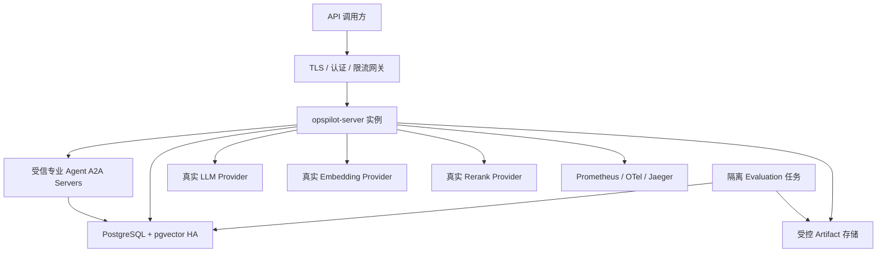

## 21. 部署方案

### 21.1 本地测试部署

本地以第 14 章 Compose 为唯一主路径：

```powershell
docker compose -f deployment/docker-compose.yml config
docker compose -f deployment/docker-compose.yml up -d postgres db-migrate retrieval-inference retrieval-model-probe
docker compose -f deployment/docker-compose.yml up -d prometheus jaeger otel-collector toxiproxy inventory-service order-service sample-gateway evidence-agent code-agent knowledge-agent diagnosis-agent remediation-agent opspilot-server
docker compose -f deployment/docker-compose.yml --profile fault-lab run --rm fault-lab-runner
docker compose -f deployment/docker-compose.yml --profile evaluation run --rm opspilot-evaluation
```

实际 README 需补充模型选择验收后的 `.env.example`（只有变量名和空值）、健康检查、场景执行、SSE、报告、评测与清理命令。清理数据卷属于破坏性动作，必须单独说明并要求显式确认。

### 21.2 生产逻辑拓扑



生产模型地址和密钥全部外部注入。默认由统一 Infinity 服务提供 Embedding 与 Rerank，Chat LLM 独立；若显式更换 Provider，仍必须通过完整合同和真实能力探针，运行时不得自动切换。

### 21.3 PostgreSQL 部署与备份

- 单一 PostgreSQL 集群按 schema/角色隔离业务、Sample、RAG 与 Evaluation；pgvector 数据参与 WAL、备份与恢复。
- 生产使用连接池、TLS、监控、定期全量备份 + WAL/PITR，并演练恢复后扩展/索引/active revision 一致性。
- Flyway 先向后兼容加表/列，再发布应用，再清理旧结构；ANN 用独立 admin job `CREATE INDEX CONCURRENTLY`。
- **待确认：**PostgreSQL HA、RPO/RTO、实例/磁盘规格、备份周期和 Artifact 对账策略。

MVP 的“数据库连接池耗尽”是 `order-service` 应用连接使用故障，不停止共享 PostgreSQL。若后续需要停止/破坏数据库实例级故障，为避免连带破坏 OpsPilot 自身状态库，应通过 ADR 增加独立 Sample PostgreSQL；届时必须说明额外部署、备份、监控和一致性成本，不能默认引入。

### 21.4 扩缩容与发布

本节描述运行环境具备的发布/回滚能力，不授权 GitHub Actions 自动操作环境。CI 和持续交付边界以第 26 章为准：GitHub 生成 `READY_FOR_MANUAL_DEPLOYMENT` 候选后停止，部署、数据库迁移和回滚均由外部人工运维流程执行。

- OpsPilot Server 可水平扩展，任务由 PostgreSQL task 租约领取，状态/事件不依赖本地内存；Agent 间委派通过 A2A，产品 SSE 断线后从数据库重放。
- 专业 Agent 可从同容器的独立端口逐步拆为独立进程/容器；无论部署形态如何都使用相同 A2A HTTP+JSON 合同、服务身份和 Task Store，禁止部署优化改变通信语义。
- Embedding/Rerank 独立扩容；同 revision 实例必须返回相同能力合同。部署新权重时先探针，再旁路重向量化/质量验证，再切 active revision。
- Provider 并发限制按端点共享，实例数增加不能突破供应商总配额；需要数据库或集中配额策略时再实现，MVP 可单实例。
- 发布失败回滚应用镜像；数据库使用向后兼容迁移；知识检索可把 collection 指针和 `searchable` 原子切回旧 revision。

### 21.5 Artifact 与可观测数据

- 本地使用隔离卷；生产介质 **待确认**。若采用对象存储，需要另行说明加密、签名 URL、生命周期、备份、网络和一致性成本。
- PostgreSQL Artifact 元数据与实际对象按 SHA-256 定期对账；Ground Truth 与 Agent input 使用不同凭证/前缀。
- Prometheus 与 Jaeger 设置明确保留期，不能承担业务审计真源；审计和模型 Usage 仍在 PostgreSQL。

### 21.6 建议实施顺序

1. 执行第 24 章 Phase 0：锁定依赖和镜像，完成 AgentScope/A2A/模型探针 Spike，校验 OpenAPI/JSON Schema；门禁未通过不得进入完整功能开发。
2. 初始化 Maven 多模块、JDK 21、代码规范；建立 PostgreSQL/pgvector、Flyway、四个 schema、六个 A2A 角色、核心/Source Registry/Resource/Observation/Evidence/模型/RAG/Sample 表及 Testcontainers，并先锁定单活动 Run、来源追溯和 Artifact 存储抽象。
3. 实现首期 Java Sample System、OTel/Prometheus/Jaeger、测试故障接口，以及 Prometheus/Jaeger/JSONL/Actuator/Compose Adapter 和共享合同测试。
4. 实现三类 Provider SPI、真实探针、DeepSeek 默认配置，以及同时加载 Embedding/Rerank 的统一 Infinity Compose。
5. 实现文档版本、精确 pgvector 召回、Rerank、引用和重新向量化。
6. 实现状态机、PostgreSQL task/state/event、Token Budget、Tool Runtime 和 6 个 Agent；同时实现锁定 A2A 1.0.1 的 contract/client/server adapter、Agent Card、Task Store 和协议合同测试。
7. 实现 Fault Lab、3 个场景、Artifact/Ground Truth 隔离、RCA 与 Evaluation。
8. 按第 25 章运行每场景 5 次质量 Run、技术失败矩阵和恢复测试；只有所有硬门禁和聚合阈值通过才发布。
9. 按第 26 章实现 GitHub CI 与持续交付，生成不可变 OCI digest、SBOM、测试证据和 Release Manifest；流水线不得自动部署任何环境。

每阶段输出实际文件、命令和测试结果，不能只报告计划。完成定义以真实构建/运行证据为准。

### 21.7 人工部署原则

- GitHub Actions 不持有目标环境凭证，不创建部署 Workflow；
- 运维人员领取第 26 章发布候选，校验 Manifest、digest、来源证明和 Runbook 后，在 GitHub 流水线之外执行；
- 运行环境只接受明确 OCI digest，不接受 `latest` 或可变 Tag；
- 实际部署记录属于环境审计事实，不反写或伪装成 CI 构建结果；
- 自动部署若成为未来需求，必须单独 ADR 和安全审查，不能在现有持续交付 Job 中直接增加部署步骤。
