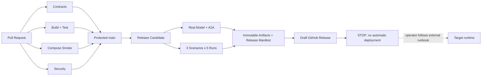

## 26. CI、持续交付与发布治理

### 26.1 定义、目标与明确边界

OpsPilot 使用 GitHub Actions 实现持续集成（CI）和持续交付（Continuous Delivery）。本项目中的 CD **不表示持续部署（Continuous Deployment）**：流水线的终点是生成可验证、不可变、可由运维人员领取的发布候选，不自动把任何内容部署到开发、测试、预生产或生产运行环境。

目标：

- 每个合并都经过相同的合同、构建、测试、数据库和安全门禁；
- 同一源码提交只构建一次，输出 JAR、OCI 镜像、SBOM、测试证据和 Release Manifest；
- 发布候选能够追溯到精确 commit、Workflow、依赖锁、镜像 digest、模型 revision、数据库迁移和评测 Profile；
- 运维人员可以在 GitHub Actions 之外，按 Runbook 验证签名和 digest 后实施部署或回滚；
- CI 失败、未运行、因条件不满足而阻塞、人工取消必须是四种不同状态，禁止把未执行显示为通过。

非目标和强制禁令：

- 不创建 `deploy.yml`，GitHub Actions 不执行 `docker compose up` 到远程主机、`kubectl apply`、Helm upgrade、SSH、云平台部署 API 或数据库生产迁移；
- GitHub Repository/Environment 不保存目标环境的 SSH Key、Kubeconfig、云部署凭证或生产数据库 DDL 凭证；
- Tag、GitHub Release、合并到 `main` 均不能自动触发环境部署；
- 流水线不自动提升 `latest`、不覆盖既有镜像 Tag、不改变运行环境中的模型、配置或知识库 active revision；
- “生成发布候选”和“批准/执行部署”是两个审计主体、两个工具边界和两个独立过程。

### 26.2 权威流水线清单

代码骨架建立后创建以下 Workflow；文件名和职责属于首版稳定工程合同：

| Workflow | 触发 | 运行内容 | 结果用途 |
|---|---|---|---|
| `.github/workflows/contracts.yml` | PR、`main` push | OpenAPI lint；全部 JSON Schema 编译；场景、Ground Truth、Evaluation Profile、Release Manifest 示例校验；Markdown 链接检查 | PR 必需检查 |
| `.github/workflows/build-test.yml` | PR、`main` push | JDK 21 Maven `verify`；Python lint/pytest；单元测试；架构规则；pgvector Testcontainers；Flyway 空库、前版升级、权限和并发测试 | PR 必需检查 |
| `.github/workflows/compose-smoke.yml` | PR、`main` push | 构建 OCI 镜像；`docker compose config`；启动 PostgreSQL、Sample/观测基础设施和不依赖真实模型的组件；验证镜像入口、健康检查和 Migration | PR 必需检查；不创建 Incident、不注册 Fake Provider、不得冒充模型/E2E 通过 |
| `.github/workflows/security.yml` | PR、`main` push、每周定时 | 依赖与许可证审查、Secret 扫描、SAST、镜像漏洞扫描、SBOM 生成校验 | PR/发布安全门禁 |
| `.github/workflows/model-integration.yml` | `workflow_dispatch`、`main` 定时、发布候选调用 | 真实 Chat/Embedding/Rerank、六个 A2A endpoint、断链失败语义和模型探针 | 发布候选必需检查 |
| `.github/workflows/evaluation.yml` | `workflow_call`、`workflow_dispatch`、每日定时 | 三场景各 5 次、恢复验证、确定性指标和硬门禁 | 发布候选必需检查 |
| `.github/workflows/release-candidate.yml` | `vX.Y.Z-rc.N` Tag 或显式手工触发 | 调用/核验全部发布门禁；构建并推送不可变 OCI；生成 SBOM、证明、Release Manifest 和 Draft GitHub Release | 持续交付终点，不部署 |

`release-candidate.yml` 只接受指向受保护 `main` 历史提交的签名 Tag。正式 `vX.Y.Z` Release 只能复用已通过的 RC commit 与镜像 digest，不允许重新构建或改变任何 Artifact；若源码、依赖或配置发生变化，必须产生新的 RC。

### 26.3 流水线依赖关系

图中的虚线不是 Workflow Job。GitHub 只记录发布候选已可领取，目标环境的变更单、批准、部署、迁移、验证和回滚记录由外部运维流程保存。

### 26.4 PR 检查、分支规则与状态语义

`main` 禁止直接 push，至少要求一名非作者审查，并要求以下 Checks 成功：`contracts`、`build-test`、`postgres-integration`、`compose-smoke`、`security-policy`。合并使用 squash 或 merge commit 由仓库统一选择；无论采用哪种策略，Release Manifest 必须记录最终 `main` commit SHA。

检查状态定义：

| 状态 | 含义 | 是否允许合并/交付 |
|---|---|---|
| `PASSED` | Job 实际执行且全部断言通过 | 允许进入下一门禁 |
| `FAILED` | 构建、断言、阈值或安全策略失败 | 禁止 |
| `BLOCKED` | 缺少受控 Runner、Secret、模型、人工授权或上游制品 | 禁止发布；不能转换成成功 |
| `NOT_APPLICABLE` | 经版本化规则证明与本次变更无关 | 仅非必需 Job 可用，必须记录规则和原因 |
| `CANCELLED` | 人工或并发策略取消 | 禁止，除非有同 commit 的后续成功运行替代 |

必需 Job 禁止 `continue-on-error`。路径过滤只能减少文档类 PR 的重型 Job，但 `contracts.yml` 永远执行；任何影响 `pom.xml`、Dockerfile、Compose、Flyway、Provider、Agent、Tool、Scenario、Evaluation 或 Workflow 的变更必须运行完整 PR 门禁。

### 26.5 Runner 与信任边界

- 普通 PR 在 GitHub 托管 Linux Runner 上执行合同、Maven、Testcontainers 和轻量 Compose，保证不依赖开发者 Windows 环境；本地 PowerShell 命令需有等价的跨平台脚本或 Maven/容器入口。
- 真实模型、GPU/大内存、本地故障实验使用仓库专属、临时化的 self-hosted Runner。Runner 不与生产网络连通，不挂载开发者目录，不持有生产凭证，Job 结束后清理容器、工作区和临时 Secret。
- 来自 Fork 或不受信 Actor 的 PR 永远不能取得 Repository/Environment Secret，也不能调度含长期凭证的 self-hosted Runner。
- 模型 Job 的 Secret 只允许访问测试 Provider/配额；Ground Truth 通过独立只读凭证挂载给 Evaluation，Agent 进程无法访问。
- 并发组按 `workflow + ref` 取消过时 PR 运行；Release Candidate Job 不允许被另一个 Tag 隐式取消。

### 26.6 Workflow 和供应链安全

1. 顶层 `permissions: contents: read`；只有推送 GHCR、生成证明或创建 Draft Release 的独立 Job 获得最小写权限。
2. 所有第三方 Action 锁定完整 commit SHA，并由 Dependabot 或受控变更更新；Tag 只写在注释中方便识别。
3. 禁止把 PR 标题、分支名、Issue 内容和模型输出未经引用直接插入 `run` Shell；参数通过环境变量传入并按输入类型校验。
4. 构建使用 Maven Wrapper、锁定 JDK distribution/版本、`versions.lock.yaml` 和 OCI base image digest；禁止浮动 `latest`。
5. Cache 只优化下载，不能作为发布输入事实源；Cache miss 后必须能从空缓存构建。Fork PR 不写入受信 Cache。
6. CI 日志、Artifact、测试报告和 SBOM 不得包含 Key、Prompt 中的敏感原文、生产数据或完整模型响应。
7. 依赖审查阻止新增达到策略级别的已知漏洞或不兼容许可证；例外必须有到期时间、责任人和 ADR/风险接受记录。

### 26.7 构建一次与不可变制品

发布候选以 `sourceCommit` 为唯一源码身份。构建 Job 输出：

- Maven JAR/测试报告；
- 一个复用代码的 OpsPilot OCI 镜像，以不同 `AGENT_ID` 启动六个角色；
- Fault Lab/Evaluation 等独立镜像；
- OpenAPI/JSON Schema 合同包；
- SPDX 或 CycloneDX SBOM；
- License 和漏洞扫描报告；
- 模型探针与 15 次评测结果摘要及原始 Artifact 哈希；
- 数据库 Migration 包和升级测试证据；
- 符合 `contracts/schemas/release-manifest.schema.json` 的 Release Manifest。

OCI 发布到 GHCR 时使用版本 Tag 便于发现，但部署和回滚只能引用 `ghcr.io/...@sha256:<digest>`。GitHub Actions Artifact 仅用于中间传递和审计，不作为长期可部署地址；长期发布候选由 OCI Registry、GitHub Release 和受控 Artifact 存储共同保存。

### 26.8 数据库交付门禁

Release Candidate 必须对 Migration 包执行：

1. 从空库迁移到目标版本；
2. 从当前受支持的生产前一版本升级到目标版本；
3. 使用旧应用版本连接扩展后的数据库执行最低回归，证明 expand 阶段向后兼容；
4. 使用新应用执行完整集成测试和单活动 Run 并发测试；
5. 扫描删除表/列、收紧非空、改类型、重命名和不可逆 DDL；首版交付候选中 `destructiveChanges` 必须为 `false`；
6. 生成供运维执行的迁移命令、预检查、预计锁影响、备份要求、验证 SQL 和停止/回滚条件，但不连接目标数据库执行。

如果需要 contract/cleanup 阶段删除旧结构，它必须成为独立发布、经过 ADR 和维护窗口批准，不能与首次使用新字段的应用版本放在同一候选中。

### 26.9 Release Manifest 与交付状态

Release Manifest 是交付候选的机器可读索引，至少记录：

- release/version、源码仓库、完整 commit SHA、Tag、Workflow run；
- 每个 JAR、OCI、合同包、Migration、SBOM、测试证据的 URI 和 SHA-256；
- `versions.lock.yaml` digest、JDK、基础镜像和模型 immutable revision；
- 合同、单元、集成、安全、模型、A2A、场景评测的独立结果；
- 数据库 baseline/target、Migration digest、向后兼容结论和 destructive DDL 结论；
- Evaluation Profile 和三个 Scenario version；
- `automaticDeployment=false`、`deploymentPerformed=false` 和外部 Runbook Artifact。

只有所有必需门禁 `PASSED` 时 `deliveryStatus` 才能为 `READY_FOR_MANUAL_DEPLOYMENT`。任一门禁 `BLOCKED/FAILED/CANCELLED` 时只能生成诊断 Artifact，不能生成可交付 Release。

### 26.10 人工部署交接和回滚边界

持续交付完成后，运维人员在 GitHub Actions 之外执行：

1. 校验 Tag/commit、Release Manifest Schema、Artifact digest、SBOM 和来源证明；
2. 创建变更单并取得目标环境批准；
3. 按 Runbook 备份并执行数据库 expand Migration；
4. 使用 Manifest 中同一 OCI digest 更新环境配置；
5. 执行 readiness、最小 Incident、SSE、引用和审计 Smoke；
6. 记录实际环境、操作者、开始/结束时间、部署结果和最终 digest；
7. 失败时按 Runbook 回滚应用 digest；数据库只允许使用预先验证的兼容路径，不自动执行破坏性 down migration。

GitHub Release 中可以附带部署命令模板，但命令必须包含显式占位符，不能内嵌目标地址或凭证，也不能由 Workflow 执行。后续如希望引入自动部署，必须新建 ADR、威胁模型、环境权限设计和恢复演练，并重新审查本章；不能通过给现有 Job 增加一步部署命令实现。

### 26.11 实施顺序与完成定义

1. 文档阶段：冻结本章、Release Manifest Schema 和示例。
2. Phase 0：先实现 `contracts.yml`；创建 Maven 骨架后实现 `build-test.yml` 和 `security.yml`。
3. Compose vertical slice 可运行后实现 `compose-smoke.yml`。
4. 真实 Provider/A2A/Scenario 可运行后实现模型、Evaluation 和 Release Candidate Workflow。
5. 配置 `main` Ruleset 和必需 Checks；使用一个失败样例证明门禁会阻止合并。
6. 用 `v0.1.0-rc.1` 演练从干净 commit 生成完整候选，并证明没有 Workflow 持有部署凭证或访问目标环境。

CI/CD 设计完成的验收条件：上述 Workflow 有明确负责人和超时；同 commit 可重复得到相同代码/配置身份；所有必需状态真实可区分；Release Manifest 通过 Schema；RC 包含不可变 digest、SBOM、迁移与评测证据；流水线在生成 Draft Release 后停止，目标环境保持不变。

### 26.12 官方依据

- GitHub Actions Maven 构建与测试：https://docs.github.com/en/actions/tutorials/build-and-test-code/java-with-maven
- GitHub Actions 安全使用：https://docs.github.com/en/actions/reference/security/secure-use
- GitHub Dependency Review：https://docs.github.com/en/code-security/concepts/supply-chain-security/dependency-review
- GitHub Artifact Attestations：https://docs.github.com/en/actions/how-tos/secure-your-work/use-artifact-attestations/use-artifact-attestations
