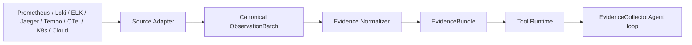

## 27. 分布式目标系统与可观测数据适配

### 27.1 产品边界

OpsPilot 的产品边界是**面向分布式、跨语言系统的故障诊断与修复建议**。OpsPilot Server、首期 Agent 运行时和 Sample System 使用 Java/JDK 21 是实现与验收选择，不构成被诊断系统的接入前提。被诊断对象可以由 Java、Go、Python、.NET、Node.js 或其他技术构成，只要能够通过受信 Adapter 提供本章定义的拓扑和可观测能力。

首期验收边界保持收敛：

- 使用 Java/Spring Boot 的 `sample-gateway`、`order-service`、`inventory-service` 构造三个确定性故障场景；
- 使用 Prometheus、Jaeger、OpenTelemetry Collector、受控 JSONL、Spring Actuator 和 Docker Compose Adapter；
- 使用 Java 代码搜索和 Maven 沙箱验证代码级能力；
- 首期不承诺所有语言和数据源已经实现，但核心领域、Agent、RCA、Evaluation、A2A 和 Tool 合同不得依赖 Java、Spring、PromQL、Jaeger API 或 Maven 类型。

### 27.2 四层解耦边界

| 层 | 稳定职责 | 禁止泄漏 |
|---|---|---|
| 目标系统模型 | 系统、服务、实例、端点、集群、数据存储、消息队列和依赖关系 | Java class、Spring Bean、Pod SDK 对象 |
| 可观测能力 | 查询日志、指标、Trace、事件、健康、配置和拓扑 | PromQL、LogQL、Elasticsearch DSL、Jaeger DTO |
| Source Adapter | 把特定信息源请求/响应转换成 `ObservationBatch` | 凭证、未经校验的外部对象、厂商异常 |
| Evidence/Agent | 把 Observation 校验为 Evidence，供 Tool Runtime 和 Agent loop 使用 | 原始数据源响应、Adapter client、厂商分页状态 |

Java 代码分析、Spring 健康检查和 Maven 测试是能力 Adapter，不是核心流程的必需类型。未配置某语言 Adapter 时，该能力按第 17.4 节矩阵记录为不可用或条件缺失，不能阻塞与语言无关的日志、指标、Trace 和拓扑诊断，也不能伪造代码级结论。

### 27.3 统一资源与拓扑模型

所有 Observation 和 Evidence 使用稳定 `ResourceRef`，至少包含：

```text
resourceId       平台分配或接入配置声明的稳定 ID
resourceType     SYSTEM/SERVICE/INSTANCE/ENDPOINT/POD/CONTAINER/NODE/
                 CLUSTER/NAMESPACE/DATASTORE/QUEUE/EXTERNAL_DEPENDENCY
systemId         所属目标系统
serviceName      逻辑服务名，可空
environment      development/test/staging/production 等受控值
cluster/namespace/region/tenant/account/project   可选作用域
attributes       受 allowlist 约束的低基数字段
```

`resourceId` 不能直接使用短暂 Pod IP、容器 ID 或 Java 类名；实例替换后逻辑 Service 身份保持稳定，瞬时实例通过独立 `INSTANCE/POD/CONTAINER` Resource 关联。拓扑关系使用版本化枚举，如 `CALLS`、`DEPENDS_ON`、`RUNS_ON`、`READS_FROM`、`WRITES_TO`、`PUBLISHES_TO`、`CONSUMES_FROM`。`TopologyQueryTool` 返回受控拓扑 Artifact/Observation，不把 Kubernetes SDK 对象直接交给 Agent。

### 27.4 采集到 Agent 的数据路径



外部数据不得直接转换成 A2A Message 或 Agent loop 控制消息。A2A 只传递 Agent 任务、状态和版本化 Artifact；Tool Runtime 只向 Agent 返回摘要、`EvidenceBundle`/Artifact 引用和明确缺失项。这样可以在进入模型前完成 Schema 校验、脱敏、限长、去重、时间对齐、来源追溯和 Prompt Injection 隔离。

首期稳定 Port：

```java
public interface ObservabilitySourceAdapter {
    SourceDescriptor descriptor();
    ObservationBatch query(ObservationQuery query, SourceExecutionContext context);
}

public interface EvidenceNormalizer {
    EvidenceBundle normalize(List<ObservationBatch> batches, NormalizationContext context);
}
```

`ObservationQuery` 表达资源、信号类型、时间窗和版本化 `queryTemplateId + typed parameters`。模型不能提交任意 PromQL、LogQL、DSL、SQL 或 URL；Adapter 根据 Source Registry、权限上下文和模板版本生成厂商查询。

### 27.5 Source Registry 与 Adapter 选择

Source Registry 保存受控信息源配置：`sourceId`、`sourceKind`、启用状态、能力集合、`connectionRef`、作用域、Adapter ID/version、超时、并发限制、数据分级和健康状态。Secret Manager/环境变量解析 `connectionRef`；数据库、Observation、日志和 Agent 上下文都不得保存连接凭证。

Source Registry 是第 28 章的专用 Registry：Adapter 由 composition root 显式装配，启动时检测重复 ID、执行共享合同探针并冻结；MVP 不使用通用 Extension Host、classpath 自动发现或运行时热替换。Source 配置可以增删实例，但 Adapter 实现集合的变化必须重启并生成新的 capability snapshot。

选择流程是确定性的：

1. Tool request 给出 Resource、信号类型、时间窗和查询模板；
2. Tool Runtime 从目标系统拓扑和 Source Registry 找出作用域匹配且 READY 的 Source；
3. 按配置优先级和场景 required source 选择 Adapter，不由模型生成 source URL；
4. 每次 Adapter 调用生成一个 `ObservationBatch`；
5. 多信息源结果只在 `EvidenceNormalizer`/`EvidenceBundle` 聚合。

同一 Resource/Signal 配置多个 Source 时，必须声明 `PRIMARY`、`CORROBORATING` 或 `FALLBACK_DISABLED`。首版禁止在技术失败时静默切换数据源；只有场景明确要求多源交叉验证时才能并行查询，并分别保留来源和失败结果。

### 27.6 ObservationBatch 与来源追溯

机器合同为 `contracts/schemas/observation-batch.schema.json`。一个普通 `ObservationBatch` 只能代表**一次 Adapter 调用和一个确定的信息源**，Batch 级 `source` 必须包含：

- `sourceId`：具体实例的稳定 ID，例如 `prod-prometheus-cn-east-1`；
- `sourceKind`：`PROMETHEUS/LOKI/ELASTICSEARCH/JAEGER/TEMPO/OPENTELEMETRY/KUBERNETES/CLOUDWATCH/AZURE_MONITOR/GOOGLE_CLOUD_MONITORING/FILE/HTTP/CUSTOM`；
- `adapterId/adapterVersion`：执行转换的 Adapter 及合同版本；
- `connectionRef`：受控配置引用，不是 URL、Token 或密码；
- `environment + scope`：环境、集群、Namespace、地域、租户、账号/订阅/项目；
- `query.templateId/parameterHash/timeWindow`、`collectedAt` 和可选上游 request ID。

每条 `ObservationRecord` 包含 `observationId`、`signalType`、`ResourceRef`、业务观测时间、脱敏摘要、原始 Artifact 引用、允许的结构化属性和 `freshness/complete/truncated/sampleRate/warnings` 质量信息。大正文、全量时序点和 Span 图只放受控 Artifact。

若一个联邦/Cloud Adapter 的单次响应内部来自多个底层系统，Batch 的 `source` 表示联邦入口，每条 Record 必须额外填写实际 `originSource`。没有 `originSource` 时，Record 继承 Batch source。禁止把 Prometheus、Loki、Jaeger 的独立调用人为拼成一个 Batch。

### 27.7 Observation 到 Evidence

Observation 是“信息源实际返回了什么”；Evidence 是“经过验证后可支持或反驳根因的事实”。`EvidenceNormalizer` 至少执行：

1. Schema、Source READY 状态、Adapter version 和 Resource 归属校验；
2. UTC 时间标准化、Incident window 重叠与时钟偏移标记；
3. 敏感数据脱敏、内容限长、Artifact 哈希和访问权限校验；
4. 同源去重和跨源相关，不把相同 OTel 数据经 Prometheus/Jaeger 二次导出误算为独立证据；
5. freshness、completeness、sampling、truncation 和查询覆盖率判断；
6. 生成不可变 Evidence 和 `sourceObservationRefs`；无法形成事实的 Observation 仍可审计保存，但不能进入根因引用。

`EvidenceBundle` 合同为 `contracts/schemas/evidence-bundle.schema.json`。每条 Evidence 必须通过 `batchId + observationId + sourceId` 回溯；跨源结论包含多个引用。最终 RCA 因而能够区分“Prometheus 指标支持、Loki 日志交叉验证、Jaeger Trace 反驳”和“某数据源不可用/超时/覆盖不足”。

### 27.8 去厂商化 Tool 合同

Agent 可见 Tool 名使用能力名称，Adapter 才使用产品名称：

| Agent Tool | 首期 Adapter | 后续可扩展 Adapter |
|---|---|---|
| `LogQueryTool` | `JsonlLogAdapter` | Loki、Elasticsearch/OpenSearch、Cloud Logging |
| `MetricQueryTool` | `PrometheusMetricAdapter` | CloudWatch、Azure Monitor、Google Cloud Monitoring |
| `TraceQueryTool` | `JaegerTraceAdapter` | Tempo、OTel/厂商 APM |
| `HealthQueryTool` | `SpringActuatorHealthAdapter`、`HttpHealthAdapter` | Kubernetes Probe、云负载均衡健康 |
| `TopologyQueryTool` | `StaticComposeTopologyAdapter` | Kubernetes、Service Catalog、CMDB、云资源图 |
| `ConfigReadTool` | 受控 Spring/文件配置 Adapter | Kubernetes Config、配置中心 Adapter |
| `CodeSearchTool` | `JavaCodeSearchAdapter` | Go/Python/.NET/Node Adapter |
| `SandboxTestTool` | `MavenTestAdapter` | Gradle/pytest/go test/dotnet test Adapter |

`KnowledgeSearchTool` 属于 OpsPilot 内部知识能力，不通过 Observability Adapter。Tool 的通用结果包含 `observationBatchIds`、`evidenceBundleId`、Artifact/Evidence 引用和状态；Agent 不读取 Adapter 原始响应。

### 27.9 失败语义

- Source 未配置：返回 `SOURCE_NOT_CONFIGURED`，按能力矩阵判断 `missingEvidence` 或失败；
- Source 不健康/超时/鉴权失败：生成关联 `ChainFailure`，不得伪装为空结果；
- 查询成功但没有记录：Batch 合法且 observations 为空，Tool 结果为 `EMPTY`；
- Schema/来源/Artifact 哈希无效：拒绝整个 Batch，返回 `OBSERVATION_BATCH_INVALID`；
- 单条 Record 无效：默认拒绝整个 Batch；若某 Adapter 合同明确允许部分结果，必须记录 rejected count/原因并使 `complete=false`；
- 联邦结果缺少 `originSource`：拒绝对应 Record，不能把联邦入口冒充实际来源；
- Source 技术失败时禁止自动改用另一个产品；显式多源查询的每个 Source 独立记录结果。

### 27.10 首期验收与扩展门禁

首期必须自动化验证：

1. Prometheus、Jaeger、JSONL、Actuator 和 Compose Adapter 的真实响应均能通过 ObservationBatch Schema；
2. 同一查询分别记录正确 `sourceKind/sourceId/adapterVersion/connectionRef/scope/query hash`；
3. Prometheus/Jaeger 停止时返回技术失败而非空 Batch，且不切换其他 Source；
4. 三个故障场景的每条 Evidence 都能回溯到实际 Batch、Record、Source 和 Artifact；
5. 多源交叉证据不会因 OTel 派生链重复计数；
6. Agent、RCA、Evaluation 代码中不存在 Prometheus/Jaeger/Spring DTO 或客户端类型；
7. 禁用 Java 代码/Maven Adapter 后，语言无关诊断仍能输出受限报告，且不生成代码级结论；
8. 新增 Loki 或 Tempo 测试 Adapter 时，只新增 Adapter、配置和合同测试，不修改 `opspilot-core`、Agent 状态机、Evidence/RCA 表结构或 A2A skill major version。

新增 `sourceKind` 是 ObservationBatch minor 版本兼容扩展；改变现有来源语义、Resource 身份或 Evidence 引用规则必须升级 major 并通过 ADR。新增语言/数据源 Adapter 必须通过共享 contract suite、安全审查、空结果/失败区分、分页/限流、来源追溯和脱敏测试。
