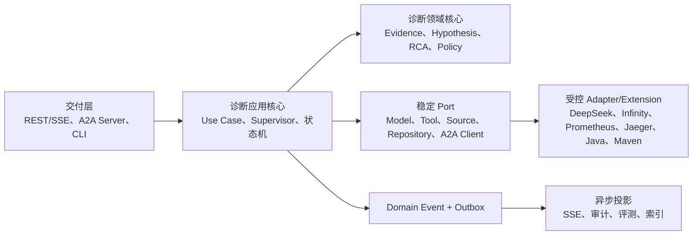
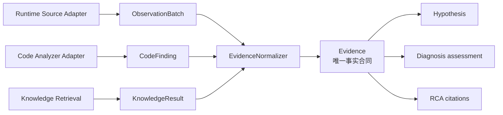
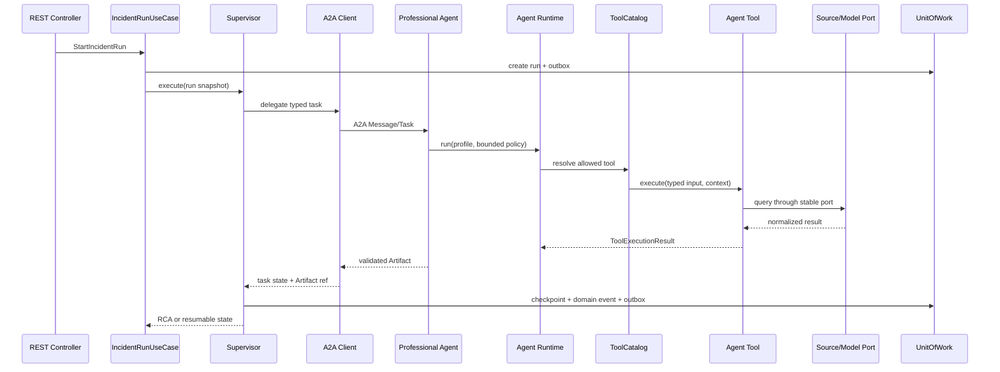

## 28. 内聚核心与受控扩展架构

### 28.1 设计定位

OpsPilot v3 采用“**内聚的诊断核心 + 明确的 Port + 受控的多实现扩展点**”，而不是通用微内核或动态插件平台。

参考 `earendil-works/pi` 的部分设计经验：扩展通过注册 API 接入、宿主统一管理生命周期、工具和 Provider 不侵入执行循环、拦截器顺序确定、单个可选扩展失败不拖垮主循环。OpsPilot 的领域状态、安全与跨进程一致性要求更强，因此以下内容继续是稳定核心，不允许 Extension 替换：

- Incident/Run/step/attempt 状态机和所有权；
- Supervisor 调度、预算、checkpoint 和停机规则；
- Evidence、Hypothesis、RCA、Approval 的领域不变量；
- A2A 任务映射、幂等、恢复与 Artifact 校验；
- Tool 权限分级、Ground Truth 隔离和结论门禁；
- 状态、审计和 outbox 的事务一致性。

只有存在多个真实实现、变化频率高且不拥有核心状态的能力才设计为扩展点。这样既获得高内聚低耦合，又避免为了“可插拔”引入动态加载、热更新、万能事件总线和难以分析的运行时依赖图。

选择性吸收矩阵：

| `pi` 中值得参考的机制 | OpsPilot 的适配方式 | 不采用的部分 |
|---|---|---|
| 小而稳定的执行循环 | Bounded ReAct、预算、取消、checkpoint 保持集中 | 不把领域状态机移出核心 |
| 工具/Provider 注册 | 五个窄 Registry 在启动时显式装配 | 不提供可注册任意能力的通用 Extension API |
| 生命周期与调用拦截 | 固定安全中间件和明确启动/停止顺序 | 不允许任意 Hook 改写核心状态流转 |
| 扩展错误隔离 | 仅可选 projector/observer 可隔离 | Provider、Tool、安全门禁等关键失败不能吞掉 |
| 扩展间事件 | 事务提交后的版本化 Domain Event/outbox | 不用内存 Event Bus 承担同步业务 RPC |
| 工具覆盖 | 通过配置显式替换稳定实现 ID，并重启/探针 | 不按加载顺序或同名注册隐式覆盖 |

### 28.2 四个架构区域



| 区域 | 高内聚职责 | 依赖规则 |
|---|---|---|
| 诊断领域核心 | 领域对象、不变量、状态转换、证据充分性和安全决策 | 只依赖 JDK/轻量校验；不知道 Spring、AgentScope、A2A 和厂商 |
| 诊断应用核心 | Use Case、Supervisor、Bounded ReAct 策略、事务、checkpoint、预算和恢复 | 依赖领域与 Port；不选择具体实现 |
| 协议与交付 | REST/SSE 和 A2A 的 DTO 映射、鉴权、幂等入口、错误映射 | 调用应用 Use Case；协议对象不进入领域 |
| Adapter/Extension | Provider、Source、Tool、代码/沙箱和基础设施实现 | 实现单一 Port；不拥有 Run 状态，不互相依赖实现类 |

Evaluation 保持独立信任边界。它消费最终投影和 Ground Truth，不进入诊断应用核心，也不能通过扩展接口向 Agent 暴露 Ground Truth。

### 28.3 建议物理模块

v2 的模块边界在逻辑上正确，但物理模块偏多。v3 将强相关、共同演进的代码收敛，减少“每个接口一个 Maven 模块”的装配成本：

```text
opspilot/
├── opspilot-core/                     # domain + application + ports
│   ├── domain/
│   ├── application/
│   └── port/
├── opspilot-tools-default/           # 九个首期 Tool，只编排 core Port
├── opspilot-agent-runtime-agentscope/ # AgentScope 适配
├── opspilot-a2a/                      # contract + client + server adapter，包级隔离
├── opspilot-adapters/
│   ├── persistence-postgres/
│   ├── model-openai-compatible/
│   ├── retrieval-infinity/
│   ├── knowledge-pgvector/
│   ├── observability/
│   ├── code-java/
│   └── sandbox-maven/
├── opspilot-server/                   # REST/SSE + composition root
├── opspilot-evaluation/
├── sample-system/
├── fault-lab/
└── deployment/
```

`opspilot-a2a` 暂时保留一个物理模块，在 `contract/client/server` 包之间使用架构测试限制依赖；只有出现独立发布、SDK 依赖冲突或复用需求时才重新拆分。`opspilot-adapters` 是 Maven 聚合目录，不是一个可以互相任意调用的“大模块”。

依赖方向固定为：

```text
core <- tools-default / agent-runtime / a2a / adapters / evaluation <- server
```

`server` 是唯一 composition root。核心代码不得使用 Spring 容器查找实现，Adapter 不得反向调用 Server。

### 28.4 保留的五类扩展点

#### 28.4.1 Model Provider

`ChatModelProvider`、`EmbeddingProvider`、`RerankProvider` 分别保持窄接口。不同厂商或协议实现以启动时 Bean 注册到对应专用 Registry。Registry 只负责稳定 ID、能力报告和选择，不负责重试、降级或业务路由。

#### 28.4.2 Source Adapter

`ObservabilitySourceAdapter` 负责把具体产品响应转换为 `ObservationBatch`。新增 Loki、Tempo、Kubernetes 或 Cloud 只增加 Adapter 和 Source Registry 配置，不增加 Agent Tool，也不修改 Evidence/RCA。

#### 28.4.3 Agent Tool

每个 Tool 实现稳定 `AgentTool<I,O>`，并声明 Schema、权限、超时和结果上限。Tool 是面向 Agent 的业务能力，不等于底层 Adapter：例如 `MetricQueryTool` 编排授权、查询模板、Source Adapter 和 EvidenceNormalizer；Prometheus 只实现 Source Adapter。

#### 28.4.4 Code Analyzer

`CodeAnalysisPort` 返回语言无关 `CodeFinding`，其合同为 `contracts/schemas/code-findings.schema.json`。它是分析器边界的可追溯中间产物，不是第二套事实模型。CodeAnalysisAgent 必须调用 `opspilot-core` 的 `EvidenceNormalizer.normalizeCode`，把每个可接受 Finding 转换为带 repository/revision/文件哈希来源的 `Evidence(signalType=CODE)`；A2A 结果同时返回 CodeFinding 审计 Artifact 和 EvidenceBundle，Diagnosis 只接收后者的 Evidence ID。首期 Java 实现在 Adapter 内使用 Maven/Java 语义，后续 Go、Python 等实现不改变 Evidence/Hypothesis 合同。

#### 28.4.5 Sandbox Runner

`SandboxRunner` 封装白名单验证动作、隔离环境和产物。Maven 只是首期实现；安全审批与动作等级属于核心 policy，不能由 Sandbox Extension 自行放宽。

PostgreSQL Repository 是基础设施 Adapter，但不是面向第三方的运行时扩展点。A2A、REST/SSE、Agent 角色、状态机和安全 Policy 也不是扩展点。

#### 28.4.6 单一事实层

系统中只有 `Evidence` 是事实。`ObservationBatch`、`CodeFinding` 和 `KnowledgeResult` 分别属于运行采集、代码分析和检索边界的输入产物；它们可以独立演进，但不能被 Diagnosis、Hypothesis 或 RCA 直接消费。



Evidence 使用统一 `provenanceRefs` 保留来源，因而“事实只有一种”不等于“来源被抹平”。Hypothesis 只保存 `supportingEvidenceIds/conflictingEvidenceIds`；若需要补证，它描述缺少的 Evidence 条件，由 Supervisor 决定再次采集运行、代码或知识输入。任何新增事实来源都必须先扩展 Evidence provenance 合同，不能为下游再增加平行的 `*Finding` 依赖。

### 28.5 专用 Registry，而非万能 Extension Host

系统只为五类扩展边界保留专用 Registry；其中模型按合同进一步分为 `ChatModelProviderRegistry`、`EmbeddingProviderRegistry`、`RerankProviderRegistry`，其余为 `ToolRegistry`、`SourceAdapterRegistry`、`CodeAnalyzerRegistry` 和 `SandboxRunnerRegistry`。它们共享以下简单规则，但不抽象成可以注册任意对象的通用注册表：

1. 启动阶段完成注册和真实能力探针，之后冻结为只读快照；MVP 不支持热加载。
2. 实现使用配置中的稳定 ID 选择，不允许模型根据自然语言、URL 或类名选择实现。
3. 同一 ID 重复注册、能力版本不兼容或必需实现缺失时启动失败；不采用“最后注册者覆盖”。
4. Registry 返回 Port 接口或受限句柄，不暴露实现类型和厂商 DTO。
5. 一个 Run 保存所用实现 ID、版本、配置摘要和 capability snapshot，恢复时必须使用兼容实现。

只有当第三方独立分发 Adapter 的真实需求出现时，才在 ADR 后为上述专用 Registry 增加 `ServiceLoader`/独立 ClassLoader；首期使用显式 Spring 配置和 Maven 依赖，降低供应链与类加载复杂度。

### 28.6 模块交互选择规则

不同交互机制解决不同问题：

| 条件 | 使用机制 | 示例 |
|---|---|---|
| 同进程、调用方需要立即结果、只有一个责任所有者 | 类型化 Port 直接调用 | Supervisor → StateRepository；Tool → SourceAdapter |
| Agent 之间跨逻辑/进程边界协作 | A2A Task | Supervisor → EvidenceCollectorAgent |
| 事务提交后通知多个非关键消费者 | Domain Event + transactional outbox | EvidenceAdded → SSE/审计/评测投影 |
| 用户或外部系统调用产品能力 | REST/SSE | 创建 Incident、订阅事件 |

禁止为了“解耦”把需要返回结果的核心调用改成 Event Bus，也禁止通过共享数据库表轮询替代 A2A 或 Port。同步依赖应当显式，异步依赖应当可重放。

### 28.7 主调用链



每一条同步箭头都必须指向 Port 或同一内聚模块内的应用服务。跨模块返回值使用领域值对象或合同 DTO，不能返回 JPA Entity、Spring 类型、AgentScope Message 或厂商响应。

### 28.8 Agent 角色的复用方式

六个 Agent 共享同一个 `AgentExecutionService` 和 AgentScope Adapter。角色差异由受版本控制的 `AgentProfile` 表达：

- role/skill ID；
- Prompt 模板版本；
- 允许的 Tool/A2A action；
- 输入输出 Schema；
- turn、Token、deadline 和调用预算；
- 完成条件和结构化结果映射器。

`AgentProfile` 的机器合同为 `contracts/schemas/agent-profile.schema.json`。它应包含逻辑 `modelProfileRef` 和少量白名单生成参数，但不包含 Provider URL、API Key 或厂商客户端配置；具体模型由 Model Registry 在启动时解析并探针。Profile 还必须显式包含：输入/输出 Schema、`factsFromEvidenceOnly=true`、Tool/A2A 白名单、预算、沙箱模式/Runner/网络/可写目录/资源上限，以及安全策略引用、资源 scope 和数据分级。

有效权限始终为 `平台安全基线 ∩ 服务身份权限 ∩ AgentProfile ∩ 单次任务约束 ∩ 人工审批`。Profile 只能收紧，不能放宽任一上层约束；首版 Schema 将 Ground Truth、Secret、任意命令和代码修改权限固定为 `false`。沙箱选项描述“该角色最多允许什么”，真正的隔离、审批和命令白名单仍由核心中间件与 SandboxRunner 强制执行。

`AgentProfile` 是受校验配置，不是可执行 Extension。新增角色必须先证明现有角色无法通过新 Tool/Profile 完成，并通过 A2A skill、状态所有权和安全评审；不能通过扫描 classpath 自动出现一个拥有未知权限的新 Agent。

### 28.9 横切关注点

授权、审批、预算、审计、脱敏和 tracing 使用显式中间件链，但链由核心固定并在启动时装配：

```text
Validate Schema
→ Authorize
→ Require Approval
→ Enforce Budget/Deadline
→ Execute Port
→ Normalize/Redact
→ Audit
```

安全相关步骤不可移除、覆盖或调整到执行之后。可选 tracing/metrics observer 失败不改变业务结果，但必须记录自身错误；授权、审批、预算或结果校验异常一律 fail closed。

这吸收了 `pi` 中事件拦截与错误隔离的优点，同时保留 OpsPilot 对关键链路顺序和失败语义的静态可分析性。

### 28.10 状态、事务与事件

核心状态只通过 Application Service 和 Repository Port 修改。专业 Agent、Tool、Provider 和 Source Adapter 都不能直接写 Supervisor 所有的 Incident/Run/Hypothesis/RCA 表。

一次 checkpoint 在同一 PostgreSQL 事务内写入：

- Run/step 状态和乐观锁版本；
- Tool/Model/A2A 调用审计；
- 新增 Evidence/Hypothesis/Artifact 绑定；
- 待发布 outbox event。

事务提交后，projector 才把 outbox 投影为 SSE、评测输入或外部通知。Domain Event 是已经发生的事实，不能作为修改核心状态的命令；消费者必须按 `eventId` 幂等。

### 28.11 启动与失败语义

启动顺序调整为：

```text
配置与 Secret 校验
→ 数据库迁移和 Repository 校验
→ 显式构造 Adapter
→ 各专用 Registry 注册并检测冲突
→ Provider/Source/Code/Sandbox 真实能力探针
→ 校验 Agent Profile 所需能力闭包
→ 构建 Agent Runtime
→ 校验 A2A Agent Card 与最小任务链路
→ 冻结 capability snapshot
→ readiness UP
```

失败分类：

- 注册冲突、缺少 required capability、版本不兼容：启动失败；
- 可选 Source 未配置：不注册，并在相关 Profile 不依赖它时允许启动；
- 已注册 Adapter 探针失败：该能力 DOWN；若被默认 Profile 依赖则 readiness DOWN；
- Tool/Provider/Source 调用失败：返回统一 `ChainFailure`，按第 17.4 节决定 Run 失败或受限完成；
- SSE/metrics 等异步 projector 失败：重试 outbox，不回滚已提交诊断状态。

### 28.12 约束与验收

架构测试必须验证：

1. `opspilot-core` 不导入 Spring、AgentScope、A2A SDK、JPA、Prometheus、Jaeger、Infinity 或厂商 SDK；
2. Adapter 之间没有实现依赖，所有调用经过 core Port；
3. Agent、Tool 和 Adapter 无权直接写 Incident 权威表；
4. Registry 冲突和缺失 required 实现确定性失败；
5. 替换 LLM Provider、Source Adapter、Code Analyzer 或 Sandbox Runner 时 core diff 为零；
6. 新增 Source Adapter 不新增 Agent Tool，新增长语言 Adapter 不修改 CodeAnalysisAgent；
7. 关键中间件顺序固定且异常 fail closed；
8. Domain Event 只在事务提交后可见，重复消费不重复投影；
9. 禁用所有非默认 Adapter 后，使用测试实现仍能完成核心状态机和恢复测试；
10. Maven module 数量增加必须由独立发布、依赖冲突或明确复用需求驱动，不能只因为新增一个接口。
11. Diagnosis/Hypothesis 的合同和运行时上下文拒绝 CodeFinding、ObservationBatch、KnowledgeResult；代码或知识事实未规范化为 Evidence 时必须 fail closed。
12. AgentProfile 必须通过 Schema、Registry 能力闭包和权限交集校验；Profile 不能携带密钥或扩大平台安全基线。

满足“核心职责集中、变化被隔离、依赖显式、失败可定位”比追求所有能力动态可插拔更重要。这是 OpsPilot 对 `pi` 设计哲学的选择性吸收，而不是复制其产品结构。
