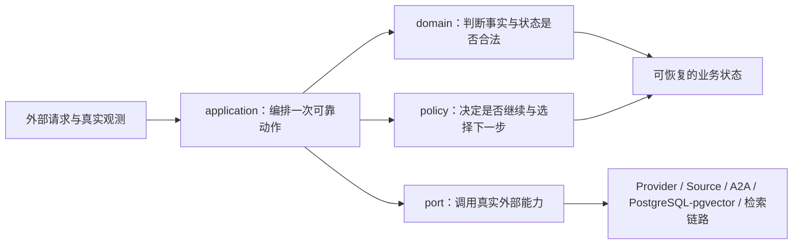
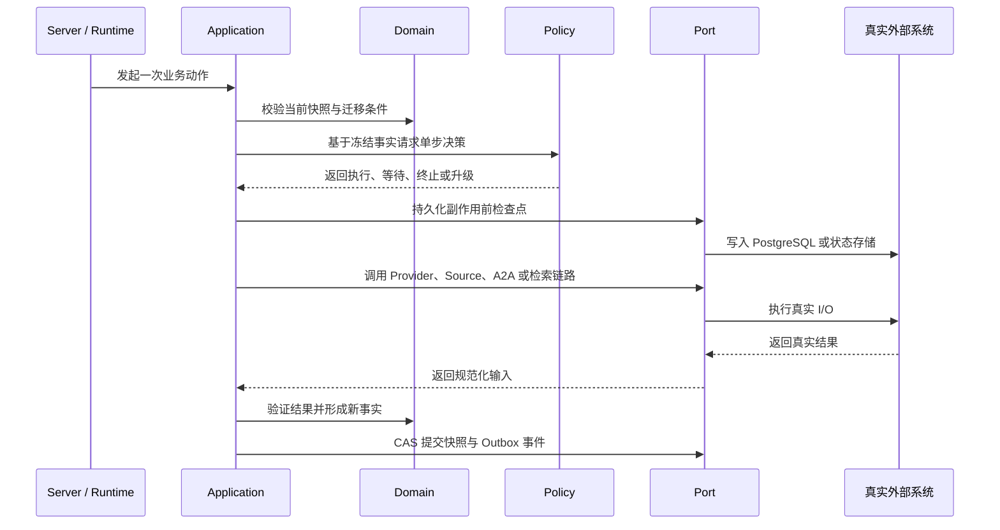
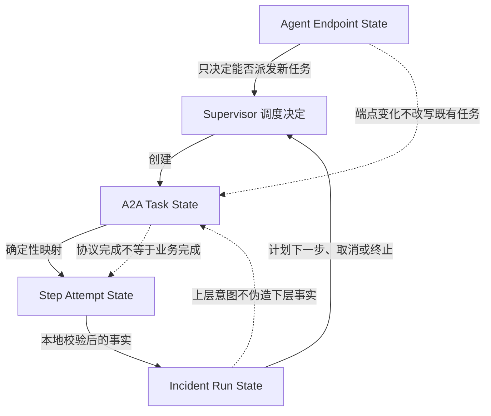

# OpsPilot Core 设计说明

> 文档状态：结构评审已通过，作为 Phase 2 Core 设计与使用说明。
>
> 本文面向架构评审与技术面试。阅读顺序刻意采用“设计目标 → 实现机制 → 分层原则 → 使用方式”，先说明为什么这样设计，再说明代码如何承载这些设计。本文只展开 `domain`、`application`、`policy`、`port` 四部分的设计思路和边界，不罗列类、字段、错误码或测试用例。

## 1. 一页结论

OpsPilot Core 不是业务接口层，也不是具体基础设施实现。它负责把一次智能运维调查中最难保持一致的部分集中起来：业务语义、状态推进、恢复边界、策略约束，以及对外部能力的抽象。

四个 package 分别回答四个不同问题：

| Package | 回答的问题 | 核心设计原则 |
| --- | --- | --- |
| `domain` | 系统认为什么事实成立 | 强语义、显式状态、不可变事实、非法状态不可表达 |
| `application` | 一次业务动作如何可靠完成 | 用例编排、先检查点后副作用、冲突后重判、提交后发事件 |
| `policy` | 在资源有限且模型不确定时是否继续 | 单步决策、冻结预算、进展判定、固定停止优先级 |
| `port` | Core 如何使用真实外部能力而不依赖具体实现 | 窄接口、能力导向、状态所有权明确、显式装配 |

可以把整体设计概括为：



设计重点不是“把代码拆成四个目录”，而是建立一条可验证的控制线：

1. 外部世界只通过 Port 进入 Core；
2. Application 只编排，不私自创造领域事实；
3. Domain 决定哪些状态和迁移合法；
4. Policy 在事实之上作受约束的单步决策；
5. 关键事实持久化后，系统才允许继续产生外部副作用。

## 2. 核心价值，以及这些价值如何实现

Core 的价值不能只写成抽象口号。下面同时给出价值、实现机制、解决的问题和相应取舍。

| 核心价值 | 实现机制与设计思路 | 解决的问题 | 主要取舍 |
| --- | --- | --- | --- |
| 统一业务语义 | 使用强类型标识、值对象、显式状态机和受控迁移，让“任务、尝试、调查、端点”各自拥有独立含义 | 避免字符串、布尔值和通用 Map 在模块间产生语义漂移 | 类型和转换代码更多，但错误更早暴露 |
| 调查过程可恢复 | 以不可变快照保存已确认事实；在外部副作用前写检查点；通过 CAS、工作单元和 Outbox 保证并发与提交边界 | 进程重启、重复回调和并发执行不会让调查从未知位置继续 | 流程更显式，但恢复行为可推理、可重放 |
| Agent 行为可控制 | Policy 每次只给出一个决策；预算在决策前冻结；用新颖度与无进展计数判断是否继续 | 防止模型自行循环、绕过预算或把重复结果当进展 | 限制自由度，换取成本和终止条件可审计 |
| 诊断结论可信 | 所有 Provider、Source、A2A 和检索结果先规范化，再携带来源、身份与关联关系进入领域状态 | 防止来源不明、格式不一或重复证据直接影响结论 | 增加边界转换，但保留可追溯性 |
| 安全策略不可绕过 | 把鉴权、授权、策略检查和审计设计成固定应用链路，而不是由调用方自由组合 | 避免某个入口少做一步检查便获得能力 | 扩展入口时必须遵守统一链路 |
| 基础设施可替换 | Core 只依赖能力导向的 Port；真实实现由外层 composition root 显式注入 | Provider SDK、数据库、向量检索或 A2A 协议变化不会污染领域规则 | 需要维护 Adapter，但边界清晰 |
| 并发结果可判定 | 用版本化快照与 CAS 拒绝最后写入覆盖；冲突后重新读取并重新判断，而不是盲目重试旧决定 | 多执行器、回调和恢复任务不会静默覆盖彼此结果 | 调用方需要处理冲突分支 |
| 设计可独立验证 | Domain 和 Policy 保持纯逻辑；Application 依赖 Port 契约；集成验证使用真实实现和真实链路 | 既能快速验证规则，又不会用 Mock、Fake 或固定结果掩盖生产缺口 | 单元验证与真实集成验证必须分层组织 |

### 2.1 价值实现的主链路



这条链路体现三个关键判断：

- 模型输出、远端协议状态和检索结果都只是输入，不天然等于领域事实；
- 任何可能重复发生的外部副作用，都必须有可恢复的检查点；
- 只有经过本地验证并成功提交的事实，才能推进整个调查。

## 3. 总体分层与依赖原则

### 3.1 依赖方向

Core 内部允许的概念依赖是：

```text
application  ─────► domain
      │               ▲
      ├──────────────► policy
      │
      └──────────────► port

policy       ─────► domain
port         ─────► domain 中必要的稳定契约
```

具体 Provider SDK、Web 框架、消息中间件、PostgreSQL 驱动、pgvector 客户端和 A2A 协议实现都位于 Core 之外。Core 不扫描 classpath，不使用服务注册表猜测实现，也不在真实实现缺失时静默降级。

### 3.2 边界原则

- `domain` 不依赖框架、数据库或远程协议；
- `application` 知道业务步骤，但不知道基础设施实现细节；
- `policy` 只根据明确输入作决定，不拥有循环和持久化；
- `port` 描述 Core 需要的能力，不复制供应商 API；
- Adapter 负责协议转换、错误翻译和真实 I/O；
- composition root 负责选择并显式装配生产实现。

## 4. Domain：让业务事实可表达、可约束、可追溯

Domain 的首要目标不是承载数据，而是定义“什么事实可以被系统承认”。

### 4.1 强语义优先于通用类型

调查标识、远端任务标识、步骤尝试标识和端点标识即使底层都是字符串，也不应互换。强类型的意义是让错误组合在编译期或领域边界处失败，而不是进入数据库后才被发现。

设计原则：

- 不用裸字符串承载不同身份；
- 不用通用 Map 代替稳定业务结构；
- 值对象在创建时完成格式和范围校验；
- 未知成本保持未知，例如为 `null`，不能用固定 `0` 假装已知。

### 4.2 显式状态优先于隐含条件

多个布尔值很容易形成无法解释的组合。Domain 使用互斥状态和受控迁移表达生命周期，使每个状态都能回答：当前发生了什么、允许做什么、下一步可能是什么。

状态迁移必须满足：

- 由拥有该状态的组件执行；
- 迁移前检查当前状态和必要事实；
- 非法迁移显式失败，不自动修正；
- 终态不会被后到消息重新打开，除非领域规则明确允许。

### 4.3 不可变事实优先于原地覆盖

调查过程需要解释“为什么走到这里”。因此快照表达某个版本已经确认的事实，更新产生新版本，而不是在共享对象上随意修改。

这样做直接支持：

- 版本比较与 CAS；
- 重启恢复和重复消息判定；
- 审计时还原决策输入；
- 将已提交事实与尚未确认的外部结果分开。

### 4.4 失败关闭

当身份、状态、成本、权限或来源无法确认时，Domain 不猜测成功结果。未知值保持未知，非法值被拒绝，未验证结果不能推进上层状态。

### 4.5 Domain 当前包含什么

Domain 当前由四组内容组成。它们不是通用基础类，而是调查链路中需要跨模块保持一致的稳定业务语言。

| 子包 / 核心类型 | 当前内容 | 在业务中的作用 |
| --- | --- | --- |
| `domain.identity.DomainIds` | `IncidentId`、`RunId`、`StepId`、`A2aTaskId`、`EvidenceId`、`ArtifactId`、`HypothesisId`，以及组合身份 `StepAttemptId`、`RemoteTaskId` | 区分事故、调查、步骤、远端任务、证据和制品，防止不同身份在编排、持久化和回调中被误用 |
| `domain.value.DomainValues` | `Sha256`、`RootCauseCode` | 为内容完整性和根因编码提供有格式约束的值对象 |
| `domain.failure.ChainFailure` | 稳定错误码、失败分类、是否可重试、关联 ID、检查点引用、受控审计日志引用和脱敏摘要 | 让失败可以跨 Provider、Source、A2A、持久化和恢复边界传递，同时阻止堆栈、密钥与原始载荷进入领域状态 |
| `domain.state.IncidentAgentState` | 带 schema 与版本的调查快照；保存计划引用、步骤与尝试摘要、证据和假设 ID、预算与用量、ReAct 计数、缺失证据、告警、取消意图和报告引用 | 为 Supervisor 提供可持久化、可迁移、可 CAS 更新的最小恢复状态；快照保存引用和摘要，不保存原始证据正文或隐藏推理 |
| `domain.state.StateMachines` | Agent Endpoint、A2A Task、Step Attempt、Incident Run 四层状态；迁移规则；协议状态映射；结果制品验证；重试计划 | 集中维护状态所有权和合法迁移，避免 Application、Runtime 与 Adapter 各自解释生命周期 |

这些内容的组合关系是：身份和值对象定义事实的基本语法，`ChainFailure` 定义失败事实的安全表达，`IncidentAgentState` 聚合调查恢复所需的已确认事实，`StateMachines` 决定这些事实如何合法变化。

## 5. 四层状态模型，以及它们之间的关系

四层状态模型不是同一生命周期的四种叫法。它们分别属于不同边界，表达不同粒度的事实。

| 状态模型 | 所有者 | 回答的问题 | 事实来源 | 影响范围 |
| --- | --- | --- | --- | --- |
| Agent Endpoint State | A2A 端点管理 | 这个端点现在是否适合接收新任务 | 健康检查、连接和管理操作 | 后续调度资格 |
| A2A Task State | A2A Runtime | 某个远端协议任务处于什么阶段 | A2A 响应、回调和轮询 | 单个远端任务 |
| Step Attempt State | Supervisor / Core | 某次本地执行尝试是否已经验证完成 | 远端状态映射、本地校验与持久化 | 单次尝试 |
| Incident Run State | Supervisor / Core | 整个调查是否继续、等待、完成或终止 | 已验证尝试、策略决定和人工控制 | 整次调查 |

### 5.1 关系总览



关系中的核心不是层层同步，而是单向影响与所有权隔离：

1. 端点状态只影响新任务是否可以派发，不改写已经创建的 A2A Task；
2. A2A Task 状态只记录远端协议事实，不能直接宣布整个调查完成；
3. Step Attempt 把远端协议事实转换为本地可验证事实；
4. Incident Run 只根据已验证的 Step Attempt 和策略决定推进；
5. 上层取消意图可以请求取消下层任务，但不能直接伪造下层已取消的事实。

### 5.2 A2A Task 到 Step Attempt 的确定性映射

远端协议状态进入 Core 时必须采用固定映射，不能由不同调用入口自行解释。

| A2A Task State | Step Attempt State | 设计含义 |
| --- | --- | --- |
| `SUBMITTED` | `QUEUED` | 远端已经接收，但本地尚未确认执行 |
| `WORKING` | `RUNNING` | 远端正在执行 |
| `INPUT_REQUIRED` | `WAITING_INPUT` | 需要业务输入，不能继续自动推进 |
| `AUTH_REQUIRED` | `WAITING_AUTH` | 需要认证或授权处理 |
| `COMPLETED` | `VALIDATING_RESULT` | 协议完成，只代表结果可供本地验证 |
| `FAILED` | `FAILED` | 远端明确失败 |
| `CANCELED` | `CANCELLED` | 远端确认取消 |
| `REJECTED` | `REJECTED` | 远端拒绝任务 |

最重要的映射是：`A2A COMPLETED` 只能进入 `Step Attempt VALIDATING_RESULT`，不能直接进入本地完成状态。原因是 Core 仍需验证结果结构、来源、关联标识和业务约束。只有验证通过，Attempt 才能形成可推进 Incident Run 的事实。

### 5.3 为什么不能合并四层状态

如果把四层状态合并为一个通用状态机会出现以下错误：

- 端点暂时不可用会被误解为既有任务失败；
- 远端协议完成会被误解为诊断步骤成功；
- 某次尝试失败会被误解为整个调查失败；
- 调查被取消会直接覆盖尚未收到确认的远端任务状态；
- 重试会丢失 Attempt 粒度，无法解释每次执行发生了什么。

分层状态的代价是需要显式映射，但换来的是状态所有权、恢复语义和错误边界都可被准确解释。

### 5.4 三个持久化状态面

状态模型在运行时对应三个不同的持久化视角：

- Incident Agent State：保存 Supervisor 推理所需的调查快照；
- Agent Runtime State：保存本地 Agent Runtime 的执行状态；
- A2A Task State：保存远端任务协议事实。

三者不能共用一个通用状态仓库接口，因为它们的并发边界、更新频率、恢复责任和所有者不同。共享底层 PostgreSQL 并不意味着共享领域契约。

## 6. Application：把一次业务动作做成可恢复事务

Application 的职责是编排，不是定义领域含义，也不是实现基础设施。

### 6.1 用例优先，而不是框架入口优先

应用流程以业务动作组织，使 HTTP、消息消费、定时恢复或 CLI 都能调用同一用例。入口只负责适配请求，不能复制状态推进规则。

### 6.2 先检查点，后外部副作用

任何可能产生真实外部影响的调用，例如创建 A2A Task、查询 Source、调用 Provider 或执行检索，都要先持久化足以恢复的意图和关联身份。

恢复时系统据此判断：

- 副作用尚未发生，可以安全执行；
- 副作用已经发生，应查询或关联既有结果；
- 结果已提交，不应重复推进。

### 6.3 CAS 冲突后重新判断

Application 保存快照时携带预期版本。版本冲突说明决策输入已经过期，正确处理是重新读取最新状态并重新判断，而不是让最后一次写入覆盖前一次结果，也不是原样重放旧决定。

### 6.4 外部结果先规范化，再进入 Domain

Provider、Source、A2A 和检索结果必须经过 Adapter 和应用边界转换，统一身份、来源、时间、错误和未知值表达。Application 不能把供应商 DTO 直接塞进领域状态。

### 6.5 事件只描述已提交事实

状态变更和待发布事件在同一工作单元中提交，再由 Outbox 发布。这样事件不会宣称一个尚未成功持久化的事实，也不会因为进程中断而永久丢失。

### 6.6 安全链路固定

需要外部能力的用例采用固定顺序：身份确认、权限判断、策略检查、执行、审计。调用方不能通过选择另一个重载或省略某个可选组件绕过安全控制。

### 6.7 Application 当前包含什么

Application 当前按业务动作和可靠性边界分为六组内容：

| 子包 / 核心类型 | 当前内容 | 在业务中的作用 |
| --- | --- | --- |
| `application.incident.IncidentUseCases` | 创建、启动、恢复、取消调查，接收 A2A 结果和生成报告的输入输出契约 | 为 Server、消息入口和 Runtime 提供统一用例边界，使不同入口不会复制调查规则 |
| `application.incident.SupervisorService` | 有限计划校验、步骤检查点、任务委派、输入后重规划、CAS 取消和迟到制品审计 | 一次只推进一个 Supervisor 动作；检查点失败时停止委派，取消后的迟到结果只审计、不重新推进调查 |
| `application.checkpoint.CheckpointService` | 检查点工作单元、版本冲突捕获、读取最新状态和迁移重判 | 将 CAS 冲突变成显式的“重读并重新评估”，返回正常提交、重判后提交或冲突拒绝 |
| `application.checkpoint.CommittedEventProjector` | 已提交领域事件投影、投影回执和重复事件识别 | 保证投影只消费已提交事实，并区分已投影、重复和可重试失败 |
| `application.evidence` | 来源契约、证据与证据包、运行观测和知识结果规范化、仅允许证据 ID 进入诊断/假设/RCA 输入 | 把不同 Source 与检索结果转换成带 provenance 的统一证据；分析阶段引用证据身份，不携带原始来源载荷 |
| `application.state` | 快照 JSON 读写、schema 迁移链、容量与内容限制、跨 Run 引用完整性校验、稳定状态契约异常 | 控制检查点能否安全序列化和恢复；拒绝原始工具输出、消息历史、隐藏推理、密钥、跨调查引用和超限状态 |
| `application.security.SecureInvocation` | 身份、授权、策略、预算、受控调用、结果规范化与审计的固定执行链 | 让所有高风险外部调用经过相同安全阶段，并把拒绝、失败、取消和成功明确区分 |
| `application.tool.ToolResultNormalizer` | 工具结果状态规范化、内联内容上限和超长内容制品化 | 防止大块原始输出进入运行状态；保留摘要，把完整内容交给 `ArtifactPort` 持久化 |

Application 内部的主链是：`IncidentUseCases` 定义动作，`SupervisorService` 编排单步执行，`SecureInvocation` 保护真实外部调用，Evidence 与 Tool Normalizer 收口结果，State 与 Checkpoint 组件负责验证、迁移和原子提交。

## 7. Policy：约束不确定决策，而不是接管流程

Policy 将变化较快的决策规则从 Application 中独立出来，但不成为新的流程引擎。

### 7.1 每次只作一个决定

Policy 接收冻结的当前事实，返回一个明确决定，例如执行下一步、等待输入、终止、升级或完成。循环、持久化、重试和 I/O 仍由 Application 与 Runtime 控制。

这样做可以确保：

- 每次模型或规则决策都有明确输入和输出；
- 每步之间都能保存检查点；
- 外层可以实施取消、超时与人工接管；
- 模型无法在一次调用内绕过预算无限循环。

### 7.2 预算是冻结的多维事实

预算不仅包含 token，还可包含时间、步骤、费用和证据数量。Policy 基于决策开始时的预算快照判断，不能在决策过程中临时扩大额度。

未知成本保持未知，不能用固定结果或 `0` 静默替代。是否允许未知成本继续执行必须由显式规则决定。

### 7.3 新颖度决定是否真的有进展

“调用成功”不等于“调查有进展”。Policy 比较新证据与已有证据的身份和语义，只有新增有效信息才重置无进展计数。重复结果、空结果和不可验证结果不能被包装成成功。

### 7.4 停止条件有固定优先级

当多个条件同时成立时，Policy 使用稳定优先级决策，例如安全拒绝、用户取消、硬预算耗尽、不可恢复失败、无进展终止、正常完成。优先级必须可测试，不能交给模型临场决定。

### 7.5 Policy 当前包含什么

当前 Policy 有意保持集中，只包含 `SupervisorPolicy`，内部用一组明确数据结构完成一次有界判断：

| 组成 | 当前内容 | 作用 |
| --- | --- | --- |
| `FrozenLimits` | 最大轮数、Agent 调用数、工具调用数、A2A 调用数、token、费用、连续无进展次数、计划步骤数和截止时间 | 保存本次调查不可被模型放大的硬边界 |
| `Usage` | 已消耗的轮数、各类调用次数、token 和费用 | 与冻结预算逐维比较，不允许只检查其中一种成本 |
| `Progress` | 动作指纹、证据指纹和连续无进展计数 | 根据新动作或新证据判断是否取得进展；重复动作和重复证据会累计无进展次数 |
| `Evaluation` | Limits、Usage、Progress、当前时间，以及输入、关键失败和取消信号 | 形成一次决策的完整、冻结输入 |
| `Decision` | `CONTINUE`、`WAIT_FOR_INPUT`、`GENERATE_LIMITED_REPORT`、`STOP` 及原因 | 给 Runtime 一个可执行的单步结果，不在 Policy 内部启动循环 |

当前实现的判断顺序是：取消 → 关键失败 → 截止时间 → 多维预算 → 无进展 → 等待输入 → 继续。模型提出的放宽轮数或费用请求不会改变 `FrozenLimits`。这一顺序既是实现内容，也是必须保持稳定的策略契约。

## 8. Port：用窄契约连接真实世界

Port 的作用不是追求接口数量，而是把 Core 所需能力与外部实现隔开。

### 8.1 能力导向，而不是供应商导向

Port 应描述业务需要的能力，例如持久化调查状态、执行 A2A 任务、查询证据源、调用模型 Provider 或进行向量检索，而不是复制某个 SDK 的完整方法集。

这样更换供应商时，变化集中在 Adapter；Core 的业务语言保持稳定。

### 8.2 接口保持窄且单一

读取、写入、CAS 更新、任务执行和事件发布具有不同失败语义，不应被塞进一个万能接口。窄接口使调用方依赖最小能力，也让超时、重试和审计边界更清楚。

### 8.3 状态所有权体现在契约中

不同状态面拥有独立 Port。即使生产环境最终都使用 PostgreSQL，Port 也不因底层技术相同而合并，因为领域所有者和一致性要求不同。

### 8.4 生产实现必须显式装配

真实 Provider、Source、A2A、PostgreSQL/pgvector 和检索链路由外层 composition root 显式创建并注入。Core 不使用以下机制掩盖配置错误：

- 不通过 ServiceLoader、classpath 扫描或通用注册表猜测实现；
- 不在真实实现缺失时切换到 Mock、Fake、内存替代或固定结果；
- 不吞掉外部错误后返回空集合；
- 不把检索失败解释为没有相关证据；
- 不用预设成功响应代替真实 A2A 或 Provider 调用。

Domain 与 Policy 的纯逻辑可以直接实例化验证；凡涉及外部能力的集成验证，都必须连接真实 PostgreSQL/pgvector、Provider、Source、A2A 与检索组件，不能用测试替身代替链路成立。

### 8.5 Port 当前包含什么

Port 按外部能力和状态所有权拆分。下表中的接口与契约由 Core 定义，具体网络、SDK、数据库和文件实现位于 Adapter 或 Runtime 模块。

| 子包 | 当前 Port / 契约 | Core 使用它完成什么 | 真实实现应负责什么 |
| --- | --- | --- | --- |
| `port.a2a` | `A2aClientPort`、`A2aTaskStatePort` | 提交和取消远端 Agent 任务；按版本读写 A2A Task 协议状态 | 调用真实 A2A 端点，处理协议身份、截止时间、回调/轮询、幂等和任务状态持久化 |
| `port.agent` | `ChatPort`、`ToolPort`、`DecisionSummaryStore`、`RuntimeAuditSink` | 调用聊天模型和工具，保存决策摘要，追加 Runtime 审计事件 | 连接真实模型 Provider 和工具，记录真实用量与错误，并持久化摘要和审计 |
| `port.provider` | `EmbeddingPort`、`RerankPort`、`ProviderContracts` | 执行 embedding 与 rerank，并统一 Provider 身份、用量、可重试失败和结果结构 | 调用真实 embedding/rerank Provider；保留模型版本、token、未知费用和真实失败 |
| `port.observability` | `ObservabilitySourceAdapter`、`ObservationContracts` | 查询日志、指标、Trace、事件、健康、配置和拓扑等观测证据，并携带来源、资源、质量和原始制品引用 | 连接真实 Prometheus、Jaeger、文件或 HTTP Source，执行查询并提供可校验 provenance |
| `port.code` | `CodeSourcePort`、`CodeAnalysisPort`、`CodeContracts` | 按仓库与 revision 物化代码快照，再产生结构化代码发现 | 获取真实代码 revision、管理凭据引用、执行真实分析并保留文件与位置身份 |
| `port.knowledge` | `KnowledgeContracts` | 统一知识检索结果 ID、知识库 ID、revision、受限摘要和制品引用 | 由外部检索链路结合真实 PostgreSQL/pgvector、embedding 与 rerank 生成结果 |
| `port.artifact` | `ArtifactPort` | 按 Run 保存报告、计划、完整工具输出和其他大制品，领域状态只保留 `ArtifactId` | 将真实字节内容持久化，并维护媒体类型、归属和可审计身份 |
| `port.repository` | `IncidentAgentStateRepository`、`CheckpointContracts` | 按版本加载和保存调查快照；在工作单元中提交状态、调用审计、引用绑定、领域事件和命令 | 使用真实 PostgreSQL 实现事务、CAS、唯一约束、Outbox 和冲突语义 |
| `port.runtime` | `AgentPolicyPort`、`AgentRuntimeStatePort` | 让 Runtime 请求单步策略判断、接收事件和中断信号，并独立保存 Runtime 会话状态 | 驱动真实 Agent Runtime，按版本保存会话状态并传播真实取消/中断 |
| `port.sandbox` | `SandboxRunnerPort` | 基于已持久化的计划制品执行受控操作，并返回接纳状态、摘要、制品和错误码 | 在真实隔离环境执行，落实超时、权限、资源限制和审计 |
| `port.extension` | `ExtensionContracts` | 用描述符声明 Provider、Tool、Source、Analyzer、Sandbox 扩展的身份、版本和能力 | composition root 根据显式配置装配真实扩展；这些描述符不是自动发现或缺失实现回退机制 |

Port 之间也有清晰分工。例如一条知识检索链路通常由真实数据源与 PostgreSQL/pgvector 完成候选召回，通过 `EmbeddingPort` 生成向量、通过 `RerankPort` 重排，再以 `KnowledgeContracts` 返回可追溯结果；任一环节失败都必须显式返回失败，不能降级为空结果。

## 9. 四部分如何协作

以“执行一个调查步骤”为例，职责分配如下：

| 阶段 | 主要责任方 | 设计判断 |
| --- | --- | --- |
| 读取当前调查 | Application + Port | 获取带版本的真实快照 |
| 判断状态是否合法 | Domain | 当前 Run 和 Attempt 是否允许继续 |
| 选择下一步 | Policy | 基于冻结预算和已验证事实返回单步决定 |
| 保存执行意图 | Application + Port | 先形成可恢复检查点 |
| 执行外部能力 | Port 的真实 Adapter | 调用真实 Provider、Source、A2A 或检索链路 |
| 接收并转换结果 | Application + Adapter | 规范化外部结果，不直接信任供应商 DTO |
| 验证与推进 | Domain | 将协议事实转为本地业务事实 |
| 提交状态和事件 | Application + Port | CAS、工作单元和 Outbox 保证提交边界 |

这张表也是排查职责错位的依据：如果某段代码同时决定领域状态、执行网络调用、修改预算并发布事件，它大概率跨越了多个边界。

## 10. 如何使用 Core

### 10.1 Server 或其他入口层

入口层负责协议解析、认证上下文提取和响应转换，然后调用 Application 用例。它不直接修改 Domain 状态，不直接调用 Repository，也不自己解释 A2A 状态。

### 10.2 Adapter 与基础设施层

Adapter 实现 Port，并负责：

- 将 Core 契约转换为真实 Provider、Source、A2A、PostgreSQL/pgvector 或检索请求；
- 将外部错误翻译为明确、可判断的失败；
- 保留来源、关联标识、时间和未知值；
- 实现 Port 约定的超时、幂等、CAS 和事务语义。

### 10.3 Runtime 与 Supervisor

Runtime 驱动执行和恢复，Supervisor 使用 Domain 状态与 Policy 决策推进调查。二者必须尊重状态所有权：远端任务由 A2A Runtime 更新，Attempt 与 Run 由 Supervisor/Core 验证后更新。

### 10.4 新增业务能力时

建议按以下顺序判断改动位置：

1. 先确认是否出现新的业务事实或不变量；若是，进入 Domain；
2. 再确认是否出现新的业务动作与恢复边界；若是，进入 Application；
3. 若只是“何时继续、停止或选择哪一步”的规则，进入 Policy；
4. 若需要新的外部能力，先定义最窄 Port，再在外层实现真实 Adapter；
5. 在 composition root 显式装配，并用真实链路完成集成验证。

## 11. 关键设计取舍

| 选择 | 放弃的方案 | 原因 |
| --- | --- | --- |
| Core 保持框架无关 | 在 Domain 中使用 Web、ORM 或 SDK 类型 | 保护业务语义和测试边界 |
| 四层状态各自拥有所有者 | 一个全局通用状态机 | 避免不同粒度事实相互覆盖 |
| A2A 完成后仍需本地验证 | 远端 `COMPLETED` 直接等于业务完成 | 协议事实不等于可信业务事实 |
| CAS 冲突后重读重判 | 最后写入覆盖或盲目重试 | 保证决定基于最新事实 |
| Policy 单步决策 | Policy 内部自主循环 | 让预算、恢复和人工控制可执行 |
| 显式 composition root | 注册表、自动发现或隐式默认实现 | 配置错误可见，生产依赖可审计 |
| 真实集成链路 | Mock、Fake、固定结果或静默降级 | 面试项目也必须证明真实边界可工作 |

## 12. 必须长期保持的设计不变量

- 外部协议完成不直接等于本地业务完成；
- Endpoint、A2A Task、Step Attempt、Incident Run 的状态所有权不可混用；
- 只有本地验证并持久化的事实才能推进 Incident Run；
- 产生外部副作用前必须有可恢复检查点；
- CAS 冲突后必须重读并重新决策；
- 未知成本和未知来源不能被固定值伪装；
- Policy 不拥有循环、I/O 或持久化；
- Domain 不依赖框架和基础设施实现；
- 事件只描述已提交事实；
- 生产链路不得用 Mock、Fake、固定结果或静默降级替代真实实现。

## 13. 面试讲解建议

建议按下面顺序介绍 Core，而不是从目录或类名开始：

1. 先说问题：智能运维调查同时面临不确定模型、异步远端任务、并发恢复、资源预算与证据可信度；
2. 再说主设计：Domain 管事实，Application 管可靠动作，Policy 管受限决策，Port 管真实外部能力；
3. 重点解释四层状态为什么不能合并，以及 `A2A COMPLETED → VALIDATING_RESULT`；
4. 用“先检查点、后副作用”和“CAS 冲突后重判”说明恢复与并发设计；
5. 用冻结预算、新颖度和固定停止优先级说明为什么 Agent 可控；
6. 最后说明所有生产能力显式装配，真实链路不会被 Mock、Fake 或静默降级掩盖。

这套讲解能够把代码结构还原为设计决策：每一层都对应一个明确风险，每个机制都有可验证的业务目的。

## 14. 验证与延伸阅读

README 只说明设计边界。具体契约、实现与验证应以仓库代码和规范为准。

建议验证命令：

```powershell
. .\scripts\environment\enter-project-env.ps1 -Quiet
mvn -pl opspilot-core test
```

进一步阅读：

- `docs/design/OpsPilot-System-Design.md`：系统级设计入口；
- `docs/design/opspilot-system-design/02-modules-and-boundaries.md`：模块边界与依赖方向；
- `docs/design/opspilot-system-design/03-a2a-multi-agent-architecture.md`：A2A 与多 Agent 架构；
- `docs/design/opspilot-system-design/17-cohesive-core-and-controlled-extensions.md`：Core 与受控扩展设计；
- `openspec/changes/implement-phase-2-cohesive-core-module-skeleton/design.md`：本阶段设计决策；
- `openspec/changes/implement-phase-2-cohesive-core-module-skeleton/specs/four-layer-state-machines/spec.md`：四层状态机约束。
