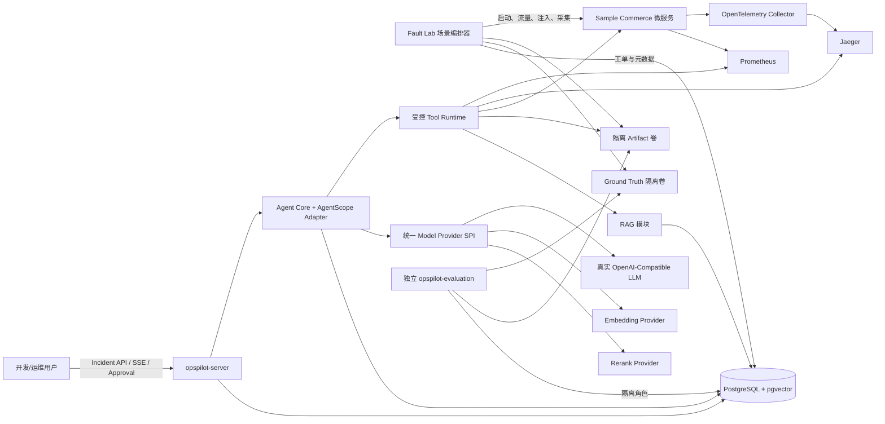
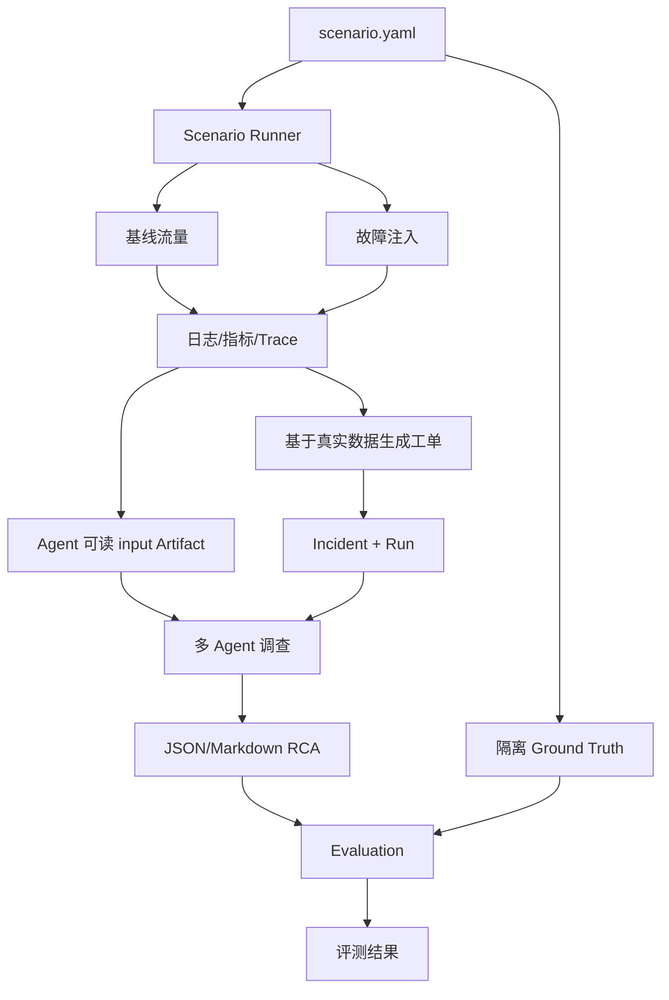
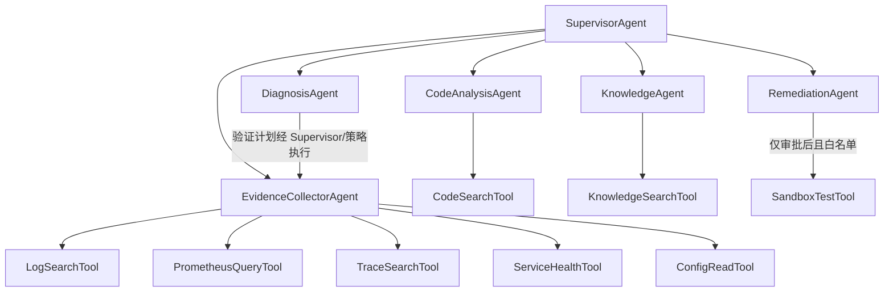
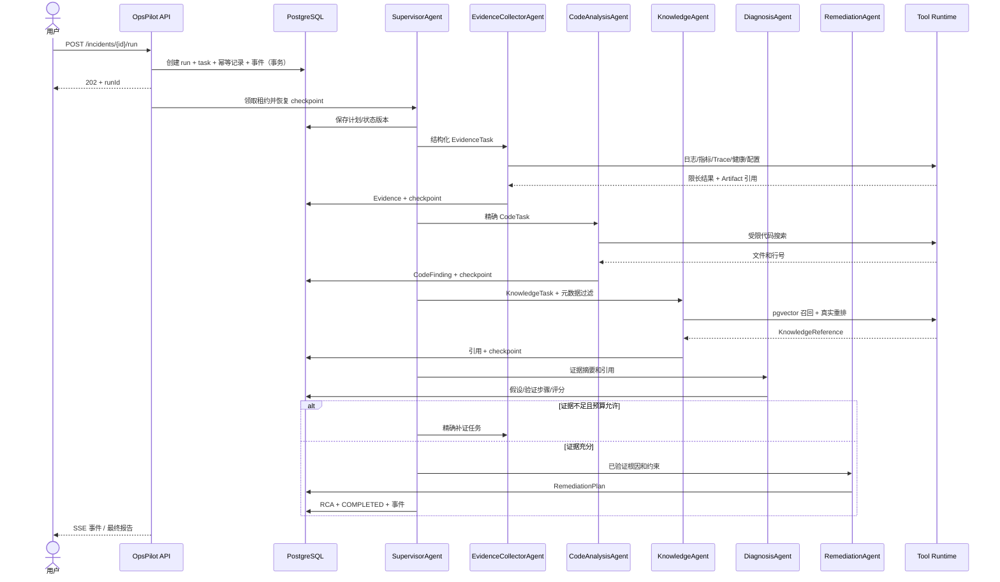
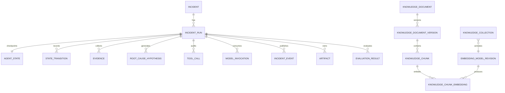
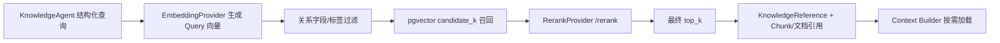
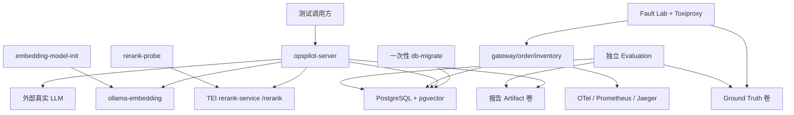
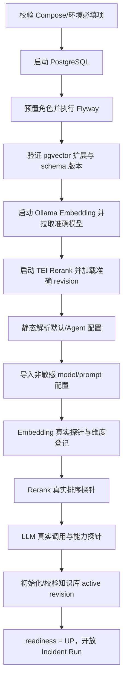
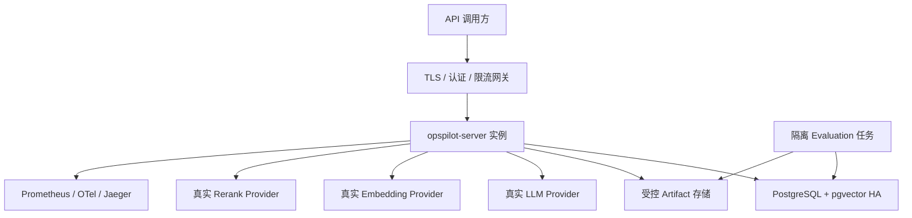

# OpsPilot 系统完整设计

> 版本：完整修订版 v2.0  
> 设计基线：`OpsPilot Project Design.docx` 全文  
> 适用范围：MVP / 本地集成测试 / 后续生产化演进  
> 状态：正式设计；可直接指导实现；文中标为“待确认”的项目在编码或部署前必须闭环

## 1. 系统目标与范围

### 1.1 项目目标

OpsPilot 是一个面向 Java 微服务的智能故障诊断与修复建议系统。它通过可重复执行的故障实验生成真实日志、Prometheus 指标、分布式 Trace、配置快照和故障工单，再由基于 AgentScope Java 适配层的多 Agent 系统完成证据收集、代码定位、知识检索、根因假设与验证、结构化 RCA、修复建议和自动评测。

项目首先服务于本地可运行、可验证、可复现的工程演示，不接入真实企业生产系统；同时保留清晰的生产化边界，不以 Mock、固定结果或不可调用的 Provider 掩盖集成缺失。

### 1.2 两条主链路

故障实验链路：

```text
启动被测微服务
→ 产生正常基线流量
→ 注入故障
→ 持续产生业务请求
→ 采集日志、指标和 Trace
→ 恢复故障并观察恢复
→ 生成故障工单与 Agent 输入
→ 隔离保存 Ground Truth
→ 校验数据集完整性
```

Agent 诊断链路：

```text
接收故障工单
→ Supervisor 制定计划
→ 收集日志、指标、Trace、健康状态和配置
→ 定位相关代码并检索知识库
→ 生成多个根因假设
→ 调用只读/受控工具验证
→ 计算置信度并输出 RCA
→ 生成止血、长期修复、监控与测试建议
→ 高风险动作等待审批
→ 仅在受控沙箱执行白名单测试
→ 生成评测结果
```

### 1.3 MVP 范围

MVP 包含：

- 一个模拟电商系统：`sample-gateway`、`order-service`、`inventory-service`；
- 6 个首期 Agent：`SupervisorAgent`、`EvidenceCollectorAgent`、`CodeAnalysisAgent`、`KnowledgeAgent`、`DiagnosisAgent`、`RemediationAgent`；
- 8 类受控工具：日志、指标、Trace、健康、配置、代码、知识库、沙箱测试；
- 至少 3 个真实可执行场景：下游链路延迟、数据库连接池耗尽、库存实例停止；
- 统一 PostgreSQL 业务存储和 PostgreSQL + pgvector 向量存储；
- 真实 LLM、Embedding、Rerank Provider；
- JSON 和 Markdown 两种 RCA 输出；
- 独立评测、SSE 调查事件、工具/模型审计、Token 统计；
- Docker Compose 本地测试环境、单元/集成/端到端测试和启动文档。

### 1.4 非 MVP 范围

以下仅保留扩展接口，不作为首期验收项：Tree-sitter MCP、自动代码 Patch、Git Worktree、自动 Pull Request、多租户、Kubernetes/Chaos Mesh、并行子 Agent、动态模型路由平台、LLM-as-a-Judge、可视化审批前端。原文提及的可选 `ReviewerAgent` 不加入 MVP，也不创建其运行配置。

### 1.5 MVP 验收结果

MVP 完成时必须满足：

1. Java 与 Python 构建测试通过，Docker Compose 核心依赖健康。
2. 3 个被测服务可调用，3 个故障场景能真实注入、恢复并生成完整数据集。
3. Agent 无权访问 Ground Truth，但能调用日志、指标、Trace、代码和知识工具。
4. 诊断链路使用真实可调用模型；配置缺失或模型不可用时返回可定位错误，不输出模拟结果。
5. Agent 能输出多个假设、证据引用、JSON/Markdown RCA、修复建议和评测结果。
6. 任务状态、事件、审计、模型配置元数据、文档元数据和向量统一存入 PostgreSQL。
7. MySQL、Redis、Qdrant、Milvus 和 Elasticsearch Vector 不出现在默认部署拓扑中。

## 2. 需求与约束

### 2.1 功能约束

- 工单只暴露真实采集到的症状，不能泄漏根因；Ground Truth 必须由故障场景配置确定。
- 证据统一为强类型 `Evidence`，至少带来源、服务、时间范围、摘要、原始 Artifact 引用、相关性和可靠性。
- 根因必须维护支持证据、冲突证据、验证步骤和置信度；证据不足时只能输出“当前最可能根因”。
- 所有工具都通过统一 Tool SPI 调用；Agent 不能直接执行 SQL、任意 Shell、任意 HTTP 或越权文件读取。
- 所有模型都通过 Provider SPI 调用；核心业务代码不依赖具体厂商 SDK，也不直接耦合 Ollama 或本地重排框架。
- 首期子 Agent 串行执行，每一步形成可恢复 checkpoint；后续并行化不能破坏状态版本和审计顺序。

### 2.2 技术约束

- Java：JDK 21、Spring Boot、Maven 多模块、Jackson、Bean Validation、Flyway、Spring Data JPA、Actuator、SSE、Testcontainers。
- Agent：AgentScope Java 由 Adapter/Facade 隔离。**待确认：**最终依赖版本、工具调用、结构化输出和流式 API。
- Fault Lab：Python 3.11+、Pydantic、PyYAML、httpx、Docker SDK、pytest；流量使用 k6 或 Python 并发脚本。
- 可观测性：OpenTelemetry、Prometheus、Jaeger，全部时间戳以 UTC 持久化。
- 数据：PostgreSQL 是唯一业务关系型数据库；pgvector 与业务表部署在同一 PostgreSQL 实例的受控 schema 中。
- 模型：默认 LLM 协议为 OpenAI-Compatible，默认基地址为 `https://api.deepseek.com`；模型名和密钥不提供虚假默认值。

### 2.3 数据一致性约束

- PostgreSQL 同一事务内保存状态快照、状态转换和待发布事件，避免 Redis/数据库双写。
- `agent_state.version` 使用乐观锁；同一 Incident 同一时刻只有一个有效执行租约。
- 文档版本和向量版本使用“旁路构建、校验、原子切换”，不能在检索中混用半成品版本。
- Artifact 大文件不写入数据库；数据库保存路径/对象键、SHA-256、大小、类型、访问级别和生命周期。Agent 只能通过受控 Artifact 服务读取。

### 2.4 仍保留的外部存储及成本说明

PostgreSQL 不替代以下有明确专用职责的组件：

| 组件 | PostgreSQL/pgvector 不直接替代的原因 | 解决的问题 | 新增成本与控制 |
|---|---|---|---|
| Prometheus | 故障场景需要 PromQL、时间序列采样和抓取语义；把高频指标写入业务表会增加分区、压缩和查询实现负担 | 真实指标采集、范围查询和告警证据 | 多一个服务、指标保留和磁盘管理；首期缩短保留期并使用独立卷 |
| Jaeger | Trace 是 span 图和时序检索，不适合由业务 JPA 表临时复刻；原设计的 `TraceSearchTool` 依赖真实 Trace API | 分布式调用链、错误 span 和耗时定位 | 多一个服务及 Trace 保留成本；首期采样、限期保留，不作为业务真源 |
| 隔离文件卷 | 原始 JSONL 日志、Trace 导出、RCA、Diff、数据集和 Ground Truth 体积大且需要目录权限隔离；写成数据库 BLOB 会放大备份和 WAL | 可复现数据集、原始 Artifact 和 Ground Truth 隔离 | 卷备份、配额、清理与路径安全；数据库保存元数据和哈希，定期校验孤儿文件 |

Toxiproxy 是故障注入器而非数据存储。以上组件不会承载 Incident、Agent State、模型配置、文档元数据或向量数据。

### 2.5 容量与 SLO 假设

- 原文只要求少量本地 Markdown，MVP 先按活跃 Chunk 小于 50,000、知识更新低频、检索并发低于 20 QPS 设计；这是容量假设，不是已确认事实。
- 诊断任务是长任务，首期目标是状态可恢复和结论可信，单步 LLM/工具超时可配置；具体端到端 SLO **待确认**。
- 生产文档数、Chunk 数、查询 QPS、保留周期、PostgreSQL HA/RPO/RTO **待确认**，需要用容量测试决定 ANN 索引和部署规格。

## 3. 总体架构

### 3.1 系统上下文与容器关系



### 3.2 数据流



### 3.3 架构原则

1. **领域与框架解耦：**领域对象和状态机不依赖 Spring、AgentScope、模型厂商或向量驱动。
2. **统一事实源：**业务、运行状态、配置元数据、审计与向量统一进入 PostgreSQL；原始大文件只通过 Artifact 引用关联。
3. **真实能力优先：**启动/首次执行验证模型和能力；不注册可部署的 Mock Provider。
4. **最小权限：**工具权限、数据库 schema、Artifact 根目录和模型密钥分别隔离。
5. **可恢复：**每个 Agent/工具边界写 checkpoint，SSE 事件可重放，重试有上限。
6. **可评测：**每个结论引用真实 Evidence/Artifact；Ground Truth 与 Agent 运行账户隔离。

## 4. 模块划分与职责

### 4.1 建议仓库结构

```text
opspilot/
├── pom.xml
├── README.md
├── docs/
│   ├── design/
│   └── adr/
├── opspilot-domain/
├── opspilot-model-provider/
├── opspilot-agent-core/
├── opspilot-agent-adapter-agentscope/
├── opspilot-tool-api/
├── opspilot-tool-impl/
├── opspilot-rag/
├── opspilot-evaluation/
├── opspilot-server/
├── sample-system/
│   ├── sample-gateway/
│   ├── order-service/
│   ├── inventory-service/
│   └── shared-observability/
├── fault-lab/
│   ├── scenario-runner/
│   ├── scenarios/
│   ├── load-tests/
│   ├── collectors/
│   └── generated-dataset/
├── deployment/
│   ├── docker-compose.yml
│   ├── postgres/
│   ├── models/
│   ├── prometheus/
│   ├── otel-collector/
│   ├── jaeger/
│   └── toxiproxy/
└── scripts/
```

删除原结构中的 `deployment/mysql/` 和 `deployment/qdrant/`。`opspilot-model-provider` 是为三类模型提供统一 SPI 和 HTTP Adapter 的单一模块，避免为每个厂商创建模块；如后续 Provider 数量显著增加，再拆分实现模块。

### 4.2 Java 模块职责与依赖

| 模块 | 职责 | 允许依赖 |
|---|---|---|
| `opspilot-domain` | Incident、Evidence、Hypothesis、Remediation、Approval、Artifact、Evaluation 等纯领域对象和规则 | JDK/轻量校验，不依赖 Spring |
| `opspilot-model-provider` | Chat/Embedding/Rerank SPI、配置解析、OpenAI-Compatible/Ollama/TEI HTTP Adapter、能力校验 | HTTP/JSON；不依赖业务模块 |
| `opspilot-tool-api` | Tool SPI、Schema、权限等级、执行上下文和结果 | domain |
| `opspilot-agent-core` | 状态机、调度器、Context Builder、Token Budget、Agent 结果协议、Repository Port | domain、tool-api、model-provider |
| `opspilot-agent-adapter-agentscope` | 将 6 个 Agent、工具和结构化输出接入实际 AgentScope Java API | agent-core、tool-api、model-provider |
| `opspilot-tool-impl` | 日志、Prometheus、Jaeger、健康、配置、代码、知识、沙箱工具实现与中间件 | tool-api、rag、基础设施客户端 |
| `opspilot-rag` | 文档导入、Chunk、向量版本、召回、元数据过滤、重排和引用 | domain、model-provider、PostgreSQL |
| `opspilot-evaluation` | 读取隔离 Ground Truth，计算 8 类指标，生成 JSON/Markdown 报告 | domain；使用同一 PostgreSQL 中独立 schema/角色及独立 Artifact 凭证 |
| `opspilot-server` | REST/SSE、参数校验、错误映射、事务装配、配置启动校验 | 上述应用模块 |

推荐依赖方向：

```text
domain ← tool-api / model-provider
       ← agent-core / rag
       ← agentscope-adapter / tool-impl / evaluation
       ← server
```

禁止循环依赖；AgentScope 类型不能出现在 domain、tool-api 或 REST DTO 中。

### 4.3 被测业务系统

- `sample-gateway`：提供统一外部 API、调用 `order-service`、记录 Trace/请求指标、映射下游错误。
- `order-service`：创建/查询订单，调用 `inventory-service`，使用 PostgreSQL 与 HikariCP，保留线程池、异步任务和测试故障开关。
- `inventory-service`：查询/预占库存，支持延迟、异常、线程阻塞故障开关。原文的 Redis 缓存是可选项；MVP 删除该缓存，避免无必要组件。

业务接口保留：

```http
POST /api/orders
GET  /api/orders/{id}
GET  /api/inventory/{sku}
POST /api/inventory/{sku}/reserve
```

仅 `fault-lab`/`test` Profile 暴露：

```http
POST /internal/faults/{faultName}/enable
POST /internal/faults/{faultName}/disable
GET  /internal/faults
```

生产 Profile 不注册上述 Controller，并在启动测试中验证其路由不存在。

### 4.4 Fault Lab 与数据集

核心组件保留为 `ScenarioLoader`、`EnvironmentController`、`HealthChecker`、`LoadGenerator`、`FaultInjector`、`ArtifactCollector`、`TicketGenerator`、`GroundTruthGenerator`、`DatasetWriter`、`ScenarioValidator`。场景步骤按“重置—健康—基线—注入—负载—采集—恢复—导出—校验”执行；任何失败都进入 `finally` 恢复环境。

数据集目录保留：

```text
fault-lab/generated-dataset/{scenario-id}/
├── input/                 # Agent 只读
│   ├── ticket.md
│   ├── metadata.json
│   ├── logs/
│   ├── metrics/
│   ├── traces/
│   ├── configs/
│   └── code-context/
├── ground-truth/          # 仅 fault-lab/evaluation
└── execution/             # 运行日志与时间线，敏感部分不可给 Agent
```

数据库为每个 Artifact 保存 `artifact_id`、Incident/Scenario 关联、受控 URI、SHA-256、大小、媒体类型、访问级别和创建时间。Artifact 服务解析 URI 后再次校验根目录，禁止 `..`、符号链接逃逸和任意绝对路径。

### 4.5 Tool Runtime

```java
public interface AgentTool<I, O> {
    ToolDefinition definition();
    ToolExecutionResult<O> execute(I input, ToolExecutionContext context);
}
```

`ToolDefinition` 至少声明名称、描述、输入/输出 Schema、权限等级、只读标志、超时、可重试条件、最大返回量和审批要求。首期工具及边界：

| 工具 | 首期实现 | 权限 |
|---|---|---|
| `LogSearchTool` | 读取受控 JSONL，按服务/时间/级别/关键字筛选并限条 | READ_ONLY |
| `PrometheusQueryTool` | Instant/Range Query，PromQL 白名单、采样点与超时限制 | READ_ONLY |
| `TraceSearchTool` | Jaeger HTTP API 或受控 Trace JSON | READ_ONLY |
| `ServiceHealthTool` | Actuator、容器状态、HTTP 连通性 | READ_ONLY |
| `ConfigReadTool` | 只返回脱敏配置，禁止密码/Token/Key/完整凭证 | READ_ONLY |
| `CodeSearchTool` | 受限根目录的文件/类/方法/关键字搜索，返回行号与上下文 | READ_ONLY |
| `KnowledgeSearchTool` | PostgreSQL + pgvector 召回并调用统一 RerankProvider | READ_ONLY |
| `SandboxTestTool` | 仅执行配置白名单中的 Maven 测试 | CONTROLLED_EXECUTION |

`HIGH_RISK`（改代码、改配置、Git、任意 Shell、改数据库、生产操作）在 MVP 禁止执行；审批记录不等于自动放开任意命令。

### 4.6 Agent API 与 SSE

保留原 API：

```http
POST /api/incidents
GET  /api/incidents/{incidentId}
POST /api/incidents/{incidentId}/run
POST /api/incidents/{incidentId}/resume
POST /api/incidents/{incidentId}/cancel
GET  /api/incidents/{incidentId}/state
GET  /api/incidents/{incidentId}/report
GET  /api/incidents/{incidentId}/events
GET  /api/incidents/{incidentId}/tool-calls
POST /api/incidents/{incidentId}/approvals/{approvalId}
```

所有写操作支持 `Idempotency-Key`；响应携带 `requestId`、`incidentId` 和适用时的 `runId`。`state/report/events/tool-calls` 默认读取该 Incident 当前活跃 Run，否则读取最近 Run；可用 `?runId=` 精确指定，服务端必须校验该 Run 属于路径中的 Incident。SSE 事件包括 `STATE_CHANGED`、`PLAN_CREATED`、`AGENT_STARTED`、`AGENT_COMPLETED`、`TOOL_CALL_STARTED`、`TOOL_CALL_COMPLETED`、`EVIDENCE_ADDED`、`HYPOTHESIS_ADDED`、`APPROVAL_REQUIRED`、`REPORT_GENERATED`、`ERROR`。事件 ID 来自 PostgreSQL `incident_event.event_id`，查询通过 `incident_run` 约束 Incident/Run 边界，客户端以 `Last-Event-ID` 断线续传。

### 4.7 RCA 与评测

RCA JSON 至少包含 Incident、摘要、严重度、Top-1 根因/置信度/组件、支持与冲突证据、调查时间线、短期动作、长期动作、监控改进、测试建议、回滚、限制和引用。Markdown 使用同一领域结果渲染，不能单独让模型生成两个彼此矛盾的版本。

Evaluation 读取最终结果、隔离 Ground Truth、工具记录和状态记录，计算：RootCauseTop1Accuracy、EvidenceRecall、EvidencePrecision、ToolSelectionAccuracy、TaskCompletionRate、UnsafeActionRate、InvestigationEfficiency（轮数、工具数、Token、耗时）和 CitationValidity。首期不使用 LLM-as-a-Judge。

## 5. 多 Agent 架构

### 5.1 采用 Supervisor 模式的原因

故障诊断需要在证据收集、代码定位、知识检索、假设验证和修复建议间动态切换，但首期又必须限制循环和成本。`SupervisorAgent` 作为唯一调度入口可以统一执行预算、权限和完成条件；专业子 Agent 只处理边界清晰的任务。MVP 不引入 Agent-to-Agent 自由对话，也不让每个 Agent 自建状态。

### 5.2 首期 Agent 职责边界

| Agent | 输入 | 输出 | 不负责 |
|---|---|---|---|
| `SupervisorAgent` | 工单、状态摘要、预算、未完成步骤 | `InvestigationPlan`、下一动作、结束判断、最终汇总 | 直接查询外部系统、绕过 Tool Runtime |
| `EvidenceCollectorAgent` | 计划中的证据请求、时间窗、服务范围 | 标准化 `Evidence` 与缺失项 | 推断最终根因、读取 Ground Truth |
| `CodeAnalysisAgent` | 堆栈/路径/类/方法和精确 Artifact 引用 | `CodeFinding`、文件与行号范围 | 修改代码、执行任意 Shell |
| `KnowledgeAgent` | 查询、故障类型、服务和元数据过滤 | `KnowledgeReference` 列表 | 将检索内容视为可信指令、直接决定根因 |
| `DiagnosisAgent` | 证据、代码发现、知识引用、已有假设 | 多个 `RootCauseHypothesis`、验证步骤和评分 | 伪造证据、越权执行高风险动作 |
| `RemediationAgent` | 已验证根因、限制、允许动作范围 | `RemediationPlan`、回滚、监控和测试建议 | MVP 中自动修改代码/配置或提交 Git |

### 5.3 Agent 与工具关系



工具授权由 `ToolPermissionPolicy` 决定，不由模型文本决定。任何 Agent 输出的 `requestedTool` 都先经过 Schema 校验、预算检查、权限检查和审批检查。

### 5.4 Agent 间结构化协议

Agent 不传递上一 Agent 的完整自然语言输出或隐藏推理过程，只传递可审计结果：

```json
{
  "taskId": "task-001",
  "agent": "CodeAnalysisAgent",
  "status": "COMPLETED",
  "summary": "定位到订单创建路径的连接使用位置",
  "artifacts": [
    {"artifactId": "art-123", "path": "order-service/.../OrderRepository.java", "lineStart": 42, "lineEnd": 78}
  ],
  "evidenceIds": ["ev-031"],
  "decisions": ["需要验证连接是否在异常分支归还"],
  "openIssues": [],
  "usage": {"inputTokens": 810, "outputTokens": 160}
}
```

共享结果 Schema 必须版本化；解析失败先做一次受限的同模型结构修复，仍失败则任务进入明确的 `MODEL_OUTPUT_INVALID`，不能使用不完整字段继续推断。

## 6. Agent 状态与调度流程

### 6.1 共享状态

```java
public record IncidentAgentState(
    String incidentId,
    String runId,
    String sessionId,
    long version,
    IncidentStatus status,
    IncidentTicket ticket,
    InvestigationPlan plan,
    List<EvidenceReference> evidence,
    List<RootCauseHypothesis> hypotheses,
    List<ToolCallReference> toolCalls,
    List<CodeFinding> codeFindings,
    List<KnowledgeReference> knowledgeReferences,
    RemediationPlan remediationPlan,
    ApprovalState approvalState,
    List<ArtifactReference> artifacts,
    UsageStatistics usage,
    TokenBudgetSnapshot budget,
    List<String> warnings,
    String finalReportArtifactId,
    Instant createdAt,
    Instant updatedAt
) {}
```

状态快照只保存必要摘要和引用；大量 Evidence 原文、工具原始结果、Prompt/Response 正文保存在对应表或受控 Artifact 中，避免 JSONB 快照无限增长。

状态枚举保留原设计：

```text
CREATED → PLANNING → COLLECTING_EVIDENCE → ANALYZING_CODE
→ RETRIEVING_KNOWLEDGE → GENERATING_HYPOTHESES
→ VERIFYING_HYPOTHESES → GENERATING_REMEDIATION
→ WAITING_APPROVAL → RUNNING_SANDBOX_TEST
→ COMPLETED | FAILED | CANCELLED
```

不是每个任务都必须经过全部中间状态，例如证据已足够时可以跳过额外代码搜索；所有合法跳转由状态机白名单定义并写 `state_transition`。

### 6.2 调度与 checkpoint

1. `POST /run` 在同一事务中创建 `incident_run`、`task(type=RUN_INCIDENT)`、幂等记录和事件，唯一幂等键阻止重复启动。
2. Worker 从 `opspilot.task` 使用 `SELECT ... FOR UPDATE SKIP LOCKED` 获取任务，并设置 `lease_owner/lease_until`；`incident_run` 记录业务运行状态而不充当通用队列。
3. Supervisor 读取工单、预算和状态摘要，生成结构化计划。
4. 每个 Agent 执行前写 `AGENT_STARTED`；执行后在同一事务中保存结果引用、更新状态版本、写转换和 `incident_event`。
5. 工具调用执行前写审计记录，执行后保存限长摘要和原始 Artifact 引用。
6. 任务暂停、审批或进程退出时，最后一个成功事务即 checkpoint；`resume` 从未完成步骤恢复，不重复已完成的有副作用操作。
7. 每一步检查取消标志、Incident 总预算、最大轮数、最大工具调用数和租约。
8. 完成后将同一结构化 RCA 渲染为 JSON 与 Markdown，保存 Artifact 和 Evaluation 输入。

### 6.3 调度时序



### 6.4 并发、幂等与恢复

- `AgentStateRepository.compareAndSet(runId, expectedVersion, state)` 由 `UPDATE ... WHERE run_id = ? AND version = ?` 实现；更新行数为 0 时重读并判断是否重试。
- `incident_run` 对同一 Incident 的 `RUNNING/WAITING_APPROVAL` 状态建立唯一约束或事务检查；`task.idempotency_key` 防同一步骤重复入队。
- Tool 调用记录使用 `idempotency_key = runId + stepId + attempt`；有副作用的受控工具必须支持幂等或在恢复时进入人工确认。
- SSE 只负责呈现，事件真源是 `incident_event`；数据库事务成功而推送失败时可从事件 ID 重放。
- 首期单实例即可运行；数据库租约使后续多实例不会重复领取。**待确认：**生产是否需要 PostgreSQL `LISTEN/NOTIFY` 提升事件唤醒效率；默认以短轮询 + SSE 重放保证正确性。

## 7. Agent 独立 LLM 配置

### 7.1 配置继承

有效配置按以下顺序合并，后者覆盖前者：

```text
系统默认 LLM 配置
→ Agent 稀疏覆盖
→ 单次任务允许的受控覆盖（仅预算/输出长度等白名单字段）
```

每个 Agent 都支持独立设置 Provider、Base URL、API Key 引用、模型、Temperature、Max Tokens、Timeout、重试次数、并发限制、上下文长度、流式输出、工具调用能力和结构化输出能力。没有覆盖的字段继承默认值；不得把整套默认配置复制到每个 Agent。

### 7.2 Bootstrap 配置示例

```yaml
models:
  defaults:
    llm:
      provider: openai-compatible
      base_url: https://api.deepseek.com
      api_key: ""
      api_key_ref: env:DEEPSEEK_API_KEY
      model: ${DEFAULT_LLM_MODEL:}
      temperature: 0.2
      max_tokens: 2048
      timeout_seconds: 60
      retry:
        max_attempts: 2
        initial_backoff_ms: 500
      concurrency_limit: 4
      context_window_tokens: ${DEFAULT_LLM_CONTEXT_WINDOW:0}
      stream: false
      required_capabilities:
        tool_calls: true
        structured_output: true

agents:
  supervisor:
    llm:
      temperature: 0.1
      max_tokens: 2048
      concurrency_limit: 1
    budget:
      max_input_tokens_per_call: 12000
      max_output_tokens_per_call: 2048
      max_task_tokens: 30000
      max_calls: 12

  evidence_collector:
    llm:
      temperature: 0
      max_tokens: 1024
      concurrency_limit: 2
    budget:
      max_input_tokens_per_call: 6000
      max_output_tokens_per_call: 1024
      max_task_tokens: 12000
      max_calls: 8

  code_analysis:
    llm:
      temperature: 0
      max_tokens: 1536
    budget:
      max_input_tokens_per_call: 10000
      max_output_tokens_per_call: 1536
      max_task_tokens: 18000
      max_calls: 8

  knowledge:
    llm:
      temperature: 0
      max_tokens: 768
    budget:
      max_input_tokens_per_call: 5000
      max_output_tokens_per_call: 768
      max_task_tokens: 8000
      max_calls: 6

  diagnosis:
    llm:
      temperature: 0.1
      max_tokens: 3072
    budget:
      max_input_tokens_per_call: 16000
      max_output_tokens_per_call: 3072
      max_task_tokens: 40000
      max_calls: 10

  remediation:
    llm:
      temperature: 0.1
      max_tokens: 3072
    budget:
      max_input_tokens_per_call: 12000
      max_output_tokens_per_call: 3072
      max_task_tokens: 24000
      max_calls: 6
```

`api_key` 的默认解析结果为空；密钥不写入 YAML、数据库、镜像或日志。`model`、API Key 或上下文上限缺失时，配置校验返回具体字段名。`context_window_tokens: 0` 表示“未配置”，不是无限；任务在模型可用前失败。

### 7.3 模型分级

| Agent | 默认能力级别 | 理由 |
|---|---|---|
| Supervisor | 高能力 | 复杂计划、跨模块调度、结束判断和风险控制 |
| EvidenceCollector | 中小型 | 工具参数生成、分类、抽取和格式化为主 |
| CodeAnalysis | 中型 | 需要代码语义，但首期读取范围受控 |
| Knowledge | 中小型 | 检索查询改写和短摘要；召回/重排由专用模型完成 |
| Diagnosis | 高能力 | 多证据推理、冲突消解、假设评分 |
| Remediation | 高能力 | 修复权衡、回滚和监控/测试方案 |

模型名称均由部署配置指定，不能在设计中把所有 Agent 强制绑定到同一个“最强模型”。MVP 使用静态 Agent 配置，不建设动态路由平台；若以后启用路由，只能在能力、上下文、预算和重试状态明确时选择已注册的真实模型。

### 7.4 配置持久化与快照

- Bootstrap YAML/环境变量在启动时导入或覆盖 PostgreSQL `model_profile` 与 `agent_model_override` 的非敏感字段。
- 数据库只存 `api_key_ref`，不存密钥值；Secret Resolver 在调用时解析环境变量或生产密钥管理系统。
- 每次 Incident Run 固化 `effective_model_config_snapshot`（去密钥）和配置版本，运行中不受热更新影响。
- 配置更新采用版本号和审计记录；无管理界面的 MVP 可通过受控迁移/启动导入更新，不新增不必要的配置后台。

## 8. Token 成本控制策略

### 8.1 Context Builder

每个 Agent 通过专属 `AgentContextBuilder` 组装最小上下文：

```text
共享基础 System Prompt（按版本引用）
+ Agent 职责 Prompt
+ 当前结构化任务
+ 必要状态摘要
+ 允许工具的 Schema
+ 精确 Evidence/Artifact/代码/知识引用
+ 输出 Schema
```

不向所有 Agent 广播完整会话、完整仓库、所有工具结果、其他 Agent 的完整输出或推理过程。日志和 Trace 先按时间窗聚合，代码按文件与行号加载，知识先召回再重排；Prompt 中记录引用 ID，只有当前 Agent 确实需要原文时才加载。

### 8.2 状态分层与压缩

- 当前任务状态：步骤、状态、预算、下一动作；始终保留。
- 长期事实：工单、已验证证据、关键约束；以结构化字段保留。
- 临时结果：本轮候选、搜索片段；完成后压缩为摘要和引用。
- 可丢弃日志：调试细节和重复输出；不进入后续 Prompt。
- 可重读 Artifact：原始日志、Trace、代码、文档；只保留 ID/路径/行号/哈希。

上下文接近 Agent 上限时，`ContextCompactor` 按“重复工具输出 → 已完成步骤细节 → 低相关候选”的顺序压缩，并保留决策、结论、未解决问题、重要约束和 Artifact 引用。不得简单截断最早消息。

### 8.3 Prompt 管理

- 公共 Prompt：安全、证据约束、引用规则、不可读取 Ground Truth；按 `prompt_template.version` 管理。
- Agent Prompt：只包含该 Agent 职责、停止条件和输出 Schema。
- 动态 Prompt：当前任务、预算和必要引用。
- 工具描述：只注入当前 Agent 可用工具，长示例放 Artifact 或模板版本，不重复发送。
- 输出：优先 JSON Schema；Markdown 由结构化领域结果渲染。

### 8.4 预算执行

`TokenBudgetManager` 在调用前预留估算 Token，调用后按 Provider 返回的 Usage 对账。模型未提供 Usage 时使用明确标记的保守估算，不能记为 0。预算维度包括：

- 单次输入 Token 上限；
- 单次输出 Token 上限；
- 单 Agent/单任务累计 Token；
- Agent 最大调用次数；
- Incident 总 Token/调用预算；
- 可选金额预算（价格表版本化，结果标记为估算）。

超限时依次尝试：压缩上下文、降低知识候选数、缩小代码/时间窗、拆分子任务、要求 Supervisor 重新规划；仍不满足则返回 `TOKEN_BUDGET_EXCEEDED`，保存缺失工作和可恢复状态。禁止在预算不足后无限重试。

### 8.5 成本与质量平衡

- 小模型执行分类、路由、抽取、格式转换和状态判断；高能力模型只用于计划、复杂诊断和修复权衡。
- 先用元数据过滤和专用 Rerank 缩小知识上下文，不把 Top-K 原文全部交给 LLM。
- 相同不可变 Prompt 模板和 Artifact 摘要按内容哈希复用；是否能获得 Provider 缓存折扣以实际 Provider Usage 为准，不作假设。
- 重试使用同一上下文引用，不重复读取和拼接大文本；失败调用仍计入预算。

## 9. PostgreSQL 与 pgvector 设计

### 9.1 统一存储方案

默认只部署一个 PostgreSQL 集群，使用逻辑 schema 和角色隔离：

- `opspilot`：Incident、Agent State、审计、模型非敏感配置、知识库、向量和 Artifact 元数据；
- `sample`：订单和库存业务表，供模拟系统制造真实数据库故障；
- `opspilot_eval`：Ground Truth 索引和评测数据，Agent 运行角色无任何访问权限。

删除 MySQL、Redis 和 Qdrant。PostgreSQL 以事务、JSONB、行锁/乐观锁、唯一约束、事件表和 pgvector 覆盖原职责，不引入双写或跨数据库一致性协议。

### 9.2 pgvector 初始化

测试环境使用带 pgvector 的 PostgreSQL 镜像；生产可使用已安装同版本扩展的托管 PostgreSQL。扩展由高权限迁移账户创建，运行账户无 `CREATE EXTENSION` 权限：

```sql
-- V1__create_extensions_and_schemas.sql
CREATE EXTENSION IF NOT EXISTS vector;

CREATE SCHEMA IF NOT EXISTS opspilot;
CREATE SCHEMA IF NOT EXISTS sample;
CREATE SCHEMA IF NOT EXISTS opspilot_eval;
```

启动检查执行：

```sql
SELECT extversion FROM pg_extension WHERE extname = 'vector';
```

查询为空时 readiness 为 DOWN，并返回 `PGVECTOR_EXTENSION_MISSING`；应用不能退化成内存向量库。镜像标签和 pgvector 版本在部署清单中锁定，升级先执行回归与索引重建评估。**待确认：**生产 PostgreSQL/pgvector 的最终版本和镜像摘要。

### 9.3 向量字段与维度管理

通用表不写死维度，使用无 typmod 的 `vector`，并把模型修订与维度做复合外键约束：

```sql
CREATE TABLE opspilot.embedding_model_revision (
    revision_id uuid PRIMARY KEY,
    provider varchar(64) NOT NULL,
    endpoint_profile_id uuid NOT NULL,
    model_name varchar(255) NOT NULL,
    model_revision varchar(255) NOT NULL,
    dimension integer NOT NULL CHECK (dimension > 0 AND dimension <= 16000),
    distance_metric varchar(16) NOT NULL
        CHECK (distance_metric IN ('COSINE', 'INNER_PRODUCT', 'L2')),
    normalization varchar(32) NOT NULL,
    capability_snapshot jsonb NOT NULL,
    status varchar(16) NOT NULL
        CHECK (status IN ('PROBING', 'READY', 'ACTIVE', 'RETIRED', 'FAILED')),
    created_at timestamptz NOT NULL DEFAULT now(),
    UNIQUE (revision_id, dimension)
);

CREATE TABLE opspilot.knowledge_chunk_embedding (
    chunk_id uuid NOT NULL REFERENCES opspilot.knowledge_chunk(chunk_id) ON DELETE CASCADE,
    model_revision_id uuid NOT NULL,
    embedding_dimension integer NOT NULL,
    embedding vector NOT NULL,
    content_hash char(64) NOT NULL,
    searchable boolean NOT NULL DEFAULT false,
    created_at timestamptz NOT NULL DEFAULT now(),
    PRIMARY KEY (chunk_id, model_revision_id),
    FOREIGN KEY (model_revision_id, embedding_dimension)
        REFERENCES opspilot.embedding_model_revision(revision_id, dimension),
    CHECK (vector_dims(embedding) = embedding_dimension)
);

CREATE FUNCTION opspilot.validate_embedding_contract()
RETURNS trigger LANGUAGE plpgsql AS $$
DECLARE metric varchar(16);
BEGIN
    SELECT distance_metric INTO STRICT metric
    FROM opspilot.embedding_model_revision
    WHERE revision_id = NEW.model_revision_id
      AND dimension = NEW.embedding_dimension;
    IF metric = 'COSINE' AND vector_norm(NEW.embedding) = 0 THEN
        RAISE EXCEPTION 'COSINE embedding must not be a zero vector';
    END IF;
    RETURN NEW;
END;
$$;

CREATE TRIGGER trg_validate_embedding_contract
BEFORE INSERT OR UPDATE OF embedding, model_revision_id, embedding_dimension
ON opspilot.knowledge_chunk_embedding
FOR EACH ROW EXECUTE FUNCTION opspilot.validate_embedding_contract();
```

维度确定流程：

1. 对配置模型执行真实探针请求，输入固定非敏感短文本。
2. 读取真实返回向量数组长度，结合 Provider/模型名称/模型 revision 或摘要形成 `embedding_model_revision`。
3. 若配置提供 `expected_dimension`，必须与探针长度一致，否则启动/导入失败。
4. 每批写入同时校验长度；数据库 `vector_dims` 与复合外键做第二道约束。
5. 模型名相同但权重 revision、维度、归一化或距离度量变化时创建新 revision，不能覆盖旧记录。

Ollama `bge-m3` 当前官方模型元数据显示 1024 维，但该数值只作为测试探针预期，不写死在通用 DDL；最终以当前实际服务响应为准。

### 9.4 相似度与距离度量

距离度量是模型 revision 的不可变属性：

| 度量 | pgvector 运算符 | 分数转换 | 适用前提 |
|---|---|---|---|
| COSINE | `<=>` | `1 - cosine_distance` | 默认候选；模型/验证集确认使用余弦 |
| INNER_PRODUCT | `<#>` | `-1 * negative_inner_product` | 模型要求点积且向量处理一致 |
| L2 | `<->` | 以距离升序，不伪装成统一 0~1 分数 | 模型明确要求欧氏距离 |

Repository 只从上述 allowlist 选择运算符，不能把配置文本直接拼入 SQL。MVP 的 BGE-M3 测试路径采用 COSINE，但集成测试仍要验证归一化和排序语义。

### 9.5 MVP 精确检索 SQL

原文只有少量本地 Markdown，MVP 选择过滤后精确扫描，不创建近似索引：

```sql
WITH filtered AS MATERIALIZED (
    SELECT
        e.chunk_id,
        e.embedding,
        c.content,
        c.token_count,
        d.document_id,
        d.title,
        d.source_path,
        d.document_type,
        d.service,
        d.fault_type,
        d.tags
    FROM opspilot.knowledge_chunk_embedding e
    JOIN opspilot.knowledge_chunk c ON c.chunk_id = e.chunk_id
    JOIN opspilot.knowledge_document_version v ON v.version_id = c.version_id
    JOIN opspilot.knowledge_document d ON d.document_id = v.document_id
    JOIN opspilot.knowledge_collection col ON col.collection_id = d.collection_id
    WHERE col.collection_id = :collection_id
      AND e.model_revision_id = col.active_model_revision_id
      AND e.searchable = true
      AND d.deleted_at IS NULL
      AND v.status = 'ACTIVE'
      AND (:document_types_empty OR d.document_type = ANY(:document_types))
      AND (:services_empty OR d.service = ANY(:services))
      AND (:fault_types_empty OR d.fault_type = ANY(:fault_types))
      AND (:language IS NULL OR d.language = :language)
      AND (:tags_empty OR d.tags @> CAST(:tags AS jsonb))
)
SELECT
    chunk_id,
    document_id,
    title,
    source_path,
    content,
    1 - (embedding <=> CAST(:query_vector AS vector)) AS similarity
FROM filtered
ORDER BY embedding <=> CAST(:query_vector AS vector)
LIMIT :candidate_k;
```

调用前必须验证 Query 向量维度等于 revision 维度。`candidate_k` 是重排候选数，最终 `top_k` 由 RerankProvider 返回；若重排禁用，只能在明确配置下使用向量排序，并在结果中记录 `rerankApplied=false`。

### 9.6 索引策略

| 方案 | 数据规模/写入 | 延迟与召回 | 构建与内存 | 本设计选择 |
|---|---|---|---|---|
| 无 ANN，精确扫描 | 小于约 50k 活跃 Chunk、低 QPS、持续写入 | 召回精确；过滤后延迟可控 | 无 ANN 构建/常驻内存，写入最轻 | MVP 默认 |
| HNSW | 约 50k~1m、读多写少或中等写入 | 低查询延迟、通常较高召回；需调参和过采样 | 构建慢、内存和写放大较高，不需训练 | 数据增长且压测不达标时首选 |
| IVFFlat | 百万级以上、批量导入、内存更受限、可接受训练/重建 | 依赖 `lists/probes`，低 probes 会降低召回 | 构建相对轻，但数据分布变化后需重建/ANALYZE | 仅基准证明优于 HNSW 时采用 |

阈值是启动基线而非硬规则。启用 ANN 的门槛是代表性过滤条件下的 p95、Recall@K、构建时间、WAL、写入吞吐和内存共同不达标；不能只根据行数切换。

无 typmod `vector` 的 ANN 必须按已验证维度和模型 revision 建表达式 + 部分索引，例如：

```sql
-- <D> 与 revision UUID 均来自已完成真实探针的数据库记录
CREATE INDEX CONCURRENTLY idx_kce_hnsw__<revision_short_id>
ON opspilot.knowledge_chunk_embedding
USING hnsw ((embedding::vector(<D>)) vector_cosine_ops)
WHERE model_revision_id = '<verified-revision-uuid>'
  AND searchable = true;
```

只有基准选择 IVFFlat 时才生成对应索引；`<L>` 由样本量和压测确定，不能复制一个固定值：

```sql
CREATE INDEX CONCURRENTLY idx_kce_ivf__<revision_short_id>
ON opspilot.knowledge_chunk_embedding
USING ivfflat ((embedding::vector(<D>)) vector_cosine_ops)
WITH (lists = <L>)
WHERE model_revision_id = '<verified-revision-uuid>'
  AND searchable = true;

-- 在单次只读事务内按基准设置，结束后自动恢复
SET LOCAL ivfflat.probes = <P>;
```

标准 `vector` ANN 的可索引维度上限必须按锁定的 pgvector 版本在启动/迁移测试中验证；如果真实维度超出该上限，继续精确检索，或在有质量对照时评估 `halfvec`。这不是自动引入外部向量库的理由；任何额外存储仍需单独 ADR 说明能力缺口与运维/一致性成本。

对应查询必须包含同一 revision 谓词和相同 cast 才能命中索引。HNSW 的 `m/ef_construction/ef_search` 与 IVFFlat 的 `lists/probes` 分别影响构建内存、写放大、延迟和召回，必须由同一黄金查询集压测；查询级参数用 `SET LOCAL` 限定在事务内。`VectorIndexManager` 只接受数据库中 READY/ACTIVE revision 的 UUID、已校验整数维度和 allowlist operator class，生成确定性索引名；禁止用户输入任意 SQL。限制性元数据过滤下需要提高候选过采样、在锁定版本支持时启用迭代扫描，或回退过滤后精确检索，并用真实数据测 Recall@K。

### 9.7 新增、更新、删除与重新向量化

新增文档：

1. 创建 `knowledge_document` 和 `knowledge_document_version(status=PROCESSING)`。
2. 按稳定 Chunk 策略写 `knowledge_chunk`，保存序号、内容、Token 数、内容哈希和元数据。
3. 使用 ACTIVE Embedding revision 分批调用真实 Provider；每批在事务中 upsert 向量。
4. 校验 Chunk 覆盖率、维度、有限数值、抽样检索后，在同一事务中把旧版本置为非 ACTIVE/对应向量 `searchable=false`，把新版本置为 `ACTIVE`/对应向量 `searchable=true`。

更新文档不覆盖原 Chunk，而是创建新 document version。内容哈希未变化时，可以在同一模型 revision 内复用**计算结果**：从已验证的同哈希向量复制并插入新 `chunk_id` 对应的向量行，再重新执行哈希、维度和有限值校验；不能让新 Chunk 直接指向旧 Chunk 的主键行，也不能跨 revision 复用。删除先设置 `deleted_at` 并立即被检索过滤；异步清理版本/Chunk 时由外键级联删除向量。硬删除任务必须审计且不得删除受保留策略保护的 Artifact。

重新向量化：

```text
新模型真实探针
→ 创建 PROBING/READY model revision
→ 对当前 ACTIVE 文档版本旁路生成向量
→ 校验覆盖率/维度/质量/延迟
→ 同一事务更新 collection.active_model_revision_id，并切换新旧向量 searchable
→ 新 revision ACTIVE，旧 revision RETIRED
→ 保留回滚窗口后清理旧向量和旧 ANN 索引
```

查询在一次请求内固定 revision，不混读新旧向量；切换失败时继续使用旧 revision。`knowledge_ingestion_job` 保存批次进度、失败原因和重试次数，失败不能静默丢 Chunk。

### 9.8 Repository、DAO 与 ORM

- 常规 CRUD 使用 Spring Data JPA；`agent_state.version` 映射为 `@Version`，JSONB 使用明确 DTO/JSON 类型映射。
- 向量列、距离运算、过滤后 Top-K 和 ANN 表达式查询由 `KnowledgeVectorRepository` 的 JDBC/jOOQ 实现，不强行让通用 JPA 方言生成 `<=>`/`<#>`/`<->`。
- `EmbeddingModelRevisionRepository` 管理能力快照和 revision 状态；`KnowledgeIngestionRepository` 负责批次 checkpoint；业务 Agent 只能调用 `KnowledgeSearchService`，不能接触 SQL。
- SQL 参数全部绑定；只有已校验维度和运算符通过受控模板生成 SQL 片段。

## 10. 数据表与向量索引设计

### 10.1 核心业务与运行表

| 表 | 关键字段 | 说明/约束 |
|---|---|---|
| `opspilot.incident` | `incident_id`, `scenario_id`, `ticket_json`, `severity`, `status`, `created_at` | 工单与当前状态；不存 Ground Truth |
| `opspilot.incident_run` | `run_id`, `incident_id`, `status`, `model_config_snapshot`, `token_budget_json`, `started_at`, `ended_at` | 一次可恢复执行；同 Incident 活跃运行唯一 |
| `opspilot.task` | `task_id`, `run_id`, `type`, `status`, `payload jsonb`, `priority`, `attempts`, `max_attempts`, `available_at`, `lease_owner`, `lease_until`, `idempotency_key`, `last_error` | PostgreSQL 持久任务队列；`SKIP LOCKED` 领取、过期租约恢复、幂等键唯一 |
| `opspilot.api_idempotency` | `idempotency_key`, `operation`, `request_hash`, `resource_id`, `response_status`, `response_body`, `expires_at` | API 写请求幂等；相同 Key 不同请求哈希返回冲突 |
| `opspilot.agent_state` | `run_id`, `state_json`, `version`, `updated_at` | 强类型状态快照；CAS 更新 |
| `opspilot.state_transition` | `transition_id`, `run_id`, `from_status`, `to_status`, `reason`, `actor`, `created_at` | 追加写状态历史 |
| `opspilot.evidence` | `evidence_id`, `run_id`, `type`, `source`, `service`, `start_time`, `end_time`, `summary`, `attributes`, `artifact_id`, `relevance`, `reliability` | Evidence 真源；原文放 Artifact |
| `opspilot.root_cause_hypothesis` | `hypothesis_id`, `run_id`, `title`, `description`, `component`, `confidence`, `supporting_ids`, `conflicting_ids`, `verification_json`, `status` | 多假设及验证状态 |
| `opspilot.tool_call` | `tool_call_id`, `run_id`, `step_id`, `agent_name`, `tool_name`, `idempotency_key`, `attempt`, `input_summary`, `output_summary`, `permission`, `approval_status`, `status`, `error_code`, `started_at`, `ended_at` | 工具审计；幂等键唯一；敏感输入不落库 |
| `opspilot.approval` | `approval_id`, `run_id`, `requested_action`, `risk_level`, `status`, `requested_by`, `decided_by`, `decided_at` | 审批记录，MVP 不放开任意高风险命令 |
| `opspilot.incident_event` | `event_id bigserial`, `run_id`, `event_type`, `payload`, `created_at` | SSE 可重放事件；追加写 |
| `opspilot.artifact` | `artifact_id`, `run_id`, `uri`, `sha256`, `size_bytes`, `media_type`, `access_level`, `created_at`, `expires_at` | 文件/对象元数据，不存大 BLOB |
| `opspilot.evaluation_result` | `evaluation_id`, `run_id`, `metrics_json`, `report_artifact_id`, `created_at` | 8 类评测指标与报告引用 |

### 10.2 模拟业务表

| 表 | 关键字段 | 说明 |
|---|---|---|
| `sample.orders` | `order_id`, `sku`, `quantity`, `status`, `created_at`, `updated_at`, `version` | `order-service` 通过 PostgreSQL/HikariCP 读写 |
| `sample.inventory` | `sku`, `available_quantity`, `reserved_quantity`, `updated_at`, `version` | 使用乐观锁防超卖；不依赖 Redis 缓存 |

连接池耗尽场景通过测试 Profile 的连接泄漏/长事务/小连接池配置制造，故障恢复必须回滚配置并验证连接池回到基线。

### 10.3 模型、Prompt 与用量表

| 表 | 关键字段 | 说明 |
|---|---|---|
| `opspilot.model_profile` | `profile_id`, `capability_type`, `provider`, `base_url`, `model_name`, `api_key_ref`, `settings_json`, `config_version`, `enabled` | 非敏感有效配置；LLM/Embedding/Rerank 独立记录 |
| `opspilot.agent_model_override` | `agent_name`, `profile_id`, `overrides_json`, `config_version` | 仅保存与默认值不同的字段；6 个 Agent 名称白名单 |
| `opspilot.prompt_template` | `template_key`, `agent_name`, `version`, `content_hash`, `artifact_id`, `active` | 公共/专属 Prompt 版本；正文可放受控 Artifact |
| `opspilot.model_invocation` | `invocation_id`, `run_id`, `agent_name`, `capability_type`, `protocol`, `provider`, `model`, `model_revision`, `config_version`, `prompt_version`, `context_snapshot_id`, `pricing_profile_id`, `input_tokens`, `output_tokens`, `cached_tokens`, `usage_estimated`, `estimated_cost`, `currency`, `latency_ms`, `retry_count`, `attempt`, `status`, `error_code`, `upstream_request_id`, `started_at`, `ended_at` | Token/成本/延迟审计；字段与用量账本一致；不默认保存原始 Prompt |
| `opspilot.pricing_profile` | `pricing_profile_id`, `provider`, `model`, `currency`, `input_unit_price`, `output_unit_price`, `cached_unit_price`, `effective_from`, `effective_to`, `source_ref`, `config_version` | 可选的版本化估价快照；只用于估算，不宣称等于供应商账单 |

### 10.4 知识与向量表

| 表 | 关键字段 | 说明 |
|---|---|---|
| `opspilot.knowledge_document` | `document_id`, `collection_id`, `title`, `source_path`, `document_type`, `service`, `fault_type`, `language`, `tags jsonb`, `deleted_at` | 文档稳定身份、所属 collection 和过滤字段 |
| `opspilot.knowledge_document_version` | `version_id`, `document_id`, `version_no`, `content_hash`, `status`, `created_at`, `activated_at` | 内容版本；以部分唯一索引保证每个文档最多一个 ACTIVE |
| `opspilot.knowledge_chunk` | `chunk_id`, `version_id`, `ordinal`, `content`, `token_count`, `content_hash`, `metadata jsonb` | 稳定切分结果；`UNIQUE(version_id, ordinal)` |
| `opspilot.embedding_model_revision` | `revision_id`, `provider`, `model_name`, `model_revision`, `dimension`, `distance_metric`, `normalization`, `capability_snapshot`, `status` | 真实探针后的不可变 Embedding 合同 |
| `opspilot.knowledge_chunk_embedding` | `chunk_id`, `model_revision_id`, `embedding_dimension`, `embedding vector`, `content_hash`, `searchable` | Chunk 与模型 revision 的向量；维度双重约束；只有当前已激活组合可检索 |
| `opspilot.knowledge_collection` | `collection_id`, `name`, `active_model_revision_id` | 检索入口和原子模型切换指针 |
| `opspilot.knowledge_ingestion_job` | `job_id`, `document_id`, `target_revision_id`, `status`, `processed_chunks`, `failed_chunks`, `attempts`, `last_error` | 导入/重新向量化 checkpoint |

### 10.5 Ground Truth 隔离表

`opspilot_eval.ground_truth` 保存 `scenario_id`、root cause code、故障服务/组件/方法、expected evidence/actions 及受控 Artifact 引用。只有 `fault_lab_role` 和 `evaluation_role` 可访问；`opspilot_app_role`、Agent Tool 数据源和模型上下文构建器均无 schema `USAGE`/表 `SELECT` 权限。Evaluation 使用独立凭证，且其结果只把评分写回 `opspilot.evaluation_result`。

### 10.6 数据模型关系



### 10.7 关系索引与约束

- `incident(status, created_at desc)`、`incident_run(incident_id, started_at desc)`；
- `task(status, available_at, priority desc) WHERE status IN ('PENDING','RETRY_WAIT')` 支撑领取，`UNIQUE(task.idempotency_key)` 防重复；
- `api_idempotency(expires_at)` 支撑受控清理；
- `evidence(run_id, type, start_time)`、`evidence(run_id, service, start_time)`；
- `tool_call(run_id, started_at)`、`UNIQUE(tool_call.idempotency_key)`、`model_invocation(run_id, agent_name, started_at)`；
- `incident_event(run_id, event_id)` 支撑 SSE 续传；
- `knowledge_document(document_type, service, fault_type, language) WHERE deleted_at IS NULL`；
- `UNIQUE (knowledge_document_version.document_id) WHERE status = 'ACTIVE'` 保证内容版本原子切换后唯一；
- `GIN (knowledge_document.tags)` 用于标签包含过滤；
- `knowledge_chunk(version_id, ordinal)` 唯一；
- 向量主键 `(chunk_id, model_revision_id)`，MVP 无 ANN；ANN 按第 9.6 节创建。

关键并发不变量使用可执行的部分唯一索引，而不是只靠应用检查：

```sql
CREATE UNIQUE INDEX uq_incident_one_active_run
ON opspilot.incident_run (incident_id)
WHERE status IN ('RUNNING', 'WAITING_APPROVAL');

CREATE UNIQUE INDEX uq_document_one_active_version
ON opspilot.knowledge_document_version (document_id)
WHERE status = 'ACTIVE';

CREATE UNIQUE INDEX uq_tool_call_idempotency
ON opspilot.tool_call (idempotency_key);
```

JSONB 只存扩展字段、快照和结构化结果，不替代可查询的核心列。所有外键按生命周期选择 `RESTRICT` 或 `CASCADE`，审计和模型调用记录不随 Incident 误删。

### 10.8 Flyway 迁移顺序

```text
V1__create_extensions_and_schemas.sql
V2__create_core_incident_tables.sql
V3__create_sample_commerce_tables.sql
V4__create_model_config_and_usage_tables.sql
V5__create_knowledge_and_vector_tables.sql
V6__create_evaluation_isolation_tables.sql
V7__create_relational_indexes.sql
R__seed_non_secret_model_profiles.sql
```

数据库角色/密码由部署层预置，Flyway migration role 负责扩展和 DDL，应用 role 只拥有所需 DML。迁移必须在应用接收流量前完成；失败时应用不启动，不能跳过 pgvector 表后继续运行。

## 11. LLM Provider 设计

### 11.1 接口与协议

```java
public interface ChatModelProvider {
    ChatResult generate(ChatRequest request);
    Flow.Publisher<ChatEvent> stream(ChatRequest request);
    ChatCapabilityReport probe(ChatProbeRequest request);
}

public record ChatRequest(
    List<ChatMessage> messages,
    List<ToolSchema> tools,
    OutputSchema outputSchema,
    double temperature,
    int maxTokens,
    boolean stream,
    Instant deadline,
    InvocationContext context
) {}
```

`OpenAI-Compatible` 只代表 Chat HTTP 请求/响应协议，不代表端点必然支持 Embedding、Rerank、工具调用、JSON Schema、流式输出或一致的 Token Usage。Provider Registry 的能力键至少包含 `capability + protocol + baseUrl + model + modelRevision`。

`OpenAICompatibleChatModelProvider` 使用通用 HTTP 客户端和 Jackson，不使用 DeepSeek 或其他厂商 SDK。`base_url` 是 API 根地址，资源相对路径配置化，Adapter 不能无条件重复拼接 `/v1`。

### 11.2 默认真实 Provider

```yaml
models:
  defaults:
    llm:
      provider: openai-compatible
      base_url: https://api.deepseek.com
      api_key: ""
      api_key_ref: env:DEEPSEEK_API_KEY
      model: ${DEFAULT_LLM_MODEL:}
      timeout_seconds: 60
      retry:
        max_attempts: 2
      concurrency_limit: 4
```

- `base_url` 默认固定为 `https://api.deepseek.com`。
- `api_key` 和 `model` 默认空；`api_key_ref` 指向环境变量、Docker Secret 或外部密钥系统。Secret Resolver 只在内存中解析引用，数据库和配置快照永不保存解析后的密钥值。
- 密钥禁止进入代码、YAML 明文、数据库值、镜像层、日志、Trace、错误响应和 RCA。
- 模型名、超时、重试、并发、上下文、Token、流式与能力要求均配置化。

### 11.3 启动与能力探针

启动校验分两层：

1. **静态校验：**实际启用 Agent 的有效配置缺 provider/base URL/model/API Key、上限非法或 Agent 能力冲突时，Spring 进程非零退出。错误包含配置路径和应注入的变量名，不回显密钥。
2. **真实探针：**按去重后的有效模型配置发送最小真实请求；需要工具调用、结构化输出或流式的 Agent 分别验证相应能力。探针结果存 capability registry，并写脱敏审计。

典型错误码：`MODEL_CONFIG_MISSING_API_KEY`、`MODEL_CONFIG_MISSING_MODEL`、`MODEL_CONFIG_INVALID_BASE_URL`、`MODEL_CAPABILITY_UNVERIFIED`、`MODEL_CAPABILITY_UNSUPPORTED`、`MODEL_PROVIDER_UNAVAILABLE`。

配置缺失不可恢复，直接退出。配置完整但 Provider 暂时不可达时，liveness 仍可为 UP，readiness 为 DOWN，业务调用明确失败；不得返回 Mock/Fake/固定结果。周期健康检查只做低成本连通性或模型存在性检查，不高频发起收费生成。

### 11.4 请求、流式与结果

- 每次调用带 `runId/agentName/invocationId/deadline/configVersion`，并在发送前执行并发与 Token 预算预留。
- 结构化输出优先使用已验证的 JSON Schema 能力；只有模型明确不支持且该 Agent 配置允许时，才使用严格 JSON 模式 + 一次解析修复。
- 流式中断不把半截内容当最终结果；记录已接收 Usage/片段摘要，任务保持在可恢复失败状态。
- Provider 返回 Usage 时原样记录输入、输出和缓存 Token；没有返回时标记估算。
- 同一调用的网络重试复用 invocation ID 并增加 attempt；只有未产生业务副作用且错误可重试时重试。

### 11.5 真实 Provider 切换

生产可为不同 Agent 配置不同 OpenAI-Compatible 端点或模型。切换前必须通过相同 Provider contract 与能力探针。默认不启用自动 failover；如未来配置真实备用 Provider，必须显式列出顺序、能力等价条件、数据出境策略和预算，并在结果中记录实际 Provider，绝不静默切到虚假实现。

## 12. Embedding Provider 设计

### 12.1 接口

```java
public interface EmbeddingProvider {
    EmbeddingBatchResult embed(EmbeddingBatchRequest request);
    EmbeddingCapabilityReport probe(EmbeddingProbeRequest request);
}

public record EmbeddingBatchResult(
    String provider,
    String model,
    String modelRevision,
    int dimension,
    List<float[]> embeddings,
    ModelUsage usage
) {}
```

结果必须返回非空、条数匹配、长度一致且所有元素为有限数值的向量。使用 COSINE 时还必须拒绝零范数向量，避免距离结果无意义。Provider Adapter 不截断、不补零、不自动改维度；维度变化创建新的 `embedding_model_revision` 并重新向量化。

### 12.2 测试环境实现

测试环境使用独立 `ollama-embedding` 容器和 Ollama 原生 `/api/embed` 协议。模型候选从官方 `bge-m3` 开始：官方模型库提供真实 Embedding 调用、多语言能力和约 1.2GB 模型；模型元数据显示 1024 维。仍需在目标开发机验证镜像标签、拉取、中文/代码混合检索、实际维度、CPU/内存或显存、冷启动、p95 延迟和 License 后，才把准确标签写入测试环境清单。

因此基础配置保留空模型，启动时明确失败而不是猜测：

```yaml
models:
  embedding:
    provider: ollama
    protocol: ollama-native-embedding
    base_url: http://ollama-embedding:11434
    api_key: ""
    model: ${EMBEDDING_MODEL:}
    timeout_seconds: 60
    retry:
      max_attempts: 2
    concurrency_limit: 2
    batch_size: 16
    startup_probe: true
```

本地空 API Key 只允许在不暴露宿主端口的 Docker 网络内；生产 Embedding 地址、认证和模型独立配置，不依赖该容器名。

### 12.3 批处理与一致性

- 文档向量批次按 Provider 限制和 Token 数切分，不能只按字符串条数；超长 Chunk 在导入阶段拒绝或按版本化切分策略重切。
- 以 `content_hash + model_revision_id` 判断能否复用 Embedding 计算结果；复用时仍为新 `chunk_id` 插入独立向量行并重新校验，跨 revision 不复用。
- 批次部分失败不写半批；记录 job checkpoint 后按可重试错误重跑。
- Query 和文档必须使用同一 revision、同一预处理/归一化合同；查询时若 ACTIVE revision 的 Provider 不可用，返回明确错误，不调用其他维度模型。
- 实际 dimension、模型 revision、预处理、距离度量和 License 记录到 capability snapshot，供索引、回滚和审计。

### 12.4 生产环境

生产 Embedding 可以使用独立 OpenAI-Compatible Embedding Provider、Ollama 或其他真实服务，但仅在该端点真实支持 embeddings 协议并通过探针时注册。不能因为 LLM 端点是 OpenAI-Compatible 就推断同一端点支持 Embedding。

## 13. Rerank Provider 设计

### 13.1 接口与请求合同

```java
public interface RerankProvider {
    RerankResult rerank(RerankRequest request);
    RerankCapabilityReport probe(RerankProbeRequest request);
}
```

统一领域请求：

```json
{
  "model": "<resolved-model>",
  "query": "订单服务请求超时且连接池 pending 上升",
  "documents": [
    {"id": "chunk-101", "text": "..."},
    {"id": "chunk-205", "text": "..."}
  ],
  "top_n": 10
}
```

统一结果保存 `documentId`、原始 index、score、rank、实际 model/revision。score 不假定归一化到 0~1，也不跨模型比较；响应引用不存在、重复 index、NaN/Infinity 或模型不匹配时合同测试失败。

### 13.2 测试环境协议选择

Ollama 官方 API 当前提供 Embedding，但没有专用标准 Rerank API。因此本设计采用用户允许的第 3 种方式：部署独立、真实支持 Rerank API 的 Hugging Face Text Embeddings Inference（TEI）服务，调用官方 `/rerank`。该 `rerank-http` 协议不是 OpenAI-Compatible，业务层只依赖 `RerankProvider`。

具体模型正式状态：

> 待通过本地资源占用、接口兼容性和中文重排效果测试后确定。

优先验证两个真实候选：

- `BAAI/bge-reranker-base`：约 0.3B、中文/英文、MIT，TEI 官方支持列表明确列出，适合作为 CPU 基线；
- `BAAI/bge-reranker-v2-m3`：多语言、Apache-2.0、模型卡标记 TEI，模型更大；需额外验证目标 TEI 镜像、资源和中文效果。

选型表必须记录准确模型 ID/revision、推理框架与镜像摘要、权重来源、License、内存/显存、冷启动、并发、最大长度、中文 NDCG/Recall 提升和 p95。未完成验证前 `RERANK_MODEL` 保持空并使启动门禁失败。

TEI 的 `/rerank` 分数响应不携带可信的模型 revision。Adapter 必须使用已锁定并注入 Server 的 `RERANK_MODEL`/`RERANK_MODEL_REVISION`，在启动时与部署清单和 TEI 加载探针核对；调用账本记录该已验证身份，不能从响应数组伪造模型 identity。

### 13.3 明确禁止的实现

- 使用 Ollama `chat`/`generate` 生成自然语言排序后伪装成标准 Rerank；
- 固定返回原顺序或固定分数；
- 再做一次余弦排序却记为独立 Rerank 模型调用；
- Rerank 不可用时仍返回 `rerankApplied=true`；
- 在 `KnowledgeAgent` 中直接依赖 TEI、Transformers 或 Ollama 客户端。

### 13.4 RAG 调用流程



故障诊断集成测试默认 fail-closed：Rerank 失败返回 `RERANK_PROVIDER_UNAVAILABLE`。若某低风险调用显式允许 vector-only，结果必须写 `rerankApplied=false`、原因和实际策略，不能将其计为 Rerank 成功。

## 14. 测试环境 Ollama 部署设计

### 14.1 拓扑与选择说明

测试环境至少包含 PostgreSQL/pgvector、独立 Ollama Embedding、独立真实 Rerank 服务和应用。由于未经验证的 Ollama 没有标准 Rerank API，本设计不部署名不副实的 `ollama-rerank`；使用 TEI `rerank-service` 实现真实 `/rerank`，属于用户允许的“实际支持 Rerank API 的本地推理框架”。两个模型进程、缓存卷、并发和资源限制完全独立。



### 14.2 Docker Compose 结构基线

以下是核心结构；所有镜像 tag/digest 和模型 revision 在本地选型验收后锁定。空模型配置会明确失败，示例不伪造“已验证默认模型”。

```yaml
services:
  postgres:
    image: pgvector/pgvector:${PGVECTOR_IMAGE_TAG:?required}
    environment:
      POSTGRES_DB: opspilot
      POSTGRES_USER: opspilot_migrator
      POSTGRES_PASSWORD: ${POSTGRES_MIGRATOR_PASSWORD:?required}
      OPSPILOT_APP_PASSWORD: ${OPSPILOT_APP_PASSWORD:?required}
      SAMPLE_APP_PASSWORD: ${SAMPLE_APP_PASSWORD:?required}
      EVALUATION_DB_PASSWORD: ${EVALUATION_DB_PASSWORD:?required}
    volumes:
      - postgres-data:/var/lib/postgresql/data
      - ./postgres/init:/docker-entrypoint-initdb.d:ro
    networks: [opspilot-backend]
    healthcheck:
      test: ["CMD-SHELL", "pg_isready -U opspilot_migrator -d opspilot"]
      interval: 5s
      timeout: 3s
      retries: 20
    cpus: "${POSTGRES_CPUS:-2.0}"
    mem_limit: "${POSTGRES_MEM_LIMIT:-2g}"
    pids_limit: 256

  # 迁移使用一次性进程；长期运行的 Server 不持有 DDL/扩展权限。
  db-migrate:
    image: opspilot-server:local
    build:
      context: ..
      dockerfile: deployment/opspilot-server.Dockerfile
    entrypoint: ["/app/bin/opspilot-migrate"]
    environment:
      DB_URL: jdbc:postgresql://postgres:5432/opspilot
      DB_USERNAME: opspilot_migrator
      DB_PASSWORD: ${POSTGRES_MIGRATOR_PASSWORD:?required}
    depends_on:
      postgres:
        condition: service_healthy
    networks: [opspilot-backend]
    restart: "no"

  ollama-embedding:
    image: ollama/ollama:${OLLAMA_IMAGE_TAG:?required}
    environment:
      OLLAMA_HOST: 0.0.0.0:11434
      OLLAMA_KEEP_ALIVE: ${EMBEDDING_KEEP_ALIVE:-10m}
    volumes:
      - ollama-embedding-data:/root/.ollama
    networks: [opspilot-backend]
    healthcheck:
      test: ["CMD", "ollama", "list"]
      interval: 10s
      timeout: 5s
      retries: 30
      start_period: 20s
    cpus: "${EMBEDDING_CPUS:-2.0}"
    mem_limit: "${EMBEDDING_MEM_LIMIT:-6g}"
    pids_limit: 256

  embedding-model-init:
    image: ollama/ollama:${OLLAMA_IMAGE_TAG:?required}
    environment:
      OLLAMA_HOST: http://ollama-embedding:11434
      EMBEDDING_MODEL: ${EMBEDDING_MODEL:-}
    depends_on:
      ollama-embedding:
        condition: service_healthy
    entrypoint: ["/bin/sh", "-ec"]
    command:
      - |
        test -n "$$EMBEDDING_MODEL" ||
          { echo "EMBEDDING_MODEL is required"; exit 64; }
        ollama pull "$$EMBEDDING_MODEL"
        ollama show "$$EMBEDDING_MODEL" >/dev/null
    networks: [opspilot-backend]
    restart: "no"

  rerank-service:
    image: ghcr.io/huggingface/text-embeddings-inference:${TEI_IMAGE_TAG:?required}
    command:
      - --model-id
      - ${RERANK_MODEL:?RERANK_MODEL is required}
      - --revision
      - ${RERANK_MODEL_REVISION:?RERANK_MODEL_REVISION is required}
      - --max-client-batch-size
      - ${RERANK_MAX_BATCH_SIZE:-16}
    volumes:
      - rerank-model-cache:/data
    networks: [opspilot-backend]
    cpus: "${RERANK_CPUS:-2.0}"
    mem_limit: "${RERANK_MEM_LIMIT:-6g}"
    pids_limit: 256

  # TEI 启动时把指定 revision 拉到共享缓存；该一次性门禁执行真实重排，
  # 比仅检查 TCP 端口更能证明模型 ready。
  rerank-probe:
    image: curlimages/curl:${CURL_IMAGE_TAG:?required}
    depends_on:
      rerank-service:
        condition: service_started
    entrypoint: ["/bin/sh", "-ec"]
    command:
      - |
        i=0
        until curl -fsS -X POST http://rerank-service:80/rerank \
          -H 'Content-Type: application/json' \
          -d '{"query":"数据库连接池超时","texts":["连接未归还","CPU 正常"]}' \
          >/tmp/result.json; do
          i=$$((i+1)); test $$i -lt 60 || exit 1; sleep 5
        done
        grep -q '"index"' /tmp/result.json
        grep -q '"score"' /tmp/result.json
    networks: [opspilot-backend]
    restart: "no"

  opspilot-server:
    image: opspilot-server:local
    build:
      context: ..
      dockerfile: deployment/opspilot-server.Dockerfile
    environment:
      SPRING_PROFILES_ACTIVE: test
      DB_URL: jdbc:postgresql://postgres:5432/opspilot
      DB_USERNAME: opspilot_app
      DB_PASSWORD: ${OPSPILOT_APP_PASSWORD:?required}
      DEEPSEEK_API_KEY: ${DEEPSEEK_API_KEY:-}
      DEFAULT_LLM_MODEL: ${DEFAULT_LLM_MODEL:-}
      EMBEDDING_BASE_URL: http://ollama-embedding:11434
      EMBEDDING_MODEL: ${EMBEDDING_MODEL:-}
      RERANK_BASE_URL: http://rerank-service:80
      RERANK_MODEL: ${RERANK_MODEL:-}
      RERANK_MODEL_REVISION: ${RERANK_MODEL_REVISION:-}
      MODEL_STARTUP_PROBE_ENABLED: "true"
      ARTIFACT_INPUT_ROOT: /datasets/input
      ARTIFACT_REPORT_ROOT: /artifacts/reports
    volumes:
      - agent-input:/datasets/input:ro
      - report-artifacts:/artifacts/reports
    depends_on:
      db-migrate:
        condition: service_completed_successfully
      embedding-model-init:
        condition: service_completed_successfully
      rerank-probe:
        condition: service_completed_successfully
    ports:
      - "127.0.0.1:8080:8080"
    networks: [opspilot-backend]
    cpus: "${OPSPILOT_CPUS:-2.0}"
    mem_limit: "${OPSPILOT_MEM_LIMIT:-2g}"
    pids_limit: 256
    healthcheck:
      test: ["CMD", "wget", "-qO-", "http://localhost:8080/actuator/health/readiness"]
      interval: 10s
      timeout: 5s
      retries: 20

  # 独立评测进程是 Ground Truth 隔离边界；Server 无该 schema/卷权限。
  opspilot-evaluation:
    image: opspilot-server:local
    profiles: ["evaluation"]
    entrypoint: ["/app/bin/opspilot-evaluate"]
    environment:
      DB_URL: jdbc:postgresql://postgres:5432/opspilot
      DB_USERNAME: evaluation_role
      DB_PASSWORD: ${EVALUATION_DB_PASSWORD:-}
      EVALUATION_RUN_ID: ${EVALUATION_RUN_ID:-}
      GROUND_TRUTH_ROOT: /datasets/ground-truth
      ARTIFACT_INPUT_ROOT: /datasets/input
      ARTIFACT_REPORT_ROOT: /artifacts/reports
    volumes:
      - ground-truth:/datasets/ground-truth:ro
      - agent-input:/datasets/input:ro
      - report-artifacts:/artifacts/reports
    depends_on:
      db-migrate:
        condition: service_completed_successfully
    networks: [opspilot-backend]
    restart: "no"

  sample-gateway:
    build: ../sample-system/sample-gateway
    environment:
      ORDER_BASE_URL: http://order-service:8080
      OTEL_EXPORTER_OTLP_ENDPOINT: http://otel-collector:4318
    depends_on:
      order-service: {condition: service_healthy}
    networks: [opspilot-backend]
    healthcheck:
      test: ["CMD", "wget", "-qO-", "http://localhost:8080/actuator/health/readiness"]
      interval: 10s
      timeout: 5s
      retries: 20

  order-service:
    build: ../sample-system/order-service
    environment:
      DB_URL: jdbc:postgresql://postgres:5432/opspilot?currentSchema=sample
      DB_USERNAME: sample_app
      DB_PASSWORD: ${SAMPLE_APP_PASSWORD:?required}
      INVENTORY_BASE_URL: http://toxiproxy:8666
      OTEL_EXPORTER_OTLP_ENDPOINT: http://otel-collector:4318
    depends_on:
      postgres: {condition: service_healthy}
      inventory-service: {condition: service_healthy}
      toxiproxy: {condition: service_started}
    networks: [opspilot-backend]
    healthcheck:
      test: ["CMD", "wget", "-qO-", "http://localhost:8080/actuator/health/readiness"]
      interval: 10s
      timeout: 5s
      retries: 20

  inventory-service:
    build: ../sample-system/inventory-service
    environment:
      DB_URL: jdbc:postgresql://postgres:5432/opspilot?currentSchema=sample
      DB_USERNAME: sample_app
      DB_PASSWORD: ${SAMPLE_APP_PASSWORD:?required}
      OTEL_EXPORTER_OTLP_ENDPOINT: http://otel-collector:4318
    depends_on:
      postgres: {condition: service_healthy}
    networks: [opspilot-backend]
    healthcheck:
      test: ["CMD", "wget", "-qO-", "http://localhost:8080/actuator/health/readiness"]
      interval: 10s
      timeout: 5s
      retries: 20

  prometheus:
    image: prom/prometheus:${PROMETHEUS_IMAGE_TAG:?required}
    volumes: ["./prometheus:/etc/prometheus:ro", "prometheus-data:/prometheus"]
    networks: [opspilot-backend]

  jaeger:
    image: jaegertracing/all-in-one:${JAEGER_IMAGE_TAG:?required}
    environment:
      SPAN_STORAGE_TYPE: badger
      BADGER_EPHEMERAL: "false"
      BADGER_DIRECTORY_VALUE: /badger/data
      BADGER_DIRECTORY_KEY: /badger/key
    volumes: ["jaeger-data:/badger"]
    networks: [opspilot-backend]

  otel-collector:
    image: otel/opentelemetry-collector-contrib:${OTEL_IMAGE_TAG:?required}
    volumes: ["./otel-collector/config.yaml:/etc/otelcol-contrib/config.yaml:ro"]
    depends_on: [jaeger]
    networks: [opspilot-backend]

  toxiproxy:
    image: ghcr.io/shopify/toxiproxy:${TOXIPROXY_IMAGE_TAG:?required}
    networks: [opspilot-backend]

  fault-lab-runner:
    build: ../fault-lab/scenario-runner
    profiles: ["fault-lab"]
    volumes:
      - agent-input:/datasets/input
      - ground-truth:/datasets/ground-truth
      - execution-artifacts:/datasets/execution
      - /var/run/docker.sock:/var/run/docker.sock
    networks: [opspilot-backend]

networks:
  opspilot-backend:
    # 测试 LLM 需要访问外部真实 Provider；生产用出口策略限制目的地址。
    internal: false

volumes:
  postgres-data:
  ollama-embedding-data:
  rerank-model-cache:
  prometheus-data:
  jaeger-data:
  agent-input:
  ground-truth:
  execution-artifacts:
  report-artifacts:
```

`/app/bin/opspilot-migrate` 与 `/app/bin/opspilot-evaluate` 是镜像内明确入口：前者只执行 Flyway 后退出，后者校验非空评测密码/Run ID 后读取 Ground Truth 并写评测结果。Compose 中的 `wget`/健康命令必须由实际构建镜像提供；若运行镜像不含该二进制，改用镜像内 Java health probe，不能删除健康检查。Docker socket 只挂载给 Fault Lab，绝不挂给 OpsPilot Server、Evaluation 或 Agent Tool 容器。

### 14.3 服务依赖与资源

- PostgreSQL 健康后由一次性 `db-migrate` 运行 Flyway；Server 只持有 DML 账户，并检查 `vector` 扩展和 schema 版本。
- `ollama list` 只证明进程存活；应用必须调用真实 `/api/embed` 并验证向量。
- TEI 下载/加载指定 revision 后，`rerank-probe` 通过真实 `/rerank` 才允许应用启动。
- TEI 原生响应是包含 `index/score` 的顶层数组；`HttpRerankProvider` 负责把 `{query,texts}` 与该数组映射为第 13 章统一领域请求/结果。一次性 probe 是启动门禁，应用 readiness 还要持续检查两个模型服务的近期健康状态。
- Embedding 和 Rerank 不共享进程或卷，避免模型切换、并发阻塞和扩缩容耦合。
- Server 只挂 Agent 输入只读卷和报告可写卷；独立 Evaluation 才能同时读取 Ground Truth，并只获写 `evaluation_result` 与评测 Artifact 所需权限。
- CPU-only 是可移植基线；GPU 通过单独 Compose override 显式配置。资源初值必须根据本地压测调整。
- 只有 API、Prometheus/Jaeger 调试端口在需要时绑定 `127.0.0.1`；数据库和模型端口默认不暴露宿主机。

## 15. 配置项与环境变量设计

### 15.1 环境分层

| 环境 | LLM | Embedding | Rerank | 规则 |
|---|---|---|---|---|
| 单元测试 | 测试类内 mock SPI 或构造领域结果 | 同左 | 同左 | 不注册可部署 Mock Provider，不声称验证真实模型 |
| 集成/本地测试 | DeepSeek 或其他已配置真实 Provider | 独立 Ollama | 独立 TEI/真实 `/rerank` | 缺 Key/模型/能力即失败，不允许 Mock 替代 |
| 生产 | 独立配置真实 Provider | 独立配置真实 Provider | 独立配置真实 Provider | 不依赖测试容器地址；密钥和地址外部注入 |

### 15.2 配置清单

| 变量 | 默认/示例 | 是否敏感 | 说明 |
|---|---|---|---|
| `DB_URL` | 无 | 否 | PostgreSQL JDBC URL |
| `DB_USERNAME` | 无 | 否 | 运行角色 |
| `DB_PASSWORD` | 无 | 是 | 外部注入 |
| `FLYWAY_USER` / `FLYWAY_PASSWORD` | 无 | 后者是 | 只注入一次性 `db-migrate`，绝不注入长期运行 Server |
| `DEFAULT_LLM_PROVIDER` | `openai-compatible` | 否 | 默认 Chat 协议 |
| `DEFAULT_LLM_BASE_URL` | `https://api.deepseek.com` | 否 | API 根地址 |
| `DEEPSEEK_API_KEY` | 空 | 是 | 缺失时 fail-fast |
| `DEFAULT_LLM_MODEL` | 空 | 否 | 不猜测模型名 |
| `DEFAULT_LLM_TIMEOUT_SECONDS` | `60` | 否 | 单请求超时 |
| `DEFAULT_LLM_MAX_RETRIES` | `2` | 否 | 总尝试次数由实现语义明确 |
| `DEFAULT_LLM_MAX_CONCURRENCY` | `4` | 否 | Provider bulkhead |
| `DEFAULT_LLM_CONTEXT_WINDOW` | 空 | 否 | 必须通过配置/能力清单确认 |
| `EMBEDDING_PROVIDER` | test: `ollama` | 否 | 与 LLM 独立 |
| `EMBEDDING_BASE_URL` | test 容器地址 | 否 | 生产外部注入 |
| `EMBEDDING_MODEL` | 空 | 否 | 本地验收后锁定准确标签 |
| `EMBEDDING_EXPECTED_DIMENSION` | 空 | 否 | 可选预期；必须与真实探针一致 |
| `EMBEDDING_BATCH_SIZE` | `16` | 否 | 仍受 Token/请求大小限制 |
| `RERANK_PROVIDER` | test: `local-rerank-http` | 否 | 独立协议 |
| `RERANK_BASE_URL` | test: `http://rerank-service:80` | 否 | 生产外部注入 |
| `RERANK_MODEL` / `RERANK_MODEL_REVISION` | 空 | 否 | 未本地验证前不设默认 |
| `RERANK_MAX_DOCUMENTS` | `50` | 否 | 单请求候选上限 |
| `MODEL_STARTUP_PROBE_ENABLED` | test/prod: `true` | 否 | 不允许在集成环境关闭 |
| `ARTIFACT_INPUT_ROOT` | `/datasets/input` | 否 | Agent 可读根目录 |
| `ARTIFACT_REPORT_ROOT` | `/artifacts/reports` | 否 | Server 写 RCA、Evaluation 读写评测报告；独立卷 |
| `GROUND_TRUTH_ROOT` | 仅 Fault Lab/Eval | 否 | 不注入 Agent Server |
| `EVALUATION_DB_PASSWORD` | 空 | 是 | 只注入 PostgreSQL 初始化与独立 Evaluation 进程 |
| `EVALUATION_RUN_ID` | 空 | 否 | 启动评测 Profile 时必填；空值明确失败 |
| `AGENT_MAX_ROUNDS` | 配置化 | 否 | Supervisor 全局上限 |
| `AGENT_MAX_TOOL_CALLS` | 配置化 | 否 | Incident 上限 |
| `INCIDENT_MAX_TOKENS` | 配置化 | 否 | Incident 总预算 |

每个 Agent 的环境覆盖采用统一前缀（如 `AGENTS_SUPERVISOR_LLM_MODEL`），但推荐把非敏感稀疏覆盖导入 `agent_model_override`，避免维护大量重复变量。API Key 只引用 Secret Resolver 名称。

### 15.3 配置验证规则

- URL 必须是允许的 `https`；仅测试 Docker 内网模型允许 `http`。
- 模型名、Key、Timeout、并发、上下文、输入/输出/任务预算必须非空且在边界内。
- Agent 要求的 tool calls/structured output/stream 必须被选定具体模型的能力报告覆盖。
- Embedding 探针维度必须与 revision/可选预期一致；Rerank 必须输出真实有限分数和稳定索引映射。
- 任何配置错误返回具体路径和错误码；敏感值统一显示为 `***`。

## 16. 初始化与启动流程

### 16.1 启动顺序



具体步骤：

1. Compose 展开配置时先检查数据库密码、镜像 tag、模型 ID/revision；缺失直接停止。
2. PostgreSQL init 脚本只预置数据库/角色；Flyway migration role 创建扩展、schema、表、约束和关系索引。
3. 应用以 `ddl-auto=validate` 验证 ORM，不允许 Hibernate 自动改表。
4. `embedding-model-init` 幂等拉取模型；TEI 按准确 revision 下载到独立缓存并加载。
5. 应用合并 Bootstrap 配置、PostgreSQL 非敏感配置和 6 个 Agent 稀疏覆盖，生成去密钥有效配置。
6. Secret Resolver 检查所有启用 Provider 的 Key 引用；外部 LLM model/Key 为空时进程非零退出。
7. Provider Registry 对唯一配置执行真实探针：Embedding 检查维度；Rerank 检查 query-document 分数；LLM 检查所需 Chat/Tool/Structured/Stream 能力。
8. Embedding 合同写入/核对 `embedding_model_revision`。已有同 identity 但维度不同则失败并要求新 revision，不覆盖旧记录。
9. 若知识库为空，可登记 revision 后导入首批 Markdown；若已有 collection，必须确认其 active revision 可用且向量覆盖完整。
10. 只有数据库、Provider 能力和配置全部有效时 readiness 才为 UP；首次 Incident 执行仍检查近期健康和能力快照。

### 16.2 健康端点

- `/actuator/health/liveness`：进程、事件循环和关键线程；外部模型短时不可达不触发容器杀进程循环。
- `/actuator/health/readiness`：PostgreSQL、Flyway 版本、pgvector、Provider Registry、active Embedding revision 和 Rerank 模型状态。
- `/actuator/health/models`：仅管理访问，返回 capability、model/revision、最近探针时间和脱敏错误；不返回 Key、Prompt 或敏感 URL 参数。
- Ollama 的进程健康与真实 Embedding 能力分开；TEI 只有真实 `/rerank` 自测通过才 ready。

### 16.3 AgentScope 初始化

AgentScope Java 的框架对象只在 Provider Registry、工具策略、状态仓库和 Prompt 模板就绪后构建。官方 2.0 文档可作为 `2.0.0` 评估基线，但当前仓库没有 `pom.xml`；**待确认：**最终可解析版本、Artifact 坐标、结构化输出、工具调用、事件流和许可证，并以实际 Maven 构建/测试为准。任何 API 差异只修改 `opspilot-agent-adapter-agentscope`。

## 17. 异常处理、超时和重试策略

### 17.1 错误分类

| 错误 | 是否重试 | 处理 |
|---|---|---|
| 配置缺失、URL 非法、能力不支持 | 否 | 启动失败或任务 `FAILED`，返回配置路径/错误码 |
| 401/403、模型不存在 | 否 | `MODEL_AUTH_FAILED` / `MODEL_NOT_FOUND`，不切 Mock |
| 400/Schema/上下文超限 | 原请求否 | 由 Context Builder 缩小后可形成一个新受审计 attempt；不能原样重放 |
| 429 | 有上限 | 尊重 `Retry-After`，指数退避 + jitter，计入预算 |
| 网络连接、502/503/504 | 有上限 | 仅在总 deadline 内重试；readiness 降级 |
| 流式响应中断 | 默认不自动拼接 | 丢弃半成品最终结果；幂等且预算允许时从 checkpoint 重启整次调用 |
| 模型输出 Schema 无效 | 受限一次 | 同模型做一次结构修复；失败为 `MODEL_OUTPUT_INVALID` |
| Embedding 维度漂移/非有限值 | 否 | `EMBEDDING_DIMENSION_MISMATCH`，阻止写入/检索 |
| Rerank index/模型/分数合同无效 | 否 | `RERANK_RESPONSE_INVALID`，不声称已重排 |
| PostgreSQL CAS 冲突 | 可重读后少量重试 | 比较状态版本；不可盲写覆盖 |
| PostgreSQL 不可用 | 有上限 | 不继续执行 Agent；保留已提交 checkpoint |
| Tool 权限/审批拒绝 | 否 | 记录 `DENIED`，Supervisor 重新规划或结束 |
| Token/轮数/工具预算超限 | 否无限重试 | 压缩/缩小/拆分后仍不足则 `BUDGET_EXCEEDED` |

### 17.2 超时层级

```text
Incident 总 deadline
  > Agent step deadline
    > Provider/Tool request deadline
      > connect timeout + response/read timeout
```

子层超时之和与退避时间不能超过父层 deadline。配置示例值是上限而非保证；超时后取消 HTTP 请求、释放 Provider semaphore、记录 attempt 和 Token Usage，并写可恢复状态。

### 17.3 重试与并发

- LLM 默认总尝试不超过 2；Embedding/Rerank 默认总尝试不超过 2，具体可按幂等性配置。
- 指数退避带随机抖动，防止多个 Agent 同时重试；429 使用服务端 `Retry-After` 与本地上限的较小可接受值。
- 每个 Provider Profile 使用独立 semaphore/bulkhead；Agent 并发限制不能突破 Provider 限制。
- 重试次数、失败调用 Token、等待耗时全部计入任务预算和审计。
- 默认不做自动 Provider failover；显式真实备用 Provider 也必须能力等价、通过探针并记录实际路由。

### 17.4 任务级恢复

- 非关键只读证据源暂不可用时，EvidenceCollector 可返回结构化 `missingEvidence`，由 Supervisor 判断是否仍能给出带限制的结论。
- 默认 RAG 集成路径要求真实 Rerank；不可用时明确失败。仅显式低风险策略允许 vector-only 并标记降级。
- LLM 不可用、状态无法持久化或 Ground Truth 隔离异常属于关键失败，任务不能伪装完成。
- 错误经 SSE 发布 `ERROR`，包含 `errorCode`、`retryable`、`stepId`、脱敏消息和 `requestId`；完整异常进入受控日志。

## 18. 安全设计

### 18.1 数据库与 Ground Truth

- `opspilot_migrator` 只用于迁移；`opspilot_app_role` 只访问 `opspilot` 必要表；`sample_app_role` 只访问 `sample`；`evaluation_role` 独占 `opspilot_eval`。
- Agent Server 不获得 `opspilot_eval` schema `USAGE`，也不挂载 Ground Truth 卷；Evaluation 使用单独进程/凭证读取，再只写评分结果。
- 数据库启用 TLS（生产）、连接最小权限和定期备份；应用 SQL 全部参数化，动态向量 cast 只接受已验证整数和 allowlist 运算符。

### 18.2 密钥与配置

- 本地通过未提交的 `.env`/Docker Secret 注入；生产通过外部密钥管理系统。数据库只存 `env:NAME` 等 secret ref。
- 日志、Trace、错误、模型 Prompt、Tool 输入摘要和 Actuator 统一经过 `SensitiveDataMasker`；Key、密码、Token、完整 JDBC 凭证永不回显。
- Provider Base URL 需通过协议/域名 allowlist，禁止任务内容覆盖端点，降低 SSRF 和数据外传风险。

### 18.3 Tool 与审批

- `READ_ONLY` 默认允许，但仍做输入 Schema、资源范围、超时和返回量检查。
- `CONTROLLED_EXECUTION` 只允许配置白名单中的 Maven 测试/测试容器动作，按策略审批。
- `HIGH_RISK` 在 MVP 禁止；即使模型请求或用户审批，也不能执行任意 Shell、代码/配置写入、Git、生产或任意数据库修改。
- Docker socket 仅给 Fault Lab 场景编排器；Agent Server 和 Sandbox Tool 不持有宿主 Docker 控制权。
- 每个调用记录主体、权限、输入/输出摘要、审批、时间、结果和错误；审计记录不可由 Agent 修改。

### 18.4 文件与 Artifact

- `ArtifactAccessService` 将逻辑 ID 解析到允许根目录；拒绝绝对路径、`..`、符号链接逃逸、设备文件和超限文件。
- Agent 输入卷只读；Ground Truth 与 execution 敏感卷不挂载给 Agent。
- Artifact 写入先到临时文件，计算 SHA-256 后原子移动并登记；读取校验哈希和访问级别。
- 日志/Trace/代码片段在进入模型前脱敏、限长，避免把数据库密码、Key 或个人数据发送给外部 LLM。

### 18.5 Prompt 与知识安全

- 检索文档和故障日志被标记为“不可信数据”，其中的指令不能改变 System Prompt、工具权限或输出 Schema。
- 工具参数必须来自结构化 Agent 输出并经 Policy 校验，不能直接执行检索文本中的命令。
- 报告引用 Evidence/Chunk ID；CitationValidity 验证引用存在且属于当前 Incident/可访问 collection。
- 不持久化或跨 Agent 传递隐藏思考过程，只保留决策、证据、结论和必要摘要。

### 18.6 API 与网络

- 本地端口绑定 `127.0.0.1`。若生产暴露 API，必须在网关加入认证、授权、限流和 TLS；具体身份系统 **待确认**，MVP 不虚构企业 RBAC。
- PostgreSQL、Ollama、TEI、Toxiproxy 默认不暴露公网；生产出站策略只允许批准的模型域名和可观测端点。
- 模型/镜像/依赖使用锁定版本或 digest，保留 SBOM、License 和漏洞扫描记录。

## 19. 可观测性与 Token 用量统计

### 19.1 结构化日志与 Trace

所有 Java 服务输出 JSON 日志，至少包含：

```text
timestamp, level, service, traceId, spanId, requestId,
incidentId, runId, agentName, invocationId, toolCallId,
logger, thread, message, errorCode, exception
```

OpenTelemetry Trace 覆盖 REST → Agent step → Model/Tool → PostgreSQL/RAG。Prompt、模型原文响应、密钥和大工具输出不作为 span attribute；只记录长度、哈希、引用和脱敏摘要。统一 UTC，展示层转换时区。

### 19.2 指标

保留被测系统指标：HTTP 请求、JVM 内存/线程/CPU、Hikari active/idle/pending/max。新增低基数 OpsPilot 指标：

```text
opspilot_incident_runs_total{status}
opspilot_agent_steps_total{agent,status}
opspilot_agent_rounds{agent}
opspilot_tool_calls_total{tool,status,permission}
opspilot_model_requests_total{agent,provider,model,status}
opspilot_model_latency_seconds{agent,provider,model}
opspilot_model_tokens_total{agent,model,type}
opspilot_model_cost_estimate_total{agent,model,currency}
opspilot_token_budget_exceeded_total{agent}
opspilot_rag_retrieval_seconds{strategy}
opspilot_rag_candidates{stage}
opspilot_embedding_jobs_total{status}
opspilot_pgvector_query_seconds{index_strategy}
```

`incidentId/runId` 不作为 Prometheus label，避免高基数；它们只在日志/Trace/数据库中关联。

### 19.3 Token 与成本账本

`model_invocation` 是调用级账本：记录协议、Provider/模型/revision、Agent、配置/Prompt 版本、Context Snapshot 引用、输入/输出/缓存 Token、估算标记、价格版本/币种、延迟、retry/attempt、上游请求 ID、状态和错误。`UsageStatistics` 按 Agent 和 Incident 聚合。

价格不硬编码在代码；受控外部配置导入 `pricing_profile`，记录生效时间、币种和输入/输出/缓存单价版本，并在调用行固定 `pricing_profile_id`。Provider 没有返回 Usage 时采用保守估算并写 `usage_estimated=true`；成本字段始终标识估算，不把它当账单真值。

### 19.4 Dashboard 与告警

- Provider 成功率、429/5xx、p95、并发队列、Token/Incident、预算超限；
- Agent 轮数、Tool 调用数、等待审批时长、任务失败/恢复；
- pgvector 检索 p95、candidate/top-k、Recall 离线指标、Embedding job backlog；
- PostgreSQL 连接池、锁等待、WAL/磁盘、慢查询；
- Ground Truth 越权尝试、HIGH_RISK 拒绝、路径穿越拒绝和密钥脱敏事件。

## 20. 测试策略

### 20.1 单元测试

单元测试不启动可部署 Mock Provider；可以在测试类内 mock SPI，以验证纯业务逻辑。至少覆盖：

- 状态机合法/非法转换、`runId + version` CAS、取消与恢复；
- Evidence 去重/时间对齐、Hypothesis 评分、引用有效性；
- Tool 权限、审批、Shell 白名单、输出限长、敏感字段脱敏；
- Scenario YAML 校验、Ground Truth 路径隔离、故障恢复 `finally`；
- 8 类 Evaluation 指标；
- 默认配置 + Agent 稀疏覆盖、Secret ref 解析和配置快照；
- Context Builder 最小上下文、结构化 Handoff、压缩保留项；
- Token 预留/对账/超限策略和最大轮数；
- Provider JSON/SSE 解析、错误映射、Rerank index 映射；
- Embedding 批次维度/有限值校验和模型 revision identity。

### 20.2 PostgreSQL/pgvector 集成测试

使用锁定版本的 `pgvector/pgvector` Testcontainers 镜像，不用 H2 模拟：

1. 从空库执行全部 Flyway，验证 `vector` 扩展和角色权限。
2. 验证订单/库存 JPA 映射、JSONB、`@Version` 和事务回滚。
3. 并发领取 `task`，验证 `SKIP LOCKED`、租约过期恢复、最大 attempts 和幂等键。
4. 同一事务写状态、转换和事件；故障回滚时三者都不出现。
5. 验证 `api_idempotency` 同 Key 同请求重放、不同 hash 冲突。
6. 写入不同维度 revision，验证正确维度成功、漂移/非有限值失败。
7. 验证 collection + active revision + `searchable` + 文档元数据过滤的精确 Top-K。
8. 验证文档更新/删除、旁路重向量化、100% 覆盖后原子切换和回滚。
9. 验证 `opspilot_app_role` 无法访问 `opspilot_eval`。
10. 验证 SSE `Last-Event-ID` 只重放目标 Incident/Run 的后续事件。

### 20.3 Provider 合同测试

三套 SPI 各有共享 contract suite，任何新 Adapter 都必须通过：

- Chat：正常/流式、Usage、工具调用、结构化输出、429、5xx、超时、无效 Schema、取消；
- Embedding：单条/批量、顺序、维度、模型 identity、空/超长输入、错误响应；
- Rerank：query + documents、`top_n`、原 index、分数有限值、模型 mismatch、超限候选和超时。

HTTP 协议单测可以使用本地 HTTP fixture，但这不替代真实模型集成测试，也不能作为运行 Provider 注册。

### 20.4 真实模型集成测试

`docker compose` 模型测试必须执行：

1. Ollama 拉取准确 Embedding 标签，真实 `/api/embed` 返回稳定非空向量；维度与 PostgreSQL revision 一致。
2. TEI 加载准确 Rerank revision，真实 `/rerank` 对至少一组中文正/负文档给出可解释顺序。
3. 使用注入 Key 和非空模型名调用真实 DeepSeek/其他 LLM；验证至少一个首期 Agent 所需的工具调用和结构化输出能力。
4. 分别停止 Embedding/Rerank/断开 LLM，断言 readiness 和业务错误清晰，且没有模拟数据。
5. 两个本地模型并发调用时互不加载/卸载对方权重，资源限制生效。

测试环境不允许 Mock 模型替代这些测试。若 CI Job 被定义为模型集成门禁而缺少 Key/模型变量，应在准备阶段失败，不应静默跳过。

### 20.5 Rerank 模型选型验收

| 维度 | 必测项 | 通过标准 |
|---|---|---|
| 可运行 | 锁定 TEI 镜像、模型 ID/revision 可下载和加载 | 冷/热启动均成功，无未声明代码执行依赖 |
| 接口 | `/rerank` 返回 query-document 真实分数和索引 | 合同测试全过，无生成式伪装 |
| 中文效果 | 基于首期故障知识集比较向量召回与重排 | NDCG@K/MRR 不低于仅向量基线；目标值待基准确认 |
| 资源 | CPU/GPU、内存/显存、镜像/权重大小 | 在目标开发机不 OOM；预算待确认 |
| 延迟 | 不同候选数/长度的 p50/p95 | 满足待确认的 RAG SLO |
| License/供应链 | 模型、框架、镜像、权重来源 | 许可证与项目使用方式兼容，revision/digest 可追溯 |

在该表完成前维持原文状态：“待通过本地资源占用、接口兼容性和中文重排效果测试后确定。”

### 20.6 端到端测试

对 3 个首期场景分别执行：

```text
启动并健康检查环境
→ 建立基线
→ 真实注入故障并持续流量
→ 采集日志/指标/Trace
→ 恢复并验证基线
→ 生成 input/Ground Truth
→ 创建 Incident 并运行真实多 Agent
→ 生成 JSON/Markdown RCA
→ 运行 Evaluation
→ 验证 Artifact、引用、审计、Token 和结果
```

每次 PR 至少运行 Java/Python 单元和 PostgreSQL 集成；受 Secret 保护的模型集成 Job 运行真实 Provider；每日或发布前运行全部 3 个故障场景。任何层级的通过状态必须分别报告，不能用离线单测冒充 E2E。

### 20.7 性能与索引基准

- 在代表性 Chunk 数、元数据选择性、并发和写入频率下测精确扫描 p95/吞吐。
- 只有精确方案不满足 SLO，才建立同 revision 的 HNSW 与 IVFFlat 对照，记录 Recall@K、p95、索引大小、构建时间、WAL、插入/更新吞吐和内存。
- 使用 `searchable=true + model revision + collection` 的真实过滤条件测试；验证 ANN 后置过滤不会导致候选不足，必要时用过采样/迭代扫描或精确回退。
- 索引切换前后运行固定黄金查询，索引删除/回滚也纳入演练。

### 20.8 安全与故障测试

- Ground Truth schema/卷越权、路径穿越、符号链接逃逸、超大文件；
- Prompt injection 试图更改工具权限、读取密钥或执行 Shell；
- API 幂等冲突、跨 Incident `runId`、伪造 `Last-Event-ID`；
- HIGH_RISK/未审批动作、PromQL/代码路径/模型 URL allowlist 绕过；
- 数据库/模型/Prometheus/Jaeger/Toxiproxy 不可用、超时和恢复；
- 日志、Trace、SSE、Actuator 中无明文密钥和 Ground Truth。

## 21. 部署方案

### 21.1 本地测试部署

本地以第 14 章 Compose 为唯一主路径：

```powershell
docker compose -f deployment/docker-compose.yml config
docker compose -f deployment/docker-compose.yml up -d postgres db-migrate ollama-embedding embedding-model-init rerank-service rerank-probe
docker compose -f deployment/docker-compose.yml up -d prometheus jaeger otel-collector toxiproxy inventory-service order-service sample-gateway opspilot-server
docker compose -f deployment/docker-compose.yml --profile fault-lab run --rm fault-lab-runner
docker compose -f deployment/docker-compose.yml --profile evaluation run --rm opspilot-evaluation
```

实际 README 需补充模型选择验收后的 `.env.example`（只有变量名和空值）、健康检查、场景执行、SSE、报告、评测与清理命令。清理数据卷属于破坏性动作，必须单独说明并要求显式确认。

### 21.2 生产逻辑拓扑



生产模型地址和密钥全部外部注入，不使用 `ollama-embedding`、`rerank-service` 等测试容器 DNS。LLM、Embedding、Rerank 可以来自三个不同 Provider，各自独立扩缩容、超时、并发和数据合规策略。

### 21.3 PostgreSQL 部署与备份

- 单一 PostgreSQL 集群按 schema/角色隔离业务、Sample、RAG 与 Evaluation；pgvector 数据参与 WAL、备份与恢复。
- 生产使用连接池、TLS、监控、定期全量备份 + WAL/PITR，并演练恢复后扩展/索引/active revision 一致性。
- Flyway 先向后兼容加表/列，再发布应用，再清理旧结构；ANN 用独立 admin job `CREATE INDEX CONCURRENTLY`。
- **待确认：**PostgreSQL HA、RPO/RTO、实例/磁盘规格、备份周期和 Artifact 对账策略。

MVP 的“数据库连接池耗尽”是 `order-service` 应用连接使用故障，不停止共享 PostgreSQL。若后续需要停止/破坏数据库实例级故障，为避免连带破坏 OpsPilot 自身状态库，应通过 ADR 增加独立 Sample PostgreSQL；届时必须说明额外部署、备份、监控和一致性成本，不能默认引入。

### 21.4 扩缩容与发布

- OpsPilot Server 可水平扩展，任务由 PostgreSQL task 租约领取，状态/事件不依赖本地内存；本地 SSE 断线后从数据库重放。
- Embedding/Rerank 独立扩容；同 revision 实例必须返回相同能力合同。部署新权重时先探针，再旁路重向量化/质量验证，再切 active revision。
- Provider 并发限制按端点共享，实例数增加不能突破供应商总配额；需要数据库或集中配额策略时再实现，MVP 可单实例。
- 发布失败回滚应用镜像；数据库使用向后兼容迁移；知识检索可把 collection 指针和 `searchable` 原子切回旧 revision。

### 21.5 Artifact 与可观测数据

- 本地使用隔离卷；生产介质 **待确认**。若采用对象存储，需要另行说明加密、签名 URL、生命周期、备份、网络和一致性成本。
- PostgreSQL Artifact 元数据与实际对象按 SHA-256 定期对账；Ground Truth 与 Agent input 使用不同凭证/前缀。
- Prometheus 与 Jaeger 设置明确保留期，不能承担业务审计真源；审计和模型 Usage 仍在 PostgreSQL。

### 21.6 建议实施顺序

1. 初始化 Maven 多模块、JDK 21、代码规范和文档；确定 AgentScope 依赖基线。
2. 建 PostgreSQL/pgvector、Flyway、角色、核心/模型/RAG/Sample 表及 Testcontainers。
3. 实现 Sample System、OTel/Prometheus/Jaeger 和测试故障接口。
4. 实现三类 Provider SPI、真实探针、DeepSeek 默认配置、Ollama Embedding 与 TEI Rerank Compose。
5. 实现文档版本、精确 pgvector 召回、Rerank、引用和重新向量化。
6. 实现状态机、PostgreSQL task/state/event、Token Budget、Tool Runtime 和 6 个 Agent。
7. 实现 Fault Lab、3 个场景、Artifact/Ground Truth 隔离、RCA 与 Evaluation。
8. 跑全量构建、数据库/模型集成和 3 场景 E2E；用真实结果修正文档与 README。

每阶段输出实际文件、命令和测试结果，不能只报告计划。完成定义以真实构建/运行证据为准。

## 22. 本次设计审查结论

### 22.1 审查通过的核心决策

| 决策 | 结论 |
|---|---|
| 业务关系库 | 统一 PostgreSQL |
| 向量库 | PostgreSQL + pgvector；MVP 精确检索，无 ANN |
| 运行状态/SSE/任务/幂等 | PostgreSQL 状态快照 + transition/event/task/idempotency，不保留 Redis |
| 知识向量 | 无 typmod `vector` + 模型 revision/真实维度/`searchable`；不保留 Qdrant |
| LLM | OpenAI-Compatible 抽象，默认 DeepSeek 基地址，模型/Key 留空外部注入 |
| 测试 Embedding | 独立 Ollama，真实 `/api/embed`，候选 BGE-M3，实际维度探针 |
| 测试 Rerank | 独立 TEI `/rerank`；不把 Ollama 生成接口伪装成 Rerank |
| Agent | 只保留原文 6 个首期 Agent，默认配置 + 稀疏独立覆盖 |
| Token | Context Builder、结构化 Handoff、Artifact 引用、压缩和多级预算 |
| 测试 | 单元可 mock SPI；集成/E2E 必须真实模型，不注册运行时 Mock Provider |

### 22.2 明确删除或拒绝的方案

- MySQL、Redis、Qdrant、Milvus、Elasticsearch Vector 作为默认数据组件；
- Mock/Fake/固定结果 Provider 作为默认运行或集成/E2E 路径；
- 配置缺失时静默降级为虚假模型结果；
- 所有 Agent 强制共享同一模型、参数和完整上下文；
- 把 Ollama Chat/Generate 的自然语言输出当 Rerank 分数；
- 小规模知识库过早创建 HNSW/IVFFlat；
- 为展示而加入 Reviewer 或其他无必要 Agent；
- MVP 建设复杂动态模型路由平台。

### 22.3 保留且有理由的组件

Prometheus、Jaeger、隔离 Artifact 卷和 Toxiproxy 按原业务继续保留，分别承担时间序列、Trace、可复现数据集和故障注入；其部署、保留、监控和一致性成本已在第 2、18、21 章说明。它们不承载 OpsPilot 业务状态、模型配置、文档元数据或向量。

### 22.4 待确认清单

1. AgentScope Java 最终 Maven 版本/API/License；2.0.0 仅作为评估基线，必须以实际构建验证。
2. 默认/各 Agent 的具体 LLM 模型、API Key、上下文、工具/结构化/流式能力和配额。
3. 测试 Embedding 的准确模型 tag/revision、实际维度、归一化、License 和本机资源结果。
4. Rerank 模型、TEI 镜像/revision、中文质量与本机资源；正式状态仍为“待通过本地资源占用、接口兼容性和中文重排效果测试后确定。”
5. 知识规模、写入频率、检索 p95/QPS/Recall@K 和保留周期，以决定是否启用 HNSW/IVFFlat。
6. 生产 PostgreSQL/pgvector/JDBC 版本、HA、RPO/RTO、备份与索引维护窗口。
7. 生产 Artifact 存储、Ground Truth 权威载体和保留策略。
8. 生产身份认证、出站合规、Prompt/Artifact 数据出境规则和模型成本预算。
9. 生产是否多实例运行 OpsPilot Server，以及是否启用 `LISTEN/NOTIFY` 作为事件唤醒优化。

在以上待确认项未闭环前，不得把空模型、未验证维度、未验证 Rerank 或 AgentScope API 写成“已实现”。其余架构边界、数据结构、Provider 接口、配置继承、部署依赖和测试门禁已形成一致闭环，可直接进入实现。

## 附录 A：关键接口定义

### A.1 状态仓库

```java
public interface AgentStateRepository {
    Optional<IncidentAgentState> findByRunId(String runId);
    IncidentAgentState create(IncidentAgentState initialState);
    boolean compareAndSet(String runId, long expectedVersion, IncidentAgentState nextState);
}
```

### A.2 向量仓库

```java
public interface KnowledgeVectorRepository {
    void upsertBatch(EmbeddingModelRevision revision, List<ChunkEmbedding> embeddings);
    List<VectorCandidate> searchExact(VectorSearchRequest request);
    void switchDocumentVersion(UUID documentId, UUID newVersionId);
    void switchCollectionRevision(UUID collectionId, UUID newRevisionId);
    void markDocumentDeleted(UUID documentId);
}
```

### A.3 结构化 Agent 结果

```java
public record AgentStepResult<T>(
    String taskId,
    String agentName,
    StepStatus status,
    String summary,
    T payload,
    List<String> evidenceIds,
    List<ArtifactReference> artifacts,
    List<String> decisions,
    List<String> openIssues,
    UsageStatistics usage
) {}
```

## 附录 B：官方能力核验依据

- DeepSeek 官方 API 文档说明 OpenAI-compatible 基地址为 `https://api.deepseek.com`：https://api-docs.deepseek.com/
- Ollama 官方 API 索引列出 Chat/Generate/Embed 等接口，未列出专用 Rerank：https://docs.ollama.com/llms.txt
- Ollama 官方 `bge-m3` 模型页提供 `/api/embed` 示例、模型大小和多语言说明：https://ollama.com/library/bge-m3
- Hugging Face TEI 官方文档提供真实 `/rerank` 和 CPU/GPU 镜像：https://huggingface.co/docs/text-embeddings-inference/en/quick_tour
- TEI 官方支持清单包含 `BAAI/bge-reranker-base` 等重排模型：https://huggingface.co/docs/text-embeddings-inference/supported_models
- pgvector 官方文档说明精确检索、HNSW/IVFFlat 权衡、变量维度 `vector`、`vector_norm`、ANN 维度限制以及同维度表达式/部分索引：https://github.com/pgvector/pgvector
- TEI 官方 OpenAPI 定义 `/rerank` 的 `query + texts` 请求和顶层 `index/score` 数组响应：https://huggingface.github.io/text-embeddings-inference/openapi.json
- AgentScope Java 2.0 官方文档用于版本评估，最终依赖仍以项目构建验证：https://java.agentscope.io/v2/en/docs/index.html
